# OpenCV 基础教程


```python
import cv2
import numpy as np
import matplotlib.pyplot as plt
%matplotlib inline
%config InlineBackend.figure_format = 'retina'
```


```python
# 用于退出 opencv 的图片展示窗口
def exit_window(k):
    if k==27:
        cv2.destroyAllWindows()  #wait for ESC key to exit
```


```python
# 展示图片
def show_img(imgs,rows,cols,titles=None,figsize=(16,8),axis = "off"):
    plt.figure(figsize=figsize)
    for i in range(rows*cols):
        if i < len(imgs):
            plt.subplot(rows, cols, i + 1)
            if titles != None:
                plt.title(titles[i])
            if len(imgs[i].shape) < 3:
                # 显示灰度图像
                plt.imshow(imgs[i],cmap = "gray")
            else:
                # 显示正常图像
                plt.imshow(imgs[i][:,:,::-1])
            plt.axis(axis)
    plt.show()
```

## OpenCV 图片基本操作

### 读取图像
使用：`'cv2.imread(文件名, 标记)'` 可选的标记如下:
- *`cv2.IMREAD_COLOR` 总是读取到三通道数组中、*
- *`cv2.IMREAD_GRAYSCALE` 读取到单通道数组中，灰度模式、*
- `cv2.IMREAD_ANYCOLOR` 读取的通道由具体的文件决定，最高3通道、
- `cv2.IMREAD_ANYDEPTH` 允许读取超过深度超过8位的图像、
- `cv2.IMREAD_UNCHANGED` 完全按照文件的原有形式进行读取、

默认情况下是 3 通道颜色模式，OpenCV 的颜色通道排列方式为 BGR，而传统的排列方式为 RGB，如下图 BGR 方式排列：

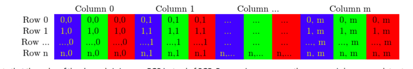


```python
# 一般图像读取方式
img = cv2.imread("./images/12.jpg")

# 以灰度方式读取图像
img_grey = cv2.imread("./images/12.jpg", cv2.IMREAD_GRAYSCALE)
```


```python
cv2.imwrite("12-grey.jpg",img_grey)
```


    True


```python
# 采用灰度模式显示
plt.imshow(img_grey,cmap="gray",interpolation = 'bicubic')
plt.show()
```


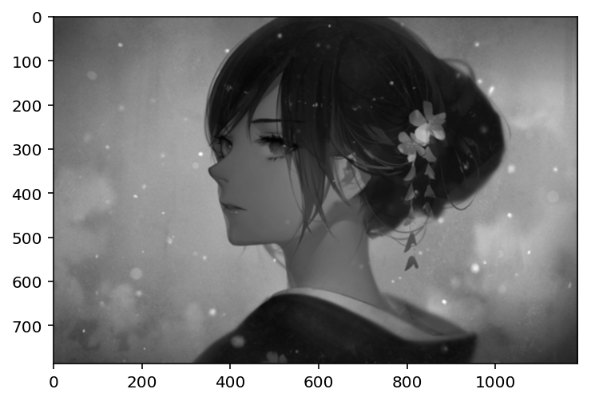


### 显示图片
使用 `cv2.imshow()` 显示图像，
- `cv2.waitKey()` 等待键盘输入，为毫秒级
- `cv2.destroyAllWindows()` 可以轻易删除任何我们建立的窗口，括号内输入想删除的窗口名

`cv2.namedWindow('image',cv2.WINDOW_NORMAL)` 可以在展示图片前先常见一个窗口，并对窗口设置参数


```python
cv2.imshow("图片",img)
k = cv2.waitKey(0)
exit_window(k)
```

    27 27


### 保存图片
使用 `cv2.imwrite(文件名, 文件数据, flags)` 保存成功返回 true, 可选的 flag 值与读取图片类似，有 ：IMWRITE_JPEG_CHROMA_QUALITY 等。


```python
cv2.imwrite("12-copy.png",img)
```


    True


```python
plt.imshow(img[:,:,::-1])
plt.show()
```


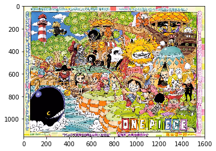


## OpenCV 视频操作

### 读取视频
对视频的捕获可以使用 `videoCapture()` ，传入 0 表示使用计算机内置的摄像头，传入文件名则读取视频。
- `isOpened()` 用于判断摄像头或者视频已经打开, 若是没有打开就需要使用 `cap.open()` 来打开
- `get(属性 ID)` 获取视频的相关信息，可算的参数值为 0 - 18，也可以使用具体的属性名称，在3.0中需要把 **CV_** 去掉：
    - CAP_PROP_POS_MSEC
    - CAP_PROP_POS_FRAMES
    - CAP_PROP_POS_AVI_RATIO
    - CAP_PROP_FRAME_WIDTH
    - CAP_PROP_FRAME_HEIGHT
    - CAP_PROP_FPS
    - CAP_PROP_FOURCC
    - CAP_PROP_FRAME_COUNT
    - CAP_PROP_FORMAT
    - CAP_PROP_MODE
    - CAP_PROP_BRIGHTNESS
    - CAP_PROP_CONTRAST
    - CAP_PROP_SATURATION
    - CAP_PROP_HUE
    - CAP_PROP_GAIN
    - CAP_PROP_EXPOSURE
    - CAP_PROP_CONVERT_RGB
    - CAP_PROP_WHITE_BALANCE
    - CAP_PROP_RECTIFICATION
- `set(属性 ID, value)`  重新设置属性的值


```python
def read_video(src):
    cap = cv2.VideoCapture(src)
    # 通过属性名称获取视频的属性
    print(cap.get(cv2.CAP_PROP_FPS))
    # 获取相关属性信息
#     for i in range(19):
#         print(cap.get(i))
    while cap.isOpened():
        # 捕获视频帧
        ret, frame = cap.read()
    
        # 对每一帧进行操作
        gray = cv2.cvtColor(frame,cv2.COLOR_BGR2GRAY)
        
        # 显示帧
        cv2.imshow("视频", gray)
        
        # 当有按键，或者视频播放完成时推出
        k = cv2.waitKey(1)
        if k & 0xFF == ord("q"):
            break
    # 操作完成，释放资源
    cap.release()
    cv2.destroyAllWindows()

# 从设备中读取帧
# read_video(0)

# 从文件中读取
read_video("/Users/weduoo/Desktop/stream/sample.rmvb")
```

    25.0


### 保存视频

保存视频使用 `VideoWriter()` 其含有一下几个参数：
- `filename` – 输出文件的文字.
- `fourcc` – 压缩帧使用的四字编码，如 VideoWriter::fourcc('P','I','M','1') 是 MPEG-1 编码, VideoWriter::fourcc('M','J','P','G') 是 motion-jpeg 编码等.完整编码列表再此页面 [Video Codecs by FOURCC](http://www.fourcc.org/codecs.php), 常用的有 Fedora : DIVX , XVID , MJPG , X264 , WMV1 , WMV2 ; XVID是最好的，MJPG是高尺寸视频，X264得到小尺寸视频. Windows : DIVX. Mac: MP4V.
- `fps` – 视频的帧率
- `frameSize` – 帧的大小.
- `isColor` – If it is not zero, the encoder will expect and encode color frames, otherwise it will work with grayscale frames (the flag is currently supported on Windows only).

The constructors/functions initialize video writers. On Linux FFMPEG is used to write videos; on Windows FFMPEG or VFW is used; on MacOSX QTKit is used.

**需要注意的是，设置的保存尺寸一定要和原始帧的大小一致，否则无法保存成视频。**

【参考】
- 翻转示例：[opencv: cv2.flip 图像翻转 进行 数据增强](https://blog.csdn.net/JNingWei/article/details/78753607)
- 编码示例：[OpenCV Video Writer on Mac OS X](https://gist.github.com/takuma7/44f9ecb028ff00e2132e)
- 保存视频示例：[Record video with Python 3 + OpenCV 3 on OSX](http://tsaith.github.io/record-video-with-python-3-opencv-3-on-osx.html)


```python
def save_video(src):
    # 读取流
    cap = cv2.VideoCapture(src)
    # 设置尺寸与帧率
    width = int(cap.get(cv2.CAP_PROP_FRAME_WIDTH) + 0.5)
    height = int(cap.get(cv2.CAP_PROP_FRAME_HEIGHT) + 0.5)
    fps = cap.get(cv2.CAP_PROP_FPS)
    # 设定编码器及其其他参数
    fourcc = cv2.VideoWriter_fourcc(*'mp4v')
    out = cv2.VideoWriter("my.mp4",fourcc,fps,(width,height))
    
    while cap.isOpened():
        ret,frame = cap.read()
        
        if ret and (src == 0):
            # 对帧进行翻转，因为摄像头拍摄的是翻过来的图片
            # 1 水平翻转，0 垂直翻转，-1 水平垂直翻转
            frame = cv2.flip(frame,1)
            
        # 保存帧
        out.write(frame)

        # 显示帧
        cv2.imshow("frame",frame)

        # waitKey 选择 0 的话无法读取图像
        if cv2.waitKey(1) & 0xFF == ord("q"):
            break
        
    # 释放资源
    cap.release()
    out.release()
    cv2.destroyAllWindows()
    
save_video(0)
```

## OpenCV 中的绘图函数

OpenCV 中有以下几种绘图函数：
- `cv2.line()` 绘制线 
- `cv2.cicle()` 绘制原型
- `cv2.rectangle()` 绘制矩形
- `cv2.ellipse()` 绘制椭圆
- `cv2.putText()` 添加文字

以上函数共有的参数如下：
- `img` 你想要绘制的图形的那副图像
- `plt1、plt2` 起止点（元组）
- `color` 形状的颜色，以RGB为例，需要传入的元组，例（255,0,0）代表蓝色，对于灰度图只需传入灰度值
- `thickness` 线条的粗细，如果给一个闭合图形设置为-1，那么这个图形就会被填充，默认值为1
- `linetype` 线条的类型，8连接，抗锯齿等。默认是8连接。cv2.LINE_AA为抗锯齿

### 画线


```python
# 创建一个黑色图片
line = np.zeros((256,256,3),np.uint8)
cv2.line(line, (0,0), (256,256),(255,255,0),2,cv2.LINE_AA)
plt.imshow(line)
plt.show()
```


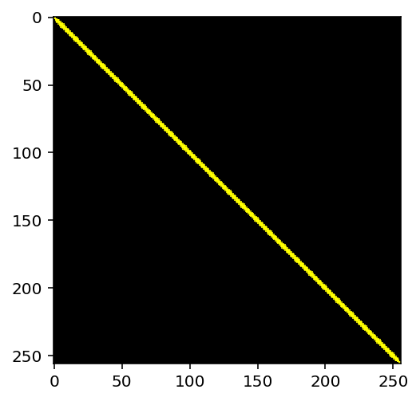


### 画矩形
需要告诉函数左上角顶点和右下角顶点的坐标


```python
rectangle = np.zeros((256,256,3),np.uint8)
cv2.rectangle(rectangle, (44,44), (150,150),(255,0,0),2,cv2.LINE_AA)
plt.imshow(rectangle)
plt.show()
```


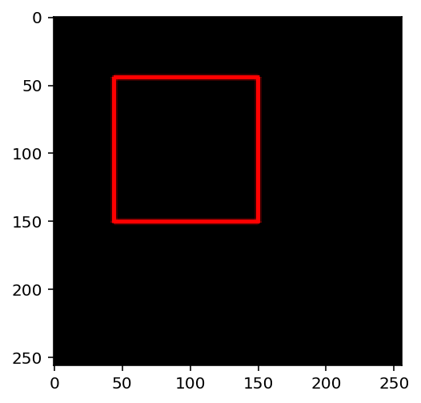


### 画圆形
需要指定圆心坐标和半径大小，可以在上面矩形中画个圆


```python
cv2.circle(rectangle, (97,97), 53, (255,0,255),2,cv2.LINE_AA)
plt.imshow(rectangle)
plt.show()
```


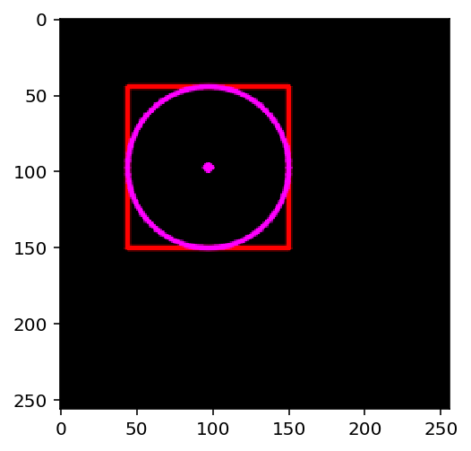


### 画椭圆
参数为：
- `img` 用于作画的图片, 
- `center` 椭圆中心点的位置, 
- `axes` 椭圆轴的长度，分为横轴与纵轴，用一个元组表示, 
- `angle` 以度为单位的旋转角度，以原点为中心顺时针旋转此角度, 
- `startAngle` 开始角度，以横轴右向为起点做顺时针旋转, 
- `endAngle`结束角度, 
- color[, thickness[, lineType[, shift]]]


```python
ellipse = np.zeros((256,256,3),np.uint8)
cv2.ellipse(ellipse, (128,128), (100,50), 0,30,135,(255,120,255),-1)
plt.imshow(ellipse)
plt.show()
```


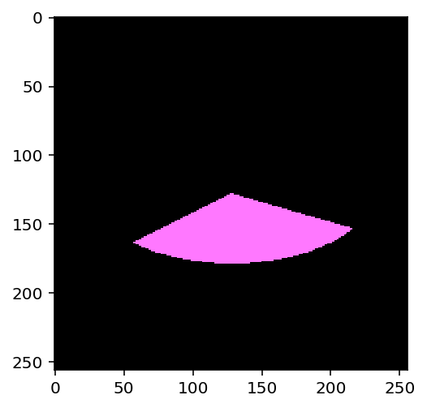


### 绘制多边形
需要指定每个顶点的坐标，构建一个大小相等于行数 × 1 × 2 的数组，行数就是点的数目，这个数组必须为int32。

`cv2.polylines()` 可以用来画很多条线。只把想画的线放在一 个列中将个列传给函数就可以了。每条线会独立绘制。会比用 `cv2.line()` 一条一条的绘制快一些。


```python
polyline = np.zeros((256,256,3),np.uint8)

pts=np.array([[100,5],[200,30],[70,200],[50,10]],np.int32)
# 这里reshape的第一个参数为-1，表明这一维度的长度是根据后面的维度计算出来的
# print(pts)
pts = pts.reshape((-1,1,2))
# print(pts)
#注意第三个参数若是False，我们得到的是不闭合的线
cv2.polylines(polyline,[pts],True,(0,255,255))
plt.imshow(polyline)
plt.show()
```


### 添加文字
需要设置，文字内容，绘制的位置，字体类型、大小、颜色、粗细、类型等，这里推荐linetype=cv2.LINE_AA。

目前 OpenCV 不支持添加中文，想要添加中文可以将图片转成 PIL 格式，在 PIL 格式上添加文字之后在转成 OpenCV 格式。


```python
text = np.zeros((256,256,3),np.uint8)
font = cv2.FONT_HERSHEY_SIMPLEX  
cv2.putText(text,'OpenCV',(10,100), font, 1,(255,123,255),2,cv2.LINE_AA)
plt.imshow(text)
plt.show()
```


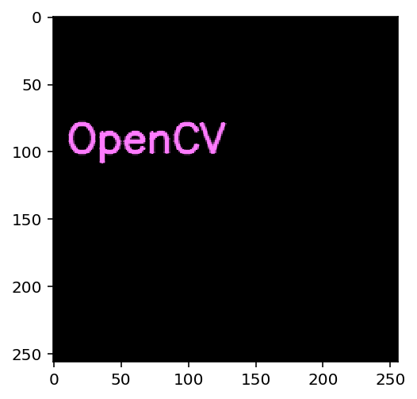


# OpenCV 进阶操作

## 图片进阶操作
### 获取并修改像素值
读取一副图像，根据像素的 *行* 和 *列* 的坐标获取它的像素值，对于RGB图像而言，返回RGB的值，对于灰度图则返回灰度值


```python
# 安装 RGB 格式读取图片
iimg = cv2.imread("./images/12.png")
# 即相当于 iimg 含有 786 个 1186 × 3 的二维数组
print("shape:",iimg.shape, "length:",len(iimg))
# shape 为 (786, 1186), 即取出第二列
iimg[:,:,2]
```

    shape: (786, 1186, 3) length: 786

    array([[ 79,  79,  79, ..., 105, 104, 103],
           [ 79,  79,  79, ..., 105, 105, 104],
           [ 80,  80,  79, ..., 105, 106, 105],
           ..., 
           [ 69,  69,  70, ...,  40,  40,  40],
           [ 69,  69,  69, ...,  39,  40,  40],
           [ 68,  68,  67, ...,  39,  39,  40]], dtype=uint8)


```python
# 取出像素并修改
px=iimg[100,100]
print(px)
blue = iimg[100,100,0]
print(blue)
iimg[101,101]=[255,255,255]
print(iimg[101,101])
```

    [ 99 109 107]
    99
    [255 255 255]


`numpy` 是经过优化了的进行快速矩阵运算的包，所以不推荐逐个获取像素值并修改能矩阵运算就不要用循环。例如前5行的后3列，用 `numpy` 的`array.item()` 和 `array.itemset()` 会更好。但是返回是标量，如果想获得所有RGB的值，需要使用 `array.item()`分割他们。
更好的方法是


```python
print(iimg.item(200,200,2))
iimg.itemset((200,200,2),100)
print(iimg.item(200,200,2))
```

    136
    100


### 查看图像的属性
属性的查看可以使用如下的方法：
- `img.shape`: 可以获得图像的形状，返回值是一个包含行数，列数，通道数的元组.如果图像是灰度图，返回值仅有行数和列数，所以通过检查返回值可以判断是灰度图还是彩色图
- `img.size`: 可以返回图像的像素数目
- `img.dtype`: 返回图像的数据类型，在debug时很重要，因为OpenCV-Python代码中经常出现数据类型的不一致


```python
# 图片形状
print("shape:", iimg.shape)

# 像素总数 即 shape 中的三个值相乘
print("size:", iimg.size)

# 数据类型
print("data type :", iimg.dtype)
```

    shape: (786, 1186, 3)
    size: 2796588
    data type : uint8


### ROI 操作
ROI 即 Region Of Interest，对感兴趣的区域操作。操作的实现都是通过 numpy索引来实现。


【参考】
- [设置图片ROI（OpenCV学习笔记之二）](https://www.jianshu.com/p/8025fa953545)


```python
plt.imshow(iimg)
plt.show()
```


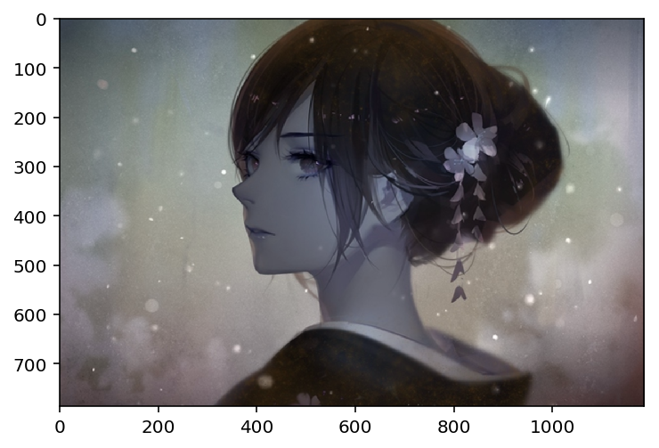


```python
# 如将眼睛做移动, 先选择高度位置，再选择宽度位置
eye = iimg[200:350,450:600]
plt.imshow(eye)
plt.show()
```


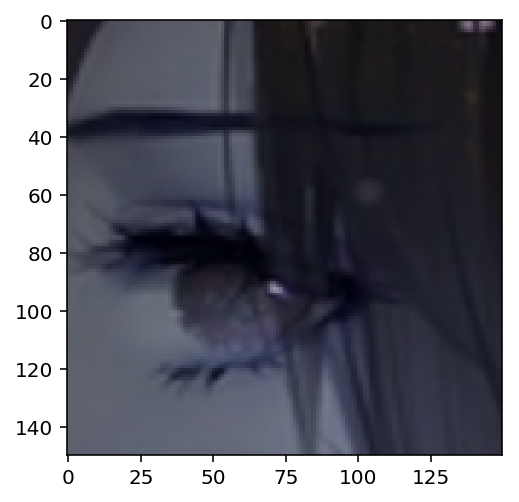


```python
# 移动位置，此处移动的位置大小要与截取大小相同
iimg[500:650,900:1050] = eye
plt.imshow(iimg)
plt.show()
```


### 通道拆分
有时需要对RGB三个通道分别操作，这就需要拆分RGB为单个通道。有时需要把独立的通道的图片合成一个RGB。

使用 `split` 可进行通道拆分， 但 OpenCV 拆出来的通道为 B、G、R。`cv2.split()` 是比较耗时的操作，能用numpy就尽量使用。假如想使所有红色通道值都为0，不必拆分再赋值，可以使用numpy索引，`img[:,:,2]=0` , 这样更快.

使用 `merge` 可进行通道合并，注意合并的顺序。

【参考】
- [小强学Python+OpenCV之－1.4.5通道拆分(cv2.split)及合并(cv2.merge)](https://www.jianshu.com/p/9fd339f806a7)


```python
# 拆分三通道
simg = cv2.imread("./images/rgb.jpg")
# 使用 numpy 操作
# b = simg[:,:,0]
# g = simg[:,:,1]
# r = simg[:,:,2]
b,g,r = cv2.split(simg)
plt.figure(figsize=(16,8))
plt.subplot(131)
plt.imshow(r,cmap="gray")
plt.subplot(132)
plt.imshow(g,cmap="gray")
plt.subplot(133)
plt.imshow(b,cmap="gray")
plt.show()
```


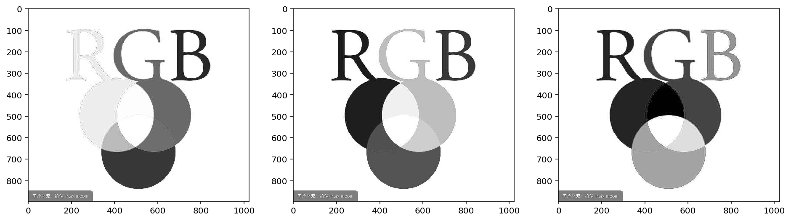


```python
cv2.imshow("Red", r)
cv2.imshow("Green", g)
cv2.imshow("Blue", b)
cv2.waitKey(0)
```


    113


```python
# 合并三通道
mimg = cv2.merge([r,g,b])
plt.figure(figsize=(16,4))
plt.subplot(131)
plt.imshow(mimg)
plt.subplot(132)
plt.imshow(cv2.merge([b,g,r]))
plt.subplot(133)
plt.imshow(cv2.merge([g,r,b]))
plt.show()
```


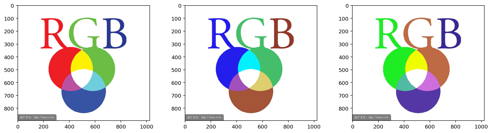


### 图片扩边（填充）
想为图像周围建一个边可以使用 `cv2.copyMakeBorder()` 函数。这经常在卷积运算或0填充时被用到。具体参数如下：
- `src`输入图像
- `top,bottom,left,right`: 对应边界的像素数目
- `borderType`要添加哪种类型的边界：
	- `cv2.BORDER_CONSTANT`: 添加有颜色的常数值边界，还需要下一个参数（value）
	- `cv2.BORDER_REFLIECT`: 边界元素的镜像。例如：fedcba | abcdefgh | hgfedcb
	- `cv2.BORDER_101`或者`cv2.BORDER_DEFAULT`: 跟上面一样，但稍作改动，例如：gfedcb | abcdefgh | gfedcba
	- `cv2.BORDER_REPLICATE`: 复后一个元素。例如: aaaaaa| abcdefgh|hhhhhhh
	- `cv2.BORDER_WRAP`: 不知怎么了, 就像样: cdefgh| abcdefgh | abcdefg
	- `value`: 边界颜色


```python
kimg = cv2.imread("./images/12.png")
print("origin:",kimg.shape)
pink = [255,123,255]
# 原始图片尺寸不变，对上下扩充 200 像素，左右扩充 100 像素。
constant = cv2.copyMakeBorder(kimg,200,200,100,100,cv2.BORDER_CONSTANT,value = pink)
print("Constant change:",constant.shape)

# 复制后一个元像素, 在上下 300 范围内重复，在左右 300 范围内重复
replicate = cv2.copyMakeBorder(kimg,300,300,300,300,cv2.BORDER_REPLICATE)
print("replicate change:",replicate.shape)

# 边界元素镜像
reflect = cv2.copyMakeBorder(kimg,0,600,0,0,cv2.BORDER_REFLECT)
print("reflect change:",reflect.shape)

# 边界镜像（从倒数第二个开始）
reflect101 = cv2.copyMakeBorder(kimg,0,600,0,0,cv2.BORDER_REFLECT101)
print("reflect101 change:",reflect101.shape)

# 位置兑换，即上面区域到下面，左边区域到右边
wrap = cv2.copyMakeBorder(kimg,300,300,300,300,cv2.BORDER_WRAP)
print("wrap change:",wrap.shape)

plt.figure(figsize=(16,8))

plt.subplot(231),plt.imshow(kimg),plt.title('original')
plt.subplot(232),plt.imshow(replicate),plt.title('replicate')
plt.subplot(233),plt.imshow(reflect),plt.title('reflect')
plt.subplot(234),plt.imshow(reflect101),plt.title('reflect101')
plt.subplot(235),plt.imshow(wrap),plt.title('wrap')
plt.subplot(236),plt.imshow(constant),plt.title('constant')

plt.show()
```

    origin: (786, 1186, 3)
    Constant change: (1186, 1386, 3)
    replicate change: (1386, 1786, 3)
    reflect change: (1386, 1186, 3)
    reflect101 change: (1386, 1186, 3)
    wrap change: (1386, 1786, 3)

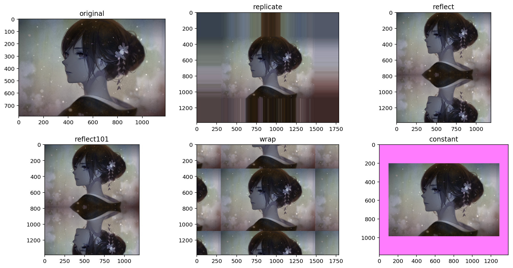


## 图像上的运算

### 图像加法运算
加法运算使用 `cv2.add()`, 也可以直接使用 numpy，`res=img1+img2`.OpenCV 中的加法与 Numpy 的加法有所不同的。 OpenCV 的加法是一种饱和操作，而 Numpy 的加法是一种模操作。 例如，对于 `100+200`，使用 `cv2.add()` 函数得到的是 255，而使用 Numpy 的加法得到的是 `300%256` . **OpenCV的结果会更好，so尽量使用OpenCV中的函数**


两幅图像的大小，类型必须一致，或者第二个图像可以是一个简单的标量值。在大小不一致的情况下可以使用 ROI 进行操作。

【参考】
- [图像的算术运算和逻辑运算](https://blog.csdn.net/qq_34838643/article/details/78305170)


```python
add1 = cv2.imread("./images/341.jpg")
add2 = cv2.imread("./images/342.jpg")
sum1 = cv2.add(add1,add2)
sum2 = add1 + add2
show_img([add1,add2,sum1,sum2],1,4,titles=["add1","add2","sum by cv2","sum by numpy"])
```


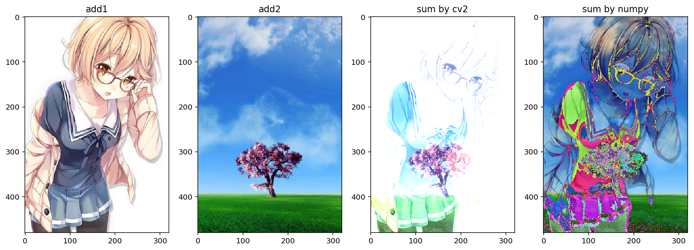


### 图像混合
次处是使用 `cv2.addWeighted()` 做权重相加。

这也是加法，不同的是两幅图像的权重不同，这会给人一种混合或者透明的感觉。图像混合的计算公式如下：

`g(x) = (1−α)f0(x)+αf1(x)`

通过修改α的值（0-->1）,可以实现很酷的混合。例：将两幅图像混合，第一幅权重为0.7 . 第二幅权重为0.3。函数cv2.addWeighed()可以按下面的公式对图片进行混合。dst = α·img1 + β·img2+γ 。这里γ的取值为0.


```python
aw1 = cv2.imread("./images/341.jpg")
aw2 = cv2.imread("./images/342.jpg")
saw1 = cv2.addWeighted(aw1,0.7,aw2, 0.3, 0)
saw2 = aw1 * 0.7 + aw2 * 0.3 + 0
show_img([aw1,aw2,saw1,saw2],1,4,titles=["aw1","aw2","saw1 by cv2","saw2 by numpy"])
```


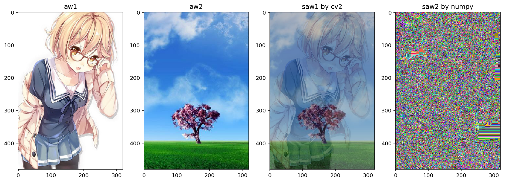


### 通过 ROI 混合图像


```python
bg = cv2.imread("./images/bg.jpg")
bg1 = cv2.imread("./images/bg.jpg")
emb = cv2.imread("./images/341.jpg")
print("bg:",bg.shape, "emb:", emb.shape)
bg[0:emb.shape[0],0:emb.shape[1]] = cv2.addWeighted(emb ,0.7 , bg[0:emb.shape[0],0:emb.shape[1]], 0.2, 0)
show_img([bg1,emb,bg],1,3)
```

    bg: (720, 1280, 3) emb: (480, 320, 3)


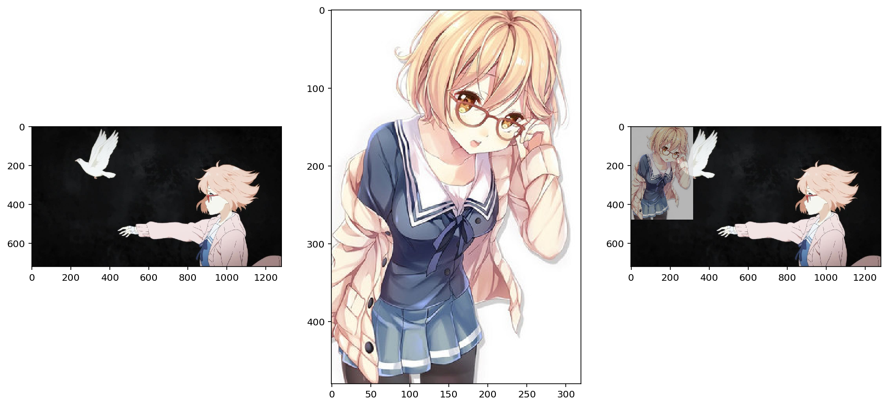


### 图像的位运算
位运算包括：and、or、not、xor 四种。与数学中的概念类似，and 表示两者相同的部分，or 表示两者叠加，not 是取反的意思，xor 表示相同的部分取反。

【参考】
- [Python二进制表示和位操作](https://www.jianshu.com/p/3a31065a8e58)


```python
shapesize = (256,256,3)
# 绘制矩形
rectangle = np.zeros(shapesize, np.uint8)
cv2.rectangle(rectangle, (28,28),(228,228),(255,255,255),-1)

# 绘制圆形
circle = np.zeros(shapesize, np.uint8)
cv2.circle(circle, (128,128),110,(255,255,255),-1)

bitwiseAnd = cv2.bitwise_and(rectangle, circle)
bitwiseOr = cv2.bitwise_or(rectangle, circle)
bitwiseNot = cv2.bitwise_not(circle)
bitwiseXor = cv2.bitwise_xor(rectangle,circle)

show_img([rectangle,bitwiseAnd,bitwiseOr,circle,bitwiseNot,bitwiseXor],2,3,
         ["rectangle origin","bitwise And","bitwise Or","circle origin","bitwise Not","bitwise Xor"])
```


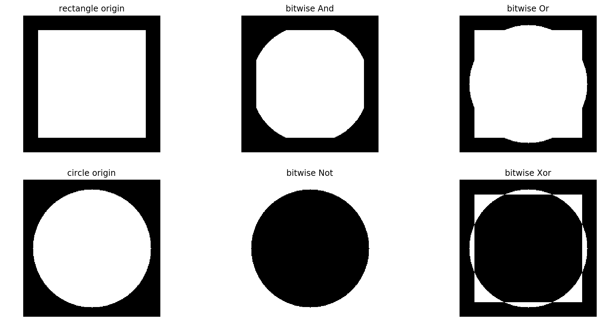


```python
# 位运算在掩膜中的运用
print(bg.shape)
circle = np.zeros(bg.shape[0:2], np.uint8)
mask = cv2.circle(circle, (1000,400), 250, (255,255,255),-1)
masked = cv2.bitwise_and(bg, bg, mask = mask)
show_img([mask,masked],1,2)
```

    (720, 1280, 3)


```python
temp = np.array([i for i in range(100)])
temp = temp.reshape((10,10))
t = cv2.bitwise_not(temp)
show_img([temp,t],1,2)
```


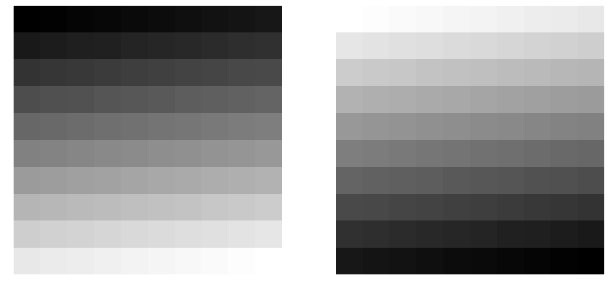

```python
# 此处需要参考位运算及其
ar1 = np.array([1,34,234,6,3,55])
ar2 = np.array([10,84,134,6,56,3])
cv2.bitwise_and(ar1,ar2)
print(bin(234))
print(bin(134))
print(234 & 134)
print(int(0b10000010))
print(234 | 134)
print(int(0b11101110))
print(~23456)
print(int(0b01111001))
print(~-23457)
print(int(0b01111001))
```

    0b11101010
    0b10000110
    130
    130
    238
    238
    -23457
    121
    23456
    121


## 颜色空间转换

### 颜色空间装换
在 OpenCV 中有 超过150 种进行颜色空间转换的方法。但是你以后就会发现我们经常用到的也就两种：BGR ↔ Gray 和 BGR ↔ HSV。

我们用到的函数是 `cv2.cvtColor(input_image，flag)`，其中 `flag` 就是转换类型。 对于BGR↔Gray的转换，我们使用的flag就是`cv2.COLOR_BGR2GRAY`。 同样对于 BGR↔HSV 的转换我们用的 `flag` 就是 `cv2.COLOR_BGR2HSV`。

在 OpenCV 的 HSV 格式中，H（色彩/色度）的取值范围是 `[0，179]`， S（饱和度）的取值范围 `[0，255]`，V（亮度）的取值范围 `[0，255]`。但是不同的软件使用的值可能不同。所以当你拿 OpenCV 的 HSV 值与其他软件的 HSV 值对比时，一定要记得归一化。

你可以下的命令得到所有可用的 flag:
```python
flags=[i for i in dir(cv2) if i.startswith('COLOR_')] 
print (flags)
```


```python
bgo = cv2.imread("./images/342.jpg")
rbg2gray = cv2.cvtColor(bgo, cv2.COLOR_BGR2GRAY)
print(rbg2gray.shape)
rgb2hsv = cv2.cvtColor(bgo, cv2.COLOR_BGR2HSV)
print(rgb2hsv.shape)
show_img([bgo,rbg2gray,rgb2hsv],1,3,["origin","rbg2gray","rgb2hsv"])
```

    (480, 320)
    (480, 320, 3)


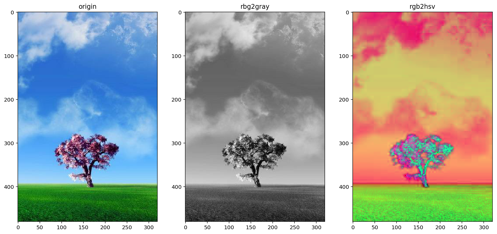


### 物体追踪 HSV
现在我们知怎样将一幅图像从 BGR 换到 HSV 了，我们可以利用 一点来提取带有某个特定色的物体。在 HSV 颜色空间中要比在 BGR 空间中更容易表示一个特定颜色。在我们的程序中，我们提取的是一个红色的苹果 ，可以使用 `cv2.inRange()` 来选定。此过程分为以下几个步奏：
- 将图像换到 HSV 空间
- 设置 HSV 阀值到蓝色范围。
- 获取红色物体，当然我们可以做其他任何我们想做的事，比如：在红色物体周围画一个圈。

追踪物体轮廓，以后可以找物体中心，然后跟踪物体，可以在摄像头前挥挥手就可以画图等一些有趣的事。


【参考】
- [【OpenCV】HSV颜色识别-HSV基本颜色分量范围](https://blog.csdn.net/Taily_Duan/article/details/51506776)


```python
apple = cv2.imread("./images/apple.jpg")
# 转到 HSV 色域
apple2hsv = cv2.cvtColor(apple, cv2.COLOR_BGR2HSV)

##设定蓝色的阀值，可以在网上查到 HSV 红色的色阈值（红色有两个色阈值）
lower_red = np.array([0,43,46])
upper_red = np.array([10,255,255])

# 根据阈值构建遮罩
apple_mask = cv2.inRange(apple2hsv, lower_red, upper_red)

#对原图和掩模进行位运算
apple_end = cv2.bitwise_and(apple,apple,mask=apple_mask)

show_img([apple,apple2hsv,apple_mask,apple_end],2,2,["apple","apple2hsv","apple_mask","apple_end"])
```


## 几何变化

### 扩展缩放
只是改变图像的尺寸大小，`cv2.resize()` 可以实现这个功能。在缩放时推荐 `cv2.INTER_AREA`，在拓展时推荐 `cv2.INTER_CUBIC`（慢）和`cv2.INTER_LINEAR`。默认情况下所有改变图像尺寸大小的操作使用的是插值法都是 `cv2.INTER_LINEAR`。

`cv2.resize()`有以下几个参数：
- src: 原始的图片
- dsize: 目标的大小，要改变成多大的图片
- fx: 沿着横轴缩放比例
- fy: 沿着纵轴缩放比例
- interpolation: 选用的插值方式


```python
scale = cv2.imread("./images/342.jpg")
print("origin:", scale.shape)

# 通过设置尺寸调整大小，下面设置的意思是宽高设置为(160,240)，与原来的 shape 顺序不同
scale_dsize = cv2.resize(scale, (160,250))
print("scale dsize:",scale_dsize.shape)

# 通过设置缩放比例调整大小，原始的shape 为(高,宽) , 👇下面 的设置就相当于
# 把宽扩大 1.5 倍，高扩大 1.2 倍
scale_port = cv2.resize(scale,None,fx=1.5, fy=1.2)
print("scale fx and fy:",scale_port.shape)

show_img([scale,scale_dsize,scale_port],1,3,["origin","dsize","fx and fy"])
```

    origin: (480, 320, 3)
    scale dsize: (250, 160, 3)
    scale fx and fy: (576, 480, 3)


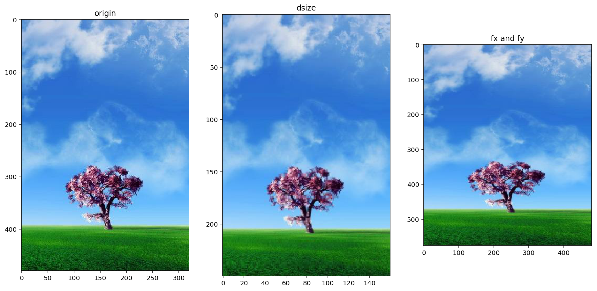


### 平移变换
如果想要沿（x，y）方向移动，移动的距离为（x,y）可以以下面方式构建移动矩阵，`M：[[1,0,x],[0,1,y]]`。可以使用Numpy数组构建矩阵，数据类型是`np.float32`，然后传给函数 `cv2.warpAffine()` , 其参数如下:
- src: 输入图片
- M: 变换矩阵，移动的距离
- dsize: 输出图片的大小，可以从原始输入中获取，但顺序为(宽,高)
- borderValue:背景的颜色
【参考】
- [Python-OpenCv之图像基本处理-平移，缩放，旋转，翻转，裁剪及仿射变换](https://blog.csdn.net/zh_jessica/article/details/77946346)


```python
tran = cv2.imread("./images/apple.jpg")
# 向左移动 40 像素，向下移动 120 像素
tranm = np.float32([[1,0,40],[0,1,120]])
rows,cols,channels = tran.shape
tran_end = cv2.warpAffine(tran,tranm,(cols,rows),borderValue=80)
show_img([tran,tran_end],1,2,["origin","translate"])
```


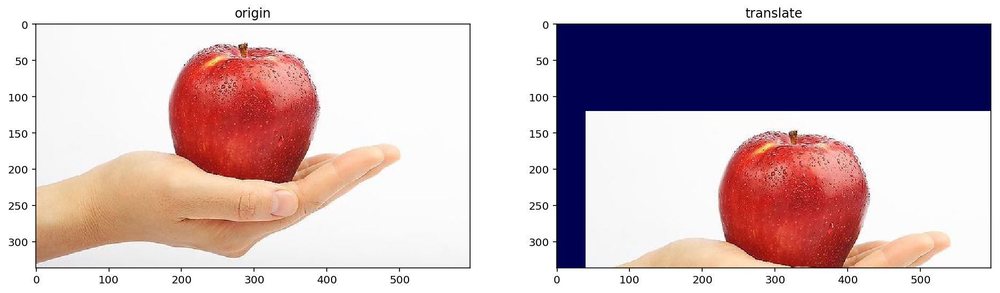


### 旋转
对一个图像旋转角度θ，需要使用下面的旋转矩阵。


但OpenCVC允许在任意地方进行旋转，所以矩阵应该为


其中 α = scale · cos θ. 为构建旋转矩阵，OpenCV提供了一个函数 `cv2.getRotationMatrix2D` 其参数如下：
- center: 旋转中心位置，在原始的图片中 
- angle: 旋转的角度，以度为单位
- scale: 旋转缩放比例


```python
rote_apple = cv2.imread("./images/apple.jpg")
rows,cols,channels = rote_apple.shape
# 逆时针旋转
rote_m1 = cv2.getRotationMatrix2D((cols/2,rows/2),45,1)
# 顺时针旋转，并缩小一半
rote_m05 = cv2.getRotationMatrix2D((cols/2,rows/2),-90,0.5)
rote_end1 = cv2.warpAffine(rote_apple, rote_m1, (cols,rows))
rote_end2 = cv2.warpAffine(rote_apple, rote_m05, (cols,rows))
show_img([rote_apple,rote_end1,rote_end2],1,3,["origin","rotation 45", "rotation -90 and scale 0.5"])
```


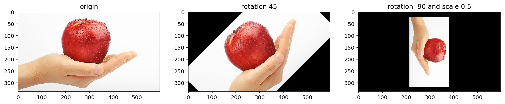


### 仿射变换
仿射变换就是图像的线性变换加上平移，用一幅图表示，就是


由 image1 到 image2 的转换经过了三个操作

- 旋转 (线性变换)
- 缩放操作(线性变换)
- 平移 (向量加)

在仿射变换中，原图中所有平行线在结果图像中同样平行。为创建这个矩阵，需要从原图像中找到三个点以及他们在输出图像中的位置，然后`cv2.getAffineTransForm()` 会创建一个2X3的矩阵。最后这个矩阵会被传给函数 `cv2.warpAffine()`

【参考】
- [OpenCV Python 学习笔记（三） 仿射变换](https://blog.csdn.net/windowsyun/article/details/78158747)
- [Python+OpenCV教程7：图像几何变换](http://ex2tron.top/2017/12/08/Python-OpenCV%E6%95%99%E7%A8%8B7%EF%BC%9A%E5%9B%BE%E5%83%8F%E5%87%A0%E4%BD%95%E5%8F%98%E6%8D%A2/#%E4%BB%BF%E5%B0%84%E5%8F%98%E6%8D%A2)


```python
# 在图上绘制点
def draw_dot(img,positions,radius=3,border=3):
    for pos in positions:
        # 每个点产生随机颜色
        R = np.random.randint(0,255)
        G = np.random.randint(0,255)
        B = np.random.randint(0,255)
        cv2.circle(img,(pos[0],pos[1]),radius,(R,G,B),border)
    return img
```


```python
aff_apple = cv2.imread("./images/apple.jpg")
rows,cols,channels = aff_apple.shape
before = [[50, 65], [150, 65], [210, 210]]
aff_apple = draw_dot(aff_apple, before)
# 变换前的三个点
pts1 = np.float32(before)
# 变换后的三个点
pts2 = np.float32([[50, 100], [150, 65], [100, 250]])

# 生成变换矩阵(src,dst)
aff_m = cv2.getAffineTransform(pts1,pts2)

# 进行仿射变换
aff_end = cv2.warpAffine(aff_apple,aff_m,(cols,rows))

show_img([aff_apple,aff_end],1,2,["origin","affine"])
```


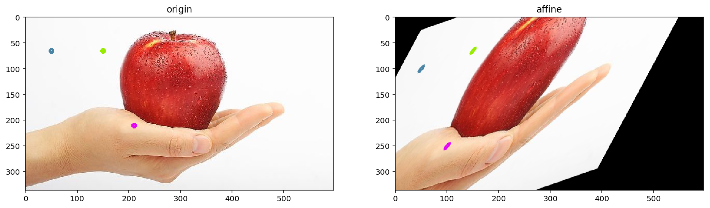


### 透视变换
透视变换绝对是一项很酷的功能。我们经常会用手机去拍身份证和文件，无论你怎么拍，貌似都拍不正或者有边框。如果你使用过手机上面一些扫描类软件，比如”扫描全能王“，”Office Lens“，它们能很好地矫正图片。这些软件就是应用透视变换实现的，跟仿射变换一样，我们不用知道它的具体原理。

透视变换后，原图中的直线依旧是直线。如下图，我们实现这个功能：

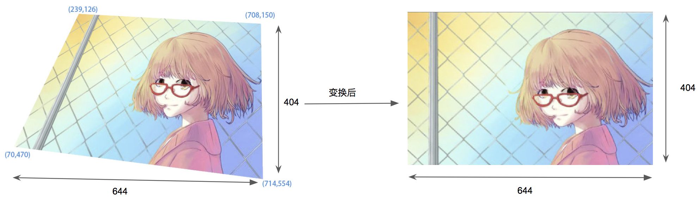

上图，首先确定四个角的坐标，并确定变换后的宽高，然后对每个点进行变换，先确定一个变换的基点，然后通过宽高算出其他几个点应该在的位置。

对于视角变换，我们需要一个3x3变换矩阵。在变换前后直线还是直线。需要在原图上找到4个点，以及他们在输出图上对应的位置，这四个点中任意三个都不能共线，可以有函数 `cv2.getPerspectiveTransform()` 构建，然后这个矩阵传给函数 `cv2.warpPerspective()`.


```python
persp = cv2.imread("./images/weilai_per.jpg")
rows,cols,channels = persp.shape
# 原图中卡片的四个角点
pts1 = np.float32([[239, 126], [708, 150], [70, 470], [714, 554]])
# 变换后分别在左上、右上、左下、右下四个点
pts2 = np.float32([[0, 0], [644, 0], [0, 404], [644, 404]])

# 生成透视变换矩阵
persp_m = cv2.getPerspectiveTransform(pts1, pts2)
# 进行透视变换
perp_end = cv2.warpPerspective(persp, persp_m, (640, 404))

show_img([persp, perp_end],1,2,["origin","change"])
```


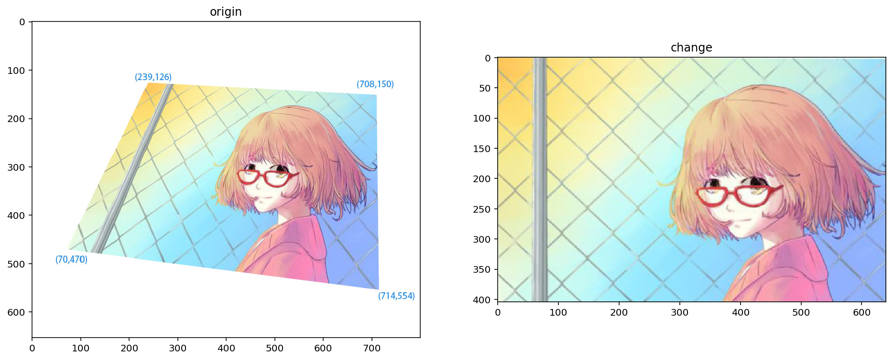


## 图像阈值
此处会用到 `cv2.threshold`, `cv2.adaptiveThreshold` 两个函数

### 固定阈值
当像素值高于阀值时，我们给这个像素赋予一个新值（可能是白色），否则我们给它赋予另外一种颜色（也许是黑色）。这个函数就是 `cv2.threshold()`参数如下：
- `src`: 原图像，原图像应该是灰度图。
- `thresh`: 阀值，
- `maxval`: 最大阈值，即超过阈值时被赋予的值
- `type`: 阈值类型， 包括以下五种
    - cv2.THRESH_BINARY
    - cv2.THRESH_BINARY_INV
    - cv2.THRESH_TRUNC
    - cv2.THRESH_TOZERO
    - cv2.THRESH_TOZERO_INV
    

【参考】
- [Python+OpenCV教程6：阈值分割](http://ex2tron.top/2017/12/07/Python-OpenCV%E6%95%99%E7%A8%8B6%EF%BC%9A%E9%98%88%E5%80%BC%E5%88%86%E5%89%B2/)


```python
# 读入灰度值
thresh = cv2.imread("./images/gray.jpg",0)

# ret 即 return Value，返回的阈值，127和255表示 当值大于127是，当前值替换为255
ret,thresh1 = cv2.threshold(thresh,127,255,cv2.THRESH_BINARY)
ret,thresh2 = cv2.threshold(thresh,127,255,cv2.THRESH_BINARY_INV)
ret,thresh3 = cv2.threshold(thresh,127,255,cv2.THRESH_TRUNC)
ret,thresh4 = cv2.threshold(thresh,127,255,cv2.THRESH_TOZERO)
ret,thresh5 = cv2.threshold(thresh,127,255,cv2.THRESH_TOZERO_INV)

titles = ["Origin","BINARY","BINARY_INV","TRUNC","TOZERO","TOZERO_INV"]
imgs = [thresh,thresh1,thresh2,thresh3,thresh4,thresh5]
show_img(imgs,2,3,titles,figsize=(16,7))
```


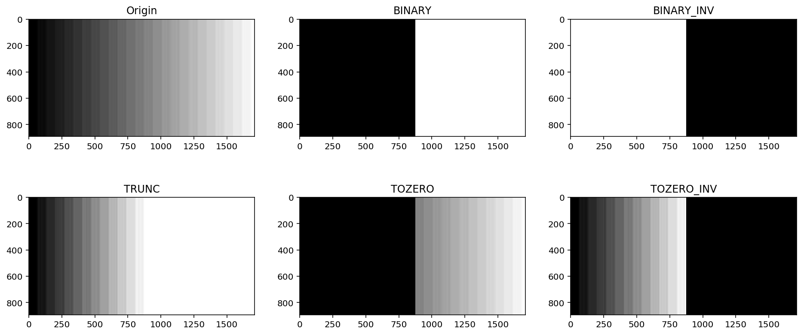

结合上图，可以看到五种方式的行为描述如下：


### 自适应阈值
根据图像上的每一个小区域计算与其对应的阀值。因此在同一幅图像上的不同区域采用的是不同的阀值，从而使我们能在亮度不同的情况下得到更好的结果。

这里需要使用 `cv2.adaptiveThreshold` 函数，参数如下：
- `src`: 原始图像，单通道, 
- `maxValue`: 当满足阈值条件是为像素赋予的值，通常为255, 
- `adaptiveMethod`: 区域阈值的计算方式, 可以选的有两个
    - `ADAPTIVE_THRESH_MEAN_C`：小区域内取均值
    - `ADAPTIVE_THRESH_GAUSSIAN_C`：小区域内加权求和，权重是个高斯核
- `thresholdType`: 阈值类型，即前面的五种, 
- `blockSize`: 小块区域的面积，如 5×5, 
- `C` : 常量，最终阈值等于小区域计算出的阈值再减去此值


```python
adp = cv2.imread("./images/12.jpg",0)

# 固定阈值
ret, th1 = cv2.threshold(adp, 127, 255, cv2.THRESH_BINARY)
# 自适应阈值
adp1 = cv2.adaptiveThreshold(adp, 255, cv2.ADAPTIVE_THRESH_MEAN_C, cv2.THRESH_BINARY, 11, 4)
adp2 = cv2.adaptiveThreshold(adp, 255, cv2.ADAPTIVE_THRESH_GAUSSIAN_C, cv2.THRESH_BINARY, 11, 6)
titles = ['Original', 'Threshold', 'Adaptive Mean', 'Adaptive Gaussian']
images = [adp, th1, adp1, adp2]
show_img(images,2,2,titles)
```


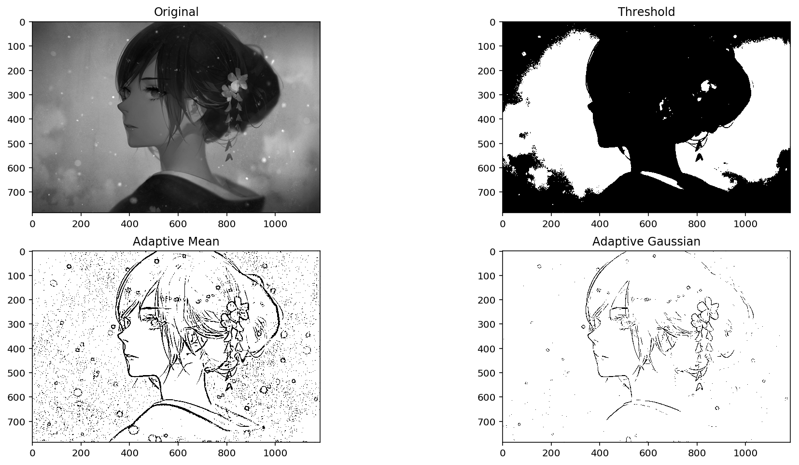


### Otsu阈值法
在前面固定阈值中，我们是随便选了一个阈值如127，那如何知道我们选的这个阈值效果好不好呢？答案是：不断尝试，所以这种方法在很多文献中都被称为经验阈值。Otsu阈值法就提供了一种自动高效的二值化方法 ，并且Otsu’s非常适合于图像灰度直方图具有双峰的情况，他会在双峰之间找到一个值作为阈值，对于非双峰图像，可能并不是很好用。那么经过Otsu’s得到的那个阈值就是函数 `cv2.threshold` 的第一个参数了。因为Otsu’s方法会产生一个阈值，那么函数 `cv2.threshold` 的的第二个参数（设置阈值）就是0了，并且在 `cv2.threshold` 的方法参数中还得加上语句 `cv2.THRESH_OTSU`。

【参考】
- [Python+OpenCV教程番外篇4：Otsu阈值法](http://ex2tron.top/2017/12/08/Python-OpenCV%E6%95%99%E7%A8%8B%E7%95%AA%E5%A4%96%E7%AF%874%EF%BC%9AOtsu%E9%98%88%E5%80%BC%E6%B3%95/)


```python
# ots1 = cv2.imread("./images/12.jpg",0)
# ots1 = cv2.imread("./images/weilai.jpg",0)
ots1 = cv2.imread("./images/high2.jpg",0)

# 固定阈值法
ret1, th1 = cv2.threshold(ots1, 100, 255, cv2.THRESH_BINARY)
# Otsu阈值法
ret2, th2 = cv2.threshold(ots1, 0, 255, cv2.THRESH_BINARY + cv2.THRESH_OTSU)
# 先进行高斯滤波，再使用Otsu阈值法
blur = cv2.GaussianBlur(ots1, (5, 5), 0)
ret3, th3 = cv2.threshold(blur, 0, 255, cv2.THRESH_BINARY + cv2.THRESH_OTSU)

images = [ots1, 0, th1, ots1, 0, th2, blur, 0, th3]
titles = ['Original', 'Histogram', 'Global(v=100)',
          'Original', 'Histogram', "Otsu's",
          'Gaussian filtered Image', 'Histogram', "Otsu's"]
plt.figure(figsize=(16,8))
for i in range(3):
    # 绘制原图
    plt.subplot(3, 3, i * 3 + 1)
    plt.imshow(images[i * 3], 'gray')
    plt.title(titles[i * 3], fontsize=8)
    plt.xticks([]), plt.yticks([])
    # 绘制直方图plt.hist，ravel函数将数组降成一维
    plt.subplot(3, 3, i * 3 + 2)
    plt.hist(images[i * 3].ravel(), 256)
    plt.title(titles[i * 3 + 1], fontsize=8)
    plt.xticks([]), plt.yticks([])
    # 绘制阈值图
    plt.subplot(3, 3, i * 3 + 3)
    plt.imshow(images[i * 3 + 2], 'gray')
    plt.title(titles[i * 3 + 2], fontsize=8)
    plt.xticks([]), plt.yticks([])
plt.show()

```


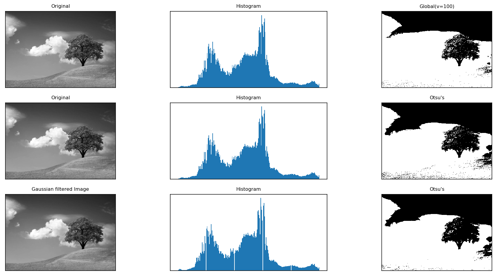


# 参考
- [OpenCV-Python中文教程](https://www.kancloud.cn/aollo/aolloopencv)
- [设置图片ROI（OpenCV学习笔记之二）](https://www.jianshu.com/p/8025fa953545)
- [小强学Python+OpenCV之－1.4.5通道拆分(cv2.split)及合并(cv2.merge)](https://www.jianshu.com/p/9fd339f806a7)

- [图像的算术运算和逻辑运算](https://blog.csdn.net/qq_34838643/article/details/78305170)
- [【OpenCV】HSV颜色识别-HSV基本颜色分量范围](https://blog.csdn.net/Taily_Duan/article/details/51506776)
- [Python-OpenCv之图像基本处理-平移，缩放，旋转，翻转，裁剪及仿射变换](https://blog.csdn.net/zh_jessica/article/details/77946346)
- [OpenCV Python 学习笔记（三） 仿射变换](https://blog.csdn.net/windowsyun/article/details/78158747)
- [Python+OpenCV教程7：图像几何变换](http://ex2tron.top/2017/12/08/Python-OpenCV%E6%95%99%E7%A8%8B7%EF%BC%9A%E5%9B%BE%E5%83%8F%E5%87%A0%E4%BD%95%E5%8F%98%E6%8D%A2/#%E4%BB%BF%E5%B0%84%E5%8F%98%E6%8D%A2)
