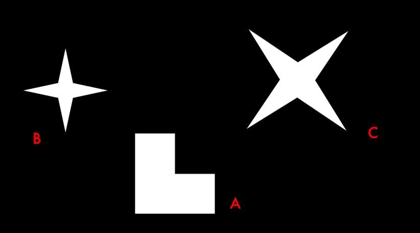
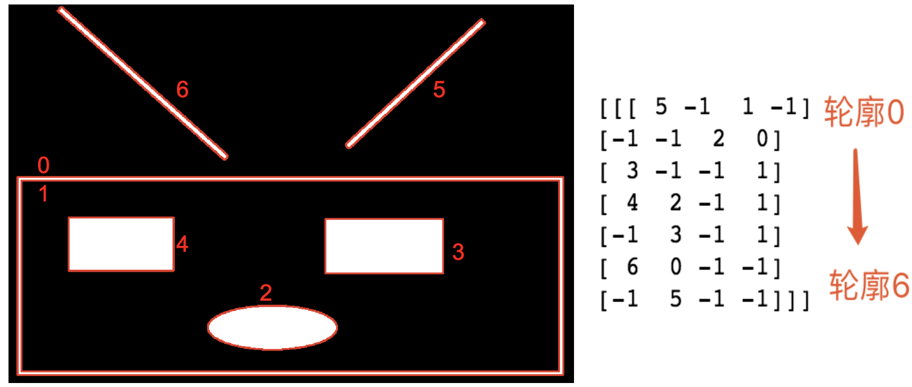
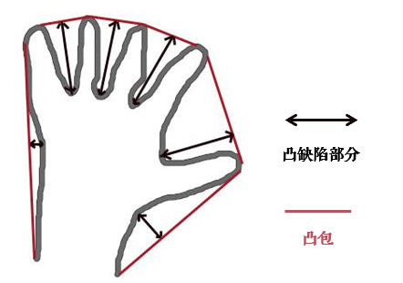

# 图像转换


```python
import cv2
import numpy as np
import matplotlib.pyplot as plt
%matplotlib inline
%config InlineBackend.figure_format = 'retina'
```


```python
# 用于退出 opencv 的图片展示窗口
def exit_window(k):
    if k==27:
        cv2.destroyAllWindows()  #wait for ESC key to exit
```


```python
# 展示图片
def show_img(imgs,rows,cols,titles=None,figsize=(16,8),axis="off"):
    plt.figure(figsize=figsize)
    for i in range(rows*cols):
        if i < len(imgs):
            plt.subplot(rows, cols, i + 1)
            if titles != None:
                plt.title(titles[i])
            if len(imgs[i].shape) < 3:
                # 显示灰度图像
                plt.imshow(imgs[i],cmap = "gray")
            else:
                # 显示正常图像
                plt.imshow(imgs[i][:,:,::-1])
            plt.axis(axis)
    plt.show()
```


```python
yinhun = cv2.imread("./images/yinhun.jpg")
img = cv2.imread("./images/weilai.jpg")
img_gray = cv2.imread("./images/weilai.jpg",0)
longmao = cv2.imread("./images/longm.jpg")
longmao_gray = cv2.imread("./images/longm.jpg",0)
flower = cv2.imread("./images/flower.jpg")
flower_gray  = cv2.imread("./images/flower.jpg",0)
```

## 图形平滑
主要包括： 卷积/滤波/模糊/降噪

总结：
- 在不知道用什么滤波器好的时候，优先高斯滤波 `cv2.GaussianBlur()`，然后均值滤波`cv2.blur()`
- 斑点和椒盐噪声优先使用中值滤波`cv2.medianBlur()`
- 要去除噪点的同时尽可能保留更多的边缘信息，使用双边滤波`cv2.bilateralFilter()`
- 线性滤波方式：均值滤波、方框滤波、高斯滤波（速度相对快）
- 非线性滤波方式：中值滤波、双边滤波（速度相对慢）

### 2D 卷积：均值滤波与模糊
关于滤波和模糊，很多人分不清：
- 它们都属于卷积，不同滤波方法之间只是卷积核不同（对线性滤波而言）
- 低通滤波器是模糊，高通滤波器是锐化

卷积运算可看作是加权求和的过程，如要求某一个像素的卷积，那么需要将卷积核的中心锚点与此像素对齐，然后求此元素及其周边元素与卷积核的乘积之和，得到的值就是此像素的新的值。对于在边上的元素可以采用 padding 技术将其补齐，如下图：


对于卷积核有以下几个要求:
- 滤波器的大小应该是**奇数**，这样它才有一个**中心**，例如3x3，5x5或者7x7。有中心了，也有了**半径**的称呼，例如5x5大小的核的半径就是2。
- 滤波器矩阵所有的元素之和应该要等于1，这是为了保证滤波前后图像的亮度保持不变。当然了，这不是硬性要求了。
- 如果滤波器矩阵所有元素之和大于1，那么滤波后的图像就会比原图像更亮，反之，如果小于1，那么得到的图像就会变暗。如果和为0，图像不会变黑，但也会非常暗。
- 对于滤波后的结构，可能会出现负数或者大于255的数值。对这种情况，我们将他们直接截断到0和255之间即可。对于负数，也可以取绝对值。

**低通滤波器（LPF）** 就是允许低频信号通过，在图像中边缘和噪点都相当于高频部分，所以低通滤波器用于去除噪点、平滑和模糊图像。**高通滤波器（HPF）**则反之，用来增强图像边缘，进行锐化处理。

常见噪声有椒盐噪声和高斯噪声，椒盐噪声可以理解为斑点，随机出现在图像中的黑点或白点；高斯噪声可以理解为拍摄图片时由于光照等原因造成的噪声；这样解释并不准确，只要能简单分辨即可

OpenCV提供的函数 `cv.filter2D()`可以对一幅图像进行卷积操作。均值滤波是一种最简单的滤波处理，它取的是卷积核区域内元素的均值，用`cv2.blur()` 实现，核说白了就是一个固定大小的数值数组。该数组带有一个 锚点 ，一般位于数组中央
，如3×3的卷积核（**其中因此的分母为权重矩阵所有元素的和**）：
$$
\large{kernel = \frac{1}{9}\left[  \begin{matrix}    1 & 1 & 1 \newline    1 & 1(anchor) & 1 \newline    1 & 1 & 1   \end{matrix}   \right]}
$$


【参考】
- [图像处理：基础(模板、卷积运算)](https://blog.csdn.net/xiaoxin_ling/article/details/3587987)
- [opencv filter2D](https://blog.csdn.net/dan1900/article/details/22716271)
- **[图像卷积与滤波的一些知识点](https://blog.csdn.net/zouxy09/article/details/49080029)**


```python
# 使用 blur 方法
blur = cv2.blur(img,(3,3))
blur2 = cv2.blur(img,(9,9))
print(img.shape,blur.shape,blur2.shape)
show_img([img,blur,blur2],1,3,["origin","blur3x3","blur9x9"],axis="on")
```

    (353, 500, 3) (353, 500, 3) (353, 500, 3)


```python
# 使用 filter2D 函数

# 使用卷积操作，需要手动均值化
kernel33 = np.ones((3,3),np.float32)/9
kernel99 = np.ones((9,9),np.float32)/81
# -1 表示通道数与原图相同
fd33 = cv2.filter2D(img, -1, kernel33)
fd99 = cv2.filter2D(img, -1, kernel99)
print(img.shape,fd33.shape,fd99.shape)
show_img([img,fd33,fd99],1,3,["origin","fd33","fd99"])
```

    (353, 500, 3) (353, 500, 3) (353, 500, 3)


### 方框滤波
使用 `cv2.boxFilter()` 方框滤波跟均值滤波很像，当可选参数 normalize 为True的时候，方框滤波就是均值滤波。当 normalize 为 False 的时候，相当于区域内像素求和，当和大于 25 5时值就为 255，因此我们就看到下面的第三张图只有部分物体显示了出来，其他值都被置为了 255 。


```python
apple = cv2.imread("./images/apple.jpg")
bf33 = cv2.boxFilter(apple, -1, (3,3))
bf33n = cv2.boxFilter(apple, -1, (3,3),normalize=False)
show_img([apple,bf33,bf33n],1,3)
```


### 高斯模糊(滤波)
现在把卷积核换成高斯核，简单的说方框不变，将原来每个方框的值是相等的，现在里面的值是符合高斯分布的，方框中心的值最大，其余方框根据距离中心元素的距离递减，构成一个高斯小山包，原来的求平均数变成求加权平均数，权就是方框里的值。如下图：


 高斯滤波器是一个**低通滤波器**，可以使用 `cv2.GaussianBlur()` 来实现，参数如下：
- `src`: 原图像, 
- `ksize`: 高斯核的大小, 
- `sigmaX、sigmaY`: X Y 轴的方差，如果我们只指定了X方向的标准差，Y方向也会取相同值，如果两个标准差都是0.那么函数会根据核函数的大小自己计算，高斯滤波可以有效的从图像中去除高斯噪音。

也可以使用 `cv2.getGaussianKernel()`自己构建一个高斯核.


```python
ga0 = cv2.GaussianBlur(img,(5,5),0)
ga1 = cv2.GaussianBlur(img,(5,5),10)
show_img([img,ga0,ga1],1,3)
```


### 中值模糊
中值又叫中位数，是所有值排序后取中间的值。中值滤波就是用区域内的中值来代替本像素值，所以那种孤立的斑点，如0或255很容易消除掉，适用于去除椒盐噪声和斑点噪声。中值是一种非线性操作，效率相比前面几种线性滤波要慢。

使用 `cv2.medianBlur()` 完成操作


```python
mb = cv2.medianBlur(img,5)
show_img([img,mb],1,2,figsize=(10,4))
```


### 双边滤波
模糊操作基本都会损失掉图像细节信息，尤其前面介绍的线性滤波器，图像的边缘信息很难保留下来。然而，边缘edge信息是图像中很重要的一个特征，所以这才有了双边滤波。用`cv2.bilateralFilter()`函数实现，他能在保持边界清晰的情况下有效的去除噪音，但比较慢。

高斯滤波器只考虑像素之间的**空间关系**，而不会考虑像素**值**之间的关系（像素的相似度），所以这种方法不会考虑一个像素是否位于边界，因此边界也会被模糊掉。

双边滤波在同时使用**空间高斯权重**和**灰度值相似性高斯权重**。空间高斯函数确保只有邻近区的像素对中心点有影响，灰度值相似性高斯函数确保只有与中心像素灰度值相近的才会被用来做模糊运算。所以能保证边界不会被模糊，因此边界处的灰度值变化比较大。


```python
# 2 表示邻域止境，两个25分别表示，空间高斯函数标准差，灰度值相似性高斯函数标准差
bf = cv2.bilateralFilter(img,9,75,75)
show_img([img,bf,blur2],1,3,["origin","bilateralFilter","mean filter"],figsize=(16,4),axis="off")
```


## 形态学操作
形态学操作其实就是改变物体的形状，比如腐蚀就是”变瘦”，膨胀就是”变胖”，看下图就明白了：


一般情况下对二值化图像进行操作，来连接相邻的元素或分离成独立的元素。需要两个参数，一个是原始图像，第二个被称为**结构化元素**或者核，它是用来决定操作的性质的。基本操作为腐蚀和膨胀，腐蚀和膨胀是针对图片中的白色部分，他们的变体构成了开运算，闭运算，梯度等。

因为形态学操作其实也是应用卷积来实现的，所以结构元素也叫做核。结构元素可以是矩形/椭圆/十字形，可以用 `cv2.getStructuringElement()` 来生成不同形状的结构元素，比如：
```python
kernel = cv2.getStructuringElement(cv2.MORPH_RECT, (5, 5))  # 矩形结构
kernel = cv2.getStructuringElement(cv2.MORPH_ELLIPSE, (5, 5))  # 椭圆结构
kernel = cv2.getStructuringElement(cv2.MORPH_CROSS, (5, 5))  # 十字形结构
```


【参考】
- [Python+OpenCV教程12：腐蚀与膨胀](http://ex2tron.top/2017/12/19/Python-OpenCV%E6%95%99%E7%A8%8B12%EF%BC%9A%E8%85%90%E8%9A%80%E4%B8%8E%E8%86%A8%E8%83%80/)

### 腐蚀
腐蚀的效果是把图片”变瘦”，其原理是在原图的小区域内取局部最小值。因为是二值化图，只有0和255，所以小区域内有一个是0该像素点就为0：


```python
kernel33 = np.ones((3,3),np.uint8)
kernel99 = np.ones((9,9),np.uint8)
erode33 = cv2.erode(img,kernel33)
erode99 = cv2.erode(img,kernel99)
show_img([img,erode33,erode99],1,3,["origin","3x3","9x9"])
```


### 膨胀
膨胀与腐蚀相反，取的是局部最大值，效果是把图片”变胖”。一般在去噪音时先腐蚀再膨胀，因为腐蚀再去掉白噪音的同时，也会使前景对象变小，所以我们再膨胀。这时噪音已经被去除，不会再回来了，但是前景还在并会增加，膨胀也可以用来连接两个分开的物体。

膨胀使用 `cv2.dilation()` 操作，参数 iterations 表示膨胀在图片上的迭代次数。


```python
kernel55 = np.ones((5,5),np.uint8)
erode55 = cv2.erode(img,kernel55)
dil = cv2.dilate(img, kernel55)
ero_dil = cv2.dilate(erode55, kernel55)
show_img([img,erode55,dil,ero_dil],2,2,["orign","erode","dilate","erode and dilate"],axis="off",figsize=(10,8))
```


### 开运算与闭运算
先进行腐蚀再进行膨胀就叫做开运算（因为先腐蚀会分开物体，这样容易记住），其作用是：分离物体，消除小区域，被用来去除噪音。

先膨胀再腐蚀成为闭运算（先膨胀会使白色的部分扩张，以至于消除/“闭合”物体里面的小黑洞，所以叫闭运算），被用来填充前景物体中的小洞，或者前景上的小黑点。

**即：如果我们的目标物体外面有很多无关的小区域，就用开运算去除掉；如果物体内部有很多小黑洞，就用闭运算填充掉**

函数可以使用`cv2.morphotogyEx()` , 参数为：
- `src`: 原图像, 
- `op`: 操作，值为cv2.MORPH_OPEN 着 cv2.MORPH_CLOSE, 
- `kernel`: 进行操作的核


```python
# 开
ope = cv2.morphologyEx(img,cv2.MORPH_OPEN,kernel55)
# 闭
close = cv2.morphologyEx(img,cv2.MORPH_CLOSE,kernel55)
show_img([img,ope,close],1,3,["origin","open","close"])
```


### 其他形态操作
#### 形态梯度
膨胀图减去腐蚀图，dilation - erosion，这样会得到物体的轮廓。一样使用 `cv2.morphologyEx()` 来完成操作，只是第二个参数变成了`cv2.MORPH_GRADIENT`.


```python
grad33 = cv2.morphologyEx(img, cv2.MORPH_GRADIENT, kernel33)
grad55 = cv2.morphologyEx(img, cv2.MORPH_GRADIENT, kernel55)
show_img([img, grad33,grad55],1,3,["origin","gradient3x3","grandient5x5"])
```


#### 顶帽
原始图像与进行开运算之后得到的图像的差，src - opening， 使用 `cv2.MORPH_TOPHAT`


```python
tophat33 = cv2.morphologyEx(img, cv2.MORPH_TOPHAT, kernel33)
tophat55 = cv2.morphologyEx(img, cv2.MORPH_TOPHAT, kernel55)
tophat99 = cv2.morphologyEx(img, cv2.MORPH_TOPHAT, kernel99)
show_img([img, tophat33,tophat55,tophat99],2,2,["origin","tophat3x3","tophat5x5","tophat9x9"])
```


#### 黑帽
闭运算后的图减去原图：closing - src， 使用 `cv2.MORPH_BLACKHAT`


```python
blackhat33 = cv2.morphologyEx(img, cv2.MORPH_BLACKHAT, kernel33)
blackhat55 = cv2.morphologyEx(img, cv2.MORPH_BLACKHAT, kernel55)
blackhat99 = cv2.morphologyEx(img, cv2.MORPH_BLACKHAT, kernel99)
show_img([img, blackhat33,blackhat55,blackhat99],2,2,["origin","blackhat3x3","blackhat5x5","blackhat9x9"])
```


## 图像梯度
图像梯度原理：简单来说就是求导。

如果你还记得高数中用一阶导数来求极值的话，就很容易理解了：把图片想象成连续函数，因为边缘部分的像素值是与旁边像素明显有区别的，所以对图片局部求极值，就可以得到整幅图片的边缘信息了。不过图片是二维的离散函数，导数就变成了差分，这个差分就称为图像的梯度。

【参考】
- [Python+OpenCV教程番外篇8：图像梯度](http://ex2tron.top/2017/12/18/Python-OpenCV%E6%95%99%E7%A8%8B%E7%95%AA%E5%A4%96%E7%AF%878%EF%BC%9A%E5%9B%BE%E5%83%8F%E6%A2%AF%E5%BA%A6/)

### 垂直边缘的提取
滤波是应用卷积来实现的，卷积的关键就是卷积核，我们来考察下面这个卷积核：
$$
\large{
k1 = \left[  \begin{matrix}    -1 & 0 & 1 \newline    -2 & 0 & 2 \newline    -1 & 0 & 1   \end{matrix}   \right]
}
$$
这个核是用来提取图片中的垂直边缘的，怎么做到的呢？看下图：


当前列左右两侧的元素进行差分，由于边缘的值明显小于（或大于）周边像素，所以边缘的差分结果会明显不同，这样就提取出了垂直边缘。同理，把上面那个矩阵转置一下，就是提取水平边缘。这种差分操作就叫图像的梯度计算：
$$
\large{k2 = \left[  \begin{matrix}    -1 & -2 & -1 \newline    0 & 0 & 0 \newline    1 & 2 & 1   \end{matrix}   \right]}
$$


```python
hvkernel = np.array([[-1, 0, 1],
                   [-2, 0, 2],
                   [-1, 0, 1]], dtype=np.float32)
dst_v = cv2.filter2D(img, -1, hvkernel)
dst_h = cv2.filter2D(img, -1, hvkernel.T)
show_img([img, dst_v, dst_h],1,3,["origin","extract vertical","extract horizontal"])
```


### Sobel算子
上面的这种差分方法就叫Sobel算子，它先在垂直方向计算梯度Gx=k1×src，再在水平方向计算梯度Gy=k2×src，最后求出总梯度：$G=\sqrt{Gx^2+Gy^2}$

Sobel算子是高斯平滑与微分操作的结合体，它的抗噪音能力很好。可以设定求导的方向（xorder或yorder）。还可以设定使用的卷积核的大小（ksize），如果ksize=-1，会使用3x3的Scharr滤波器，效果会更好，若速度相同，在使用3x3滤波器时尽量使用Scharr。

我们可以把前面的代码用Sobel算子更简单地实现：
```python
sobelx = cv2.Sobel(img, -1, 1, 0, ksize=3)  # 只计算x方向
sobely = cv2.Sobel(img, -1, 0, 1, ksize=3)  # 只计算y方向

```

很多人疑问，Sobel算子的卷积核这几个值是怎么来的呢？事实上，并没有规定，你可以用你自己的。当然，3×3下另外一个卷积核相比Sobel更好用，叫Scharr算子，大家可以了解下：$K = \left[  \begin{matrix}    -3 & 0 & 3 \newline    -10 & 0 & 10 \newline    -3 & 0 & 3   \end{matrix}   \right]$

### Laplacian算子
高数中用一阶导数求极值，在这些极值的地方，二阶导数为0，所以可以通过求二阶导计算梯度：
$$
\large{dst=\frac{\partial^2 f}{\partial x^2}+\frac{\partial^2 f}{\partial y^2}}
$$
可假设其离散实现类似于二阶Sobel导数，事实上OpenCV在计算拉普拉斯算子时直接调用Sobel算子。


```python
lap = cv2.Laplacian(img, -1)
# 输入源、深度、dx、dy、核大小
sobelx = cv2.Sobel(img, -1, 1, 0, ksize = 3)
sobely = cv2.Sobel(img, -1, 0, 1, ksize = 3)
# 使用 Scharr 算子
sobelx1 = cv2.Sobel(img, -1, 1, 0, ksize = -1)
sobely1 = cv2.Sobel(img, -1, 0, 1, ksize = -1)
show_img([img,sobelx,sobelx1,lap,sobely,sobely1],2,3,
         ["origin","sobelx","sobelx scharr","laplacian","sobely","sobely scharr"])
```


## 边缘检测
使用 `cv2.Canny()` 来完成。实现步骤如下：
1. 使用5×5高斯滤波消除噪声：边缘检测本身属于锐化操作，对噪点比较敏感，所以需要进行平滑处理。

2. 计算图像梯度的方向：首先使用 Sobel 算子计算梯度 Gx 和 Gy ，然后算出梯度的方向：θ=arctan(Gy/Gx)，保留这四个方向的梯度：0°/45°/90°/135°.梯度的方向一般总是与边界垂直。梯度方向被归为四类：垂直，水平，和两条对角线。

3. 取局部极大值：梯度其实已经表示了轮廓，为了进一步筛选，可以在上面的四个角度方向上再取局部极大值： 

    比如，A点在45°方向上大于B/C点，那就保留它，把B/C设置为0。

4. 滞后阈值：经过前面三步，就只剩下0和可能的边缘像素值了，为了最终确定下来，需要设定高低阈值：  
    - 像素点的值大于最高阈值，那肯定是边缘（上图A）
    - 同理像素值小于最低阈值，那肯定不是边缘
    - 像素值介于两者之间，如果与高于最高阈值的点连接，也算边缘，所以上图中C算，B不算

Canny推荐的高低阈值比在2:1到3:1之间。其实很多情况下，阈值分割后再检测边缘，效果会更好.


```python
canny = cv2.Canny(img,30,70)
canny2 = cv2.Canny(img,30,180)
_,thld = cv2.threshold(img_gray, 0, 255, cv2.THRESH_BINARY + cv2.THRESH_OTSU)
canny_threshold = cv2.Canny(thld, 30,70)
show_img([img,canny,canny2,canny_threshold],2,2,["origin","canny","canny30-180","threshold and canny"])
```


# 轮廓
轮廓是一系列相连的点组成的曲线，具有相同的颜色或者灰度，代表了物体的基本外形。

谈起轮廓不免想到边缘，它们确实很像。简单的说，轮廓是连续的，边缘并不全都连续（下图）。其实边缘主要是作为图像的特征使用，比如可以用边缘特征可以区分脸和手，而轮廓主要用来分析物体的形态，比如物体的周长和面积等，可以说边缘包括轮廓。


寻找轮廓的操作一般用于二值化图，所以通常会使用阈值分割或Canny边缘检测先得到二值图。

** 寻找轮廓是针对白色物体的，一定要保证物体是白色，而背景是黑色，不然很多人在寻找轮廓时会找到图片最外面的一个框 **

## 轮廓基础
### 寻找轮廓
使用 `cv2.findContours()` 寻找轮廓，返回图像、轮廓、层级，参数如下：
- `image`: 输入图像, 单通道图像
- `mode`: 轮廓的查找方式，一般使用 `cv2.RETR_TREE`，表示提取所有的轮廓并建立轮廓间的层级
- `method`: 轮廓的近似方法。比如对于一条直线，我们可以存储该直线的所有像素点，也可以只存储起点和终点。使用 `cv2.CHAIN_APPROX_SIMPLE` 就表示用尽可能少的像素点表示轮廓


```python
# 阈值计算
_,flower_thd = cv2.threshold(flower_gray, 0, 255, cv2.THRESH_BINARY + cv2.THRESH_OTSU)
_,longmao_thd = cv2.threshold(longmao_gray, 0, 255, cv2.THRESH_BINARY + cv2.THRESH_OTSU)

# 返回的图像为差值计算图像
flower_fc,flower_cts,flower_hie = cv2.findContours(flower_thd, cv2.RETR_TREE, cv2.CHAIN_APPROX_SIMPLE)
longmao_fc,longmao_cts,longmao_hie = cv2.findContours(longmao_thd,cv2.RETR_TREE, cv2.CHAIN_APPROX_SIMPLE)
print("flower:",len(flower_cts),len(flower_hie))
print("longmao:",len(longmao_cts),len(longmao_hie))
show_img([flower,flower_gray,flower_fc,longmao,longmao_gray,longmao_fc],2,3,
        ["origin","gray","contour","longmao origin","longmao gray","longmao contour"])
```

    flower: 570 1
    longmao: 19 1


### 绘制轮廓
轮廓找出来后，为了方便观看，可以像前面图中那样用红色画出来：`cv2.drawContours()`，此函数的参数为：
- `image`: 在那张图片上绘制,
- `contours`: 轮廓数据, 
- `contourIdx`: 轮廓数据的索引值, 如果是负值，表示绘制所有的轮廓点 
- `color`: 绘制线的颜色, 
- `thickness`: 线的粗细, 
- `lineType`: 绘制线的类型


```python
flower_contour_draw = cv2.drawContours(flower, flower_cts, -1, (0,0,255),2)
longmao_contour_draw = cv2.drawContours(longmao, longmao_cts, -1, (0,0,255),1)
show_img([flower_contour_draw,longmao_contour_draw],1,2)
```


## 轮廓特征
要学习轮廓的特征首先要找到轮廓。使用上面龙猫与花的轮廓。


```python
# 创建背景图
print(flower.shape,longmao.shape)
flower = cv2.cvtColor(flower_gray, cv2.COLOR_GRAY2BGR)
flower2 = np.copy(flower)
# 在 flower2 上画出轮廓
cv2.drawContours(flower2, flower_cts, 0, (0, 0, 255), 2)
show_img([flower,flower2],1,2)
```

    (772, 800, 3) (496, 496, 3)


### 计算
#### 面积
注意轮廓特征计算的结果并不等同于像素点的个数，而是根据几何方法算出来的，所以有小数。

如果统计二值图中像素点个数，应尽量避免循环，可以使用 `cv2.countNonZero()`，更加高效


```python
# 计算轮廓的面积
area = cv2.contourArea(flower_cts[0])
nonzero = cv2.countNonZero(flower_gray)
print("area:",area,nonzero)
```

    area: 291023.5 309212


#### 轮廓周长


```python
# 第二个参数表示轮廓是否闭合
perimeter = cv2.arcLength(flower_cts[0],True)
print(perimeter)
```

    6714.958166718483


#### 图像矩
矩可以理解为图像的各类几何特征:M中包含了很多轮廓的特征信息，比如`M['m00']`表示轮廓面积，与前面`cv2.contourArea()`计算结果是一样的。质心也可以用算：`cx, cy = M['m10'] / M['m00'], M['m01'] / M['m00']`


```python
Mo = cv2.moments(flower_cts[0])
print(Mo)
print("area:",Mo["m00"])

cx, cy = Mo['m10'] / Mo['m00'], Mo['m01'] / Mo['m00']
print("cx:",cx,"cy:",cy)
```

    {'m00': 291023.5, 'm10': 117573397.16666666, 'm01': 113410283.33333333, 'm20': 54796998074.916664, 'm11': 45670971740.125, 'm02': 51007719983.75, 'm30': 28013889181235.152, 'm21': 21229966377517.4, 'm12': 20502415743136.465, 'm03': 25156818507960.703, 'mu20': 7297384740.217789, 'mu11': -146744991.11558533, 'mu02': 6812346188.34536, 'mu30': -20361822145.816406, 'mu21': -5557431546.532715, 'mu12': 9685299803.792969, 'mu03': -30082887680.601562, 'nu20': 0.08616107825330432, 'nu11': -0.0017326353362058099, 'nu02': 0.08043417113363086, 'nu30': -0.0004456526476595997, 'nu21': -0.00012163371554682567, 'nu12': 0.00021197903949986974, 'nu03': -0.0006584144802021551}
    area: 291023.5
    cx: 403.99966726627457 cy: 389.6945893831025


#### 外接矩形
形状的外接矩形有两种，如下图，绿色的叫外接矩形，表示不考虑旋转并且能包含整个轮廓的矩形。蓝色的叫最小外接矩，考虑了旋转：


```python
# 外接矩形 绿色线
x,y,w,h = cv2.boundingRect(flower_cts[0])
cv2.rectangle(flower, (x, y), (x + w, y + h), (0, 255, 0), 2)

# 最小外接矩形 蓝色线
rect = cv2.minAreaRect(flower_cts[0])  # 最小外接矩形
box = np.int0(cv2.boxPoints(rect))  # 矩形的四个角点取整
cv2.drawContours(flower, [box], 0, (255, 0, 0), 2)
show_img([flower],1,1)
```


#### 最小外接圆
外接圆跟外接矩形一样，找到一个能包围物体的最小圆：


```python
(x, y), radius = cv2.minEnclosingCircle(flower_cts[0])
(x, y, radius) = np.int0((x, y, radius))  # 圆心和半径取整
cv2.circle(flower, (x, y), radius, (0, 0, 255), 2)
show_img([flower],1,1)
```


#### 拟合椭圆


```python
ellipse = cv2.fitEllipse(flower_cts[0])
cv2.ellipse(flower, ellipse, (255, 255, 0), 2)
show_img([flower],1,1)
```


#### 轮廓相似
cv2.matchShapes()可以检测两个形状之间的相似度，返回值越小，越相似。先读入下面这张图片：


```python
shape = cv2.imread("./images/shape.jpg",0)
_,thresh = cv2.threshold(shape,0,255,cv2.THRESH_BINARY + cv2.THRESH_OTSU)
shape_image,shape_cts,shape_h = cv2.findContours(thresh, 3, 2)
shape_color = cv2.cvtColor(thresh, cv2.COLOR_GRAY2BGR)  # 用于绘制的彩色图

# 计算匹配度
cnt_a, cnt_b, cnt_c = shape_cts[0], shape_cts[1], shape_cts[2]
# 第三个表示匹配的方式
print(cv2.matchShapes(cnt_b, cnt_b, 1, 0.0))  # 0.0
print(cv2.matchShapes(cnt_b, cnt_c, 1, 0.0))  # 2.17e-05
print(cv2.matchShapes(cnt_b, cnt_a, 1, 0.0))  # 0.418
```

    0.0
    0.0002567656427194809
    0.4178097016832507


## 轮廓的层级
前面我们使用 `cv2.findContours()` 寻找轮廓时，参数3表示轮廓的寻找方式(RetrievalModes)，当时我们传入的是 `cv2.RETR_TREE`，它表示什么意思呢？另外，函数返回值 hierarchy 有什么用途呢？

【参考】
- [Python+OpenCV教程番外篇9：轮廓层级](http://ex2tron.top/2017/12/20/Python-OpenCV%E6%95%99%E7%A8%8B%E7%95%AA%E5%A4%96%E7%AF%879%EF%BC%9A%E8%BD%AE%E5%BB%93%E5%B1%82%E7%BA%A7/)

### 理解轮廓层级
很多情况下，图像中的形状之间是有关联的，比如说下图：


图中总共有8条轮廓，2和2a分别表示外层和里层的轮廓，3和3a也是一样。从图中看得出来：

- 轮廓0/1/2是最外层的轮廓，我们可以说它们处于同一轮廓等级：0级
- 轮廓2a是轮廓2的子轮廓，反过来说2是2a的父轮廓，轮廓2a算一个等级：1级
- 同样3是2a的子轮廓，轮廓3处于一个等级：2级
- 类似的，3a是3的子轮廓，等等…………

这里面OpenCV关注的就是两个概念：同一轮廓等级和轮廓间的子属关系。

### OpenCV中轮廓等级的表示
如果我们打印出 `cv2.findContours()` 函数的返回值hierarchy，会发现它是一个包含4个值的数组：`[Next, Previous, First Child, Parent]`
- Next：与当前轮廓处于同一层级的下一条轮廓

举例来说，前面图中跟0处于同一层级的下一条轮廓是1，所以Next=1；同理，对轮廓1来说，Next=2；那么对于轮廓2呢？没有与它同一层级的下一条轮廓了，此时**Next=-1**。

- Previous：与当前轮廓处于同一层级的上一条轮廓

跟前面一样，对于轮廓1来说，Previous=0；对于轮廓2，Previous=1；对于轮廓1，没有上一条轮廓了，所以Previous=-1。

- First Child：当前轮廓的第一条子轮廓

比如对于轮廓2，第一条子轮廓就是轮廓2a，所以First Child=2a；对轮廓3a，First Child=4。

- Parent：当前轮廓的父轮廓

比如2a的父轮廓是2，Parent=2；轮廓2没有父轮廓，所以Parent=-1。


```python
lunk = cv2.imread("./images/lunk.jpg")
lunk_copy = np.copy(lunk)
lunk_gray = cv2.cvtColor(lunk,cv2.COLOR_BGR2GRAY)
_,lunk_thresh = cv2.threshold(lunk_gray, 0, 255, cv2.THRESH_BINARY + cv2.THRESH_OTSU)
lunk_th, lunk_cts, lunk_h = cv2.findContours(lunk_thresh, cv2.RETR_TREE, 2)
print(len(lunk_cts),lunk_h)
# 绘制轮廓
cv2.drawContours(lunk, lunk_cts, -1, (0,0,255),2)
show_img([lunk],1,1)
```

    7 [[[ 5 -1  1 -1]
      [-1 -1  2  0]
      [ 3 -1 -1  1]
      [ 4  2 -1  1]
      [-1  3 -1  1]
      [ 6  0 -1 -1]
      [-1  5 -1 -1]]]


```python
## 按顺序绘制出轮廓图
def draw_shape(origin,contours):
    plt.figure(figsize=(16,20))
    for i in range(len(contours)):
        copy = np.copy(origin)
        cv2.drawContours(copy,contours,i,(255,0,0),4)
        plt.subplot(len(contours)//2 + 1,2,i+1)
        plt.title(str(i))
        plt.imshow(copy,"gray")
    plt.show()
draw_shape(lunk_copy, lunk_cts)
```


由上面可以看出，轮廓的顺序为



### 轮廓寻找方式
OpenCV中有四种轮廓寻找方式RetrievalModes，下面分别来看下：

#### RETR_LIST(retrieves list)
这是最简单的一种寻找方式，它不建立轮廓间的子属关系，也就是所有轮廓都属于同一层级。这样的话，hierarchy中的后两个值`[Next, Previous, First Child, Parent]` 都为-1。因为没有从属关系，所以轮廓0的下一条是1，1的下一条是2……。如果你不需要轮廓层级信息的话，cv2.RETR_LIST更推荐使用，因为性能更好。比如同样的图，我们使用RETR_LIST来寻找轮廓


```python
_,_,hierarchy = cv2.findContours(lunk_thresh, cv2.RETR_LIST, 2)
print(hierarchy)
```

    [[[ 1 -1 -1 -1]
      [ 2  0 -1 -1]
      [ 3  1 -1 -1]
      [ 4  2 -1 -1]
      [ 5  3 -1 -1]
      [ 6  4 -1 -1]
      [-1  5 -1 -1]]]


#### RETR_TREE
cv2.RETR_TREE就是之前我们一直在使用的方式，它会完整建立轮廓的层级从属关系。

#### RETR_EXTERNAL
这种方式只寻找最高层级的轮廓，即最外层的轮廓，也就是它只会找到前面我们所说的3条0级轮廓：


```python
_,contours,hierarchy = cv2.findContours(lunk_thresh, cv2.RETR_EXTERNAL, 2)
print(len(contours),hierarchy)
ex_hier = np.copy(lunk_copy)
cv2.drawContours(ex_hier, contours, -1, (0,0,255),2)
show_img([ex_hier],1,1)
```

    3 [[[ 1 -1 -1 -1]
      [ 2  0 -1 -1]
      [-1  1 -1 -1]]]


#### RETR_CCOMP
相比之下cv2.RETR_CCOMP比较难理解，但其实也很简单：它把所有的轮廓只分为2个层级，不是外层的就是里层的。


```python
_, contours, hierarchy = cv2.findContours(lunk_thresh, cv2.RETR_CCOMP, 2)
print(len(contours),hierarchy)
```

    7 [[[ 1 -1 -1 -1]
      [ 2  0 -1 -1]
      [ 3  1 -1 -1]
      [ 5  2  4 -1]
      [-1 -1 -1  3]
      [ 6  3 -1 -1]
      [-1  5 -1 -1]]]

```python
draw_shape(lunk_copy,contours)
```


将上面结果绘制在同一张图上如下：


#### 寻找轮廓并填充
寻找轮廓并为最里层的轮廓添加填充，效果如下：


```python
circle = cv2.imread("./images/circle.jpg")
circle_copy = np.copy(circle)
circle_gray = cv2.cvtColor(circle, cv2.COLOR_BGR2GRAY)
_,thresh = cv2.threshold(circle_gray, 0, 255, cv2.THRESH_BINARY + cv2.THRESH_OTSU)
# 使用 cv2.RETR_CCOMP 查找方式 查找两级层级关系
imgage,contours,hierarchy = cv2.findContours(thresh, cv2.RETR_CCOMP, cv2.CHAIN_APPROX_SIMPLE)
print(len(contours),(hierarchy))

# 将层级的最外移除，基础从(1,6,4) 编程 (6,4)
hierarchy = np.squeeze(hierarchy)
for i in range(len(contours)):
    # 说明此轮廓有父节点
    if (hierarchy[i][3] != -1):
        # thickness 为 -1 表示进行填充
        cv2.drawContours(circle_copy, contours, i, (180,215,215), -1)
show_img([circle_copy],1,1)
```

    6 [[[ 2 -1  1 -1]
      [-1 -1 -1  0]
      [ 4  0  3 -1]
      [-1 -1 -1  2]
      [-1  2  5 -1]
      [-1 -1 -1  4]]]


## 凸包及其其他轮廓特征


【参考】
- [Python+OpenCV教程番外篇10：凸包及更多轮廓特征](http://ex2tron.top/2017/12/20/Python-OpenCV%E6%95%99%E7%A8%8B%E7%95%AA%E5%A4%96%E7%AF%8710%EF%BC%9A%E5%87%B8%E5%8C%85%E5%8F%8A%E6%9B%B4%E5%A4%9A%E8%BD%AE%E5%BB%93%E7%89%B9%E5%BE%81/)

### 多边形逼近
前面使用过矩形和最小矩形来包围花朵，我们还可以使用多边形来包围花朵。这里可以使用 `cv2.approxPolyDP()` , 参数有：
- `curve` : 输入的二维数据点，即轮廓点, 
- `epsilon`: 表示多边形的轮廓接近实际轮廓的程度，值越小，越精确, 
- `closed`: 曲线是否闭合

画线使用 `cv2.polylines()` ，参数如下：
- `img`: 作画的图片, 
- `pts`: 多边形曲线的点，数组, 
- `isClosed`: 是否闭合, 
- `color`: 颜色
- `thickness`: 线的厚度


```python
flower = cv2.imread("./images/flower.jpg")
flower_copy = np.copy(flower)
flower_gray = cv2.cvtColor(flower, cv2.COLOR_BGR2GRAY)
_,thresh = cv2.threshold(flower_gray, 0, 255, cv2.THRESH_BINARY + cv2.THRESH_OTSU)
flower_image,flower_contours,flower_hierarchy = cv2.findContours(thresh, cv2.RETR_TREE, cv2.CHAIN_APPROX_SIMPLE)
print(len(flower_contours))
flower_cnt = flower_contours[0]

# 进行多边形逼近
approxCurve = cv2.approxPolyDP(flower_cnt, 50, True)
approxCurve2 = cv2.approxPolyDP(flower_cnt, 3, True)

# 画出多边形
cv2.polylines(flower_copy, [approxCurve], True, (0,255,0), 2)

flower_c2 = np.copy(flower)
cv2.polylines(flower_c2, [approxCurve2], True, (0,255,0), 2)


show_img([flower,flower_copy,flower_c2],1,3,["origin","epsilon=50","epsilon=3"])
```

    550


### 凸包
凸包跟多边形逼近很像，只不过它是物体最外层的”凸”多边形：集合A内连接任意两个点的直线都在A的内部，则称集合A是凸形的。如下图，红色的部分为手掌的凸包，双箭头部分表示凸缺陷(Convexity Defects)，凸缺陷常用来进行手势识别等：



使用 `cv2.convexHull` 来寻找凸包的角点, 他有个可选参数returnPoints，默认是True，代表返回角点的x/y坐标；如果为False的话，表示返回轮廓中是凸包角点的索引。

当使用 `cv2.convexityDefects()` 计算凸包缺陷时，`cv2.convexHull` 的returnPoints需为False 。`cv2.convexityDefects()`的返回值为:
- `start_index`: 凸缺陷在轮廓中的起点索引, 
- `end_index`: 凸缺陷在轮廓中的止点索引, 
- `farthest_pt_index`: 凸缺陷在轮廓中的最远点, 
- `fixpt_depth`:最远点到凸包的近似距离

也可以使用 `cv2.isContourConvex` 判断是不是凸包。


```python
# 默认使用 第二个参数是 True , 返回的是角点的坐标
hull = cv2.convexHull(flower_cnt)
print(hull[0])
# 返回的是索引
hull_f = cv2.convexHull(flower_cnt,returnPoints=False)
print(hull_f[0])
print(flower_cnt[2287])
print(cv2.isContourConvex(hull))

flower_hull = np.copy(flower)

# 查找凸缺陷
defects = cv2.convexityDefects(flower_cnt, hull_f)
# 得出有多少个凸缺陷
for i in range(defects.shape[0]):
    # 凸缺陷点的信息 s 表示始点在 轮廓中的索引， e 表示止点在 轮廓中的索引，f 表示最远点的索引
    s,e,f,d = defects[i,0]
    # 找到点的位置
    far = tuple(flower_cnt[f][0])
    cv2.circle(flower_hull,far,5,[0,0,255],-1)
    
cv2.polylines(flower_hull, [hull], True, (0, 255, 0), 2)
show_img([flower,flower_hull],1,2,["origin","converx"],axis="on")
```

    [[751 381]]
    [2287]
    [[751 381]]
    True


### 点到轮廓的距离
使用 `cv2.pointPolygonTest()` 函数计算点到轮廓的最短距离（也就是垂线），又称多边形测试. 函数的第三个参数为True时表示计算距离值：点在轮廓外面值为负，点在轮廓上值为0，点在轮廓里面值为正；参数3为False时，只返回-1/0/1表示点相对轮廓的位置，不计算距离。


```python
cv2.pointPolygonTest(flower_cnt, (0, 0), True) # -1.0
cv2.pointPolygonTest(flower_cnt, (751, 381), True) # 0.0
cv2.pointPolygonTest(flower_cnt, (400, 400), True) # 194.28329830430613
```
