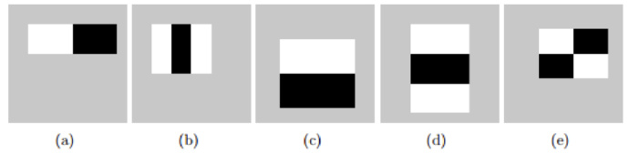
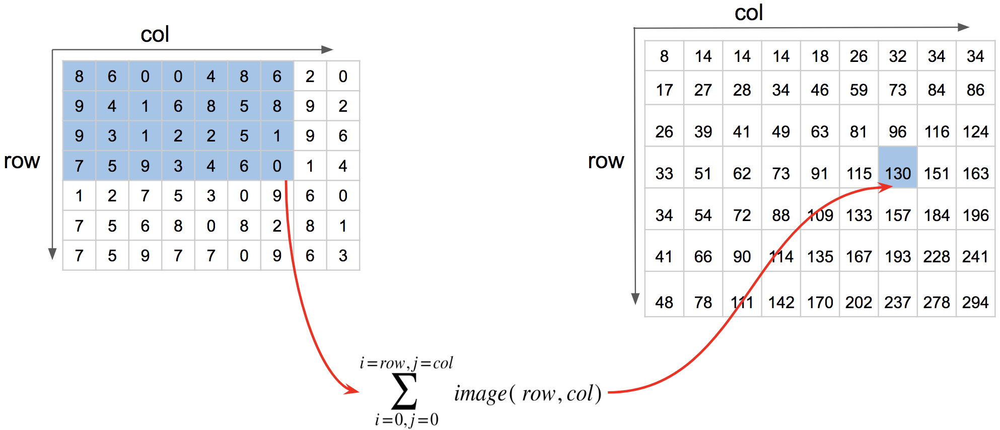

```python
import cv2
import numpy as np
import matplotlib.pyplot as plt
%matplotlib inline
%config InlineBackend.figure_format = 'retina'
```


```python
# 用于退出 opencv 的图片展示窗口
def exit_window(k):
    if k==27:
        cv2.destroyAllWindows()  #wait for ESC key to exit
```


```python
# 展示图片
def show_img(imgs,rows,cols,titles=None,figsize=(16,8),axis="off"):
    plt.figure(figsize=figsize)
    for i in range(rows*cols):
        if i < len(imgs):
            plt.subplot(rows, cols, i + 1)
            if titles != None:
                plt.title(titles[i])
            if len(imgs[i].shape) < 3:
                # 显示灰度图像
                plt.imshow(imgs[i],cmap = "gray")
            else:
                # 显示正常图像
                plt.imshow(imgs[i][:,:,::-1])
            plt.axis(axis)
    plt.show()
```


```python
yinhun = cv2.imread("./images/yinhun.jpg")
img = cv2.imread("./images/weilai.jpg")
img_gray = cv2.imread("./images/weilai.jpg",0)
longmao = cv2.imread("./images/longm.jpg")
longmao_gray = cv2.imread("./images/longm.jpg",0)
flower = cv2.imread("./images/flower.jpg")
flower_gray  = cv2.imread("./images/flower.jpg",0)
multi = cv2.imread("./images/multi.jpg")
multi_gray = cv2.imread("./images/multi.jpg",0)
```


```python
show_img([yinhun,img,longmao,flower],1,4,["yinhun","img","longmao","flower"])
```


# 直方图

直方图简单来说就是图像中每个像素值的个数统计，比如说一副灰度图中像素值为0的有多少个，1的多少个……直方图是一种分析图片的手段：


-在计算直方图之前，有几个术语先来了解一下：

- dims：要计算的通道数，对于灰度图dims=1
- range：要计算的像素值范围，一般为[0,256]（不包括256）
- bins：子区段数目，如果我们统计0~255每个像素值，bins=256；如果划分区间，比如0~15, 16~31…240~255这样16个区间，bins=16

【参考】
- [Python+OpenCV教程15：直方图](http://ex2tron.top/2017/12/23/Python-OpenCV%E6%95%99%E7%A8%8B15%EF%BC%9A%E7%9B%B4%E6%96%B9%E5%9B%BE/)

## 计算直方图
OpenCV和Numpy中都提供了计算直方图的函数，我们对比下它们的性能。

使用 `cv2.calcHist()` 计算，其中：

- `images`: 要计算的原图，以方括号的传入，如：[img], 
- `channels`: 类似前面提到的dims，灰度图写[0]就行，彩色图B/G/R分别传入[0]/[1]/[2],
- `mask`：要计算的区域，计算整幅图的话，写None
- `histSize`：前面提到的bins
- `ranges`：前面提到的range


```python
# opencv 中的计算
op_hist = cv2.calcHist([img_gray], [0], None, [256], [0,256])

# numpy 中的计算 需要将二维数组展开成一维
np_hist,bins = np.histogram(img_gray.ravel(),256,[0,256])

# 更高效的方式
gnp_hist = np.bincount(img_gray.ravel(), minlength=256)
```


```python
plt.figure(figsize=(16,4))
plt.subplot(141)
plt.imshow(img[:,:,::-1])
plt.subplot(142)
plt.title("cv2")
plt.plot(op_hist)
plt.subplot(143)
plt.title("numpy common")
plt.plot(np_hist)
plt.subplot(144)
plt.title("numpy hight")
plt.plot(gnp_hist)
plt.show()
```


## 直方图均衡化
副效果好的图像通常在直方图上的分布比较均匀，直方图均衡化就是用来改善图像的全局亮度和对比度。


OpenCV中用 `cv2.equalizeHist()` 实现均衡化。


```python
equ = cv2.equalizeHist(img_gray)
show_img([img_gray,equ],1,2,["origin","equalize"])
```


```python
equ_hist = cv2.calcHist([equ],[0],None,[256],[0,256])
plt.figure(figsize=(16,4))
plt.subplot(131)
plt.imshow(img_gray,"gray")
plt.title("origin")
plt.subplot(132)
plt.plot(op_hist)
plt.title("no equalize")
plt.subplot(133)
plt.plot(equ_hist)
plt.title("equalize")
plt.show()
```


## 自适应均衡化
不难看出来，直方图均衡化是应用于整幅图片的，会有什么问题呢？看下图：


很明显，因为全局调整亮度和对比度的原因，脸部太亮，大部分细节都丢失了。

自适应均衡化就是用来解决这一问题的：它在每一个小区域内（默认8×8）进行直方图均衡化。当然，如果有噪点的话，噪点会被放大，需要对小区域内的对比度进行了限制，所以这个算法全称叫：对比度受限的自适应直方图均衡化CLAHE:Contrast Limited Adaptive Histogram Equalization


```python
# 所有参数都是可选的
clahe = cv2.createCLAHE(clipLimit = 2.0,tileGridSize = (8,8))
clahe_img = clahe.apply(np.copy(img_gray))
show_img([img_gray,equ,clahe_img],1,3,["origin","use globel equalize","use clahe"])
```


# 模板匹配
即在模板中寻找物体匹配，需要使用到的函数为：`cv2.matchTemplate()`, `cv2.minMaxLoc()`.

## 单点匹配
就是用来在大图中找小图，也就是说在一副图像中寻找另外一张模板图像的位置，匹配方式如下：


`cv2.matchTemplate()` 匹配函数返回的是一副灰度图，最白的地方表示最大的匹配。使用 `cv2.minMaxLoc()` 函数可以得到最大匹配值的坐标，以这个点为左上角角点，模板的宽和高画矩形就是匹配的位置了.

其中 `cv2.matchTemplate()` 第三个参数提供了六种匹配方法：
- CV_TM_SQDIFF 平方差匹配：用两者的平方差来匹配，最好的匹配值为0
- CV_TM_SQDIFF_NORMED 归一化平方差匹配
- CV_TM_CCORR 相关匹配：用两者的乘积匹配，数值越大表明匹配程度越好
- CV_TM_CCORR_NORMED 归一化相关匹配
- CV_TM_CCOEFF 相关系数匹配：用两者的相关系数匹配，1表示完美的匹配，-1表示最差的匹配
- CV_TM_CCOEFF_NORMED 归一化相关系数匹配


```python
weilai_face = cv2.imread("./images/weilai_face.jpg", 0)
# 获取匹配图的宽高rows,cols
h,w = weilai_face.shape[:2]
template_method = {"TM_SQDIFF":cv2.TM_SQDIFF,"TM_SQDIFF_NORMED":cv2.TM_SQDIFF_NORMED,"TM_CCORR":cv2.TM_CCORR,
    "TM_CCORR_NORMED":cv2.TM_CCORR_NORMED,"TM_CCOEFF":cv2.TM_CCOEFF,"TM_CCOEFF_NORMED":cv2.TM_CCOEFF_NORMED}
def match_method(method):
    img_result = []
    keys = []
    for key in method:
        # 相关系数匹配方法：cv2.TM_CCOEFF
        result = cv2.matchTemplate(img_gray, weilai_face, method[key])
        
        # 返回最大最小元素的值及其所在位置,其中最大位置就是匹配值开始的坐标，即左上角
        minVal, maxVal, minLoc, maxLoc = cv2.minMaxLoc(result)

        right_bottom = (maxLoc[0] + w, maxLoc[1] + h)
        # 绘制出来
        img_copy = np.copy(img)
        cv2.rectangle(img_copy, maxLoc, right_bottom, (0,0,255), 2)
        img_result.append(img_copy)
        keys.append(key)
    return keys,img_result

keys,images = match_method(template_method)
show_img(images,2,3,keys)
```


需要对上图做一个补充说明，在进行匹配的时候像素的大小一定要匹配。就是说我们不同直接在屏幕上截图，然后用截图去做匹配的模板，这是因为截的图大小适合原图的大小不匹配的，我们需要提取的尺寸与原来的图匹配，否则在大小上就不匹配了，最终也找不到好的匹配结果。

## 匹配多个
前面我们是找最大匹配的点，所以只能匹配一次。我们可以设定一个匹配阈值来匹配多次。


```python
multi = cv2.imread("./images/multi.jpg")
temp = multi[22:88,22:88]
cv2.imwrite("./images/multi_face.jpg",temp)
multi_face = cv2.imread("./images/multi_face.jpg",0)
multi_gray = cv2.cvtColor(multi, cv2.COLOR_BGR2GRAY)
h,w = multi_face.shape[0:2]

result = cv2.matchTemplate(multi_gray, multi_face, cv2.TM_CCOEFF_NORMED)

threshold = 0.8
# 匹配程度大于%80的坐标 y,x ， 即找到配置读在 80% 以上的坐标
loc = np.where(result >= threshold)
# loc 的坐标是先 y 在 x 因此需要翻转一下
for pt in zip(*loc[::-1]):  # *号表示可选参数
    right_bottom = (pt[0] + w, pt[1] + h)
    cv2.rectangle(multi, pt, right_bottom, (0, 0, 255), 1)
show_img([multi_face,multi],1,2)
```


### 不同匹配算法效果


```python
## 相同阈值下不同匹配算法的效果
def mutil_alg(methods):
    img_result = []
    keys = []
    for key in methods:
        result = cv2.matchTemplate(multi_gray, multi_face, methods[key])

        threshold = 0.8
        # 匹配程度大于%80的坐标 y,x ， 即找到配置读在 80% 以上的坐标
        loc = np.where(result >= threshold)
        # loc 的坐标是先 y 在 x 因此需要翻转一下
        temp = np.copy(multi)
        for pt in zip(*loc[::-1]):  # *号表示可选参数
            right_bottom = (pt[0] + w, pt[1] + h)
            cv2.rectangle(temp, pt, right_bottom, (0, 0, 255), 1)
        img_result.append(temp)
        keys.append(key)
    return keys,img_result
keys,images = mutil_alg(template_method)
show_img(images,2,3,keys,figsize=(16,6))
```


### 不同阈值匹配效果


```python
# 同一个算法下，不同的阈值
def multi_threshold(thresholds):
    img_result = []
    result = cv2.matchTemplate(multi_gray, multi_face, cv2.TM_CCOEFF_NORMED)
    for num in thresholds:
        threshold = num
        # 匹配程度大于%80的坐标 y,x ， 即找到配置读在 80% 以上的坐标
        loc = np.where(result >= threshold)
        # loc 的坐标是先 y 在 x 因此需要翻转一下
        temp = np.copy(multi)
        for pt in zip(*loc[::-1]):  # *号表示可选参数
            right_bottom = (pt[0] + w, pt[1] + h)
            cv2.rectangle(temp, pt, right_bottom, (0, 0, 255), 1)
        img_result.append(temp)
    return img_result
thresholds = [0.1, 0.3, 0.5, 0.7, 0.9, 1]
show_img(multi_threshold(thresholds),2,3,thresholds, figsize=(16,6))
```


# 进阶

## 理解特征
我们是不是总可以用一些词语来描述一件物体，比如说描述人脸，我们可以说脸上有两只眼睛，一个鼻子和一个嘴巴，这其实就是特征。对于计算机来说，图片本身的二维矩阵就是最完整的特征，但我们有时也需要像描述人脸那样，让计算机提取一些显著的特征。

那计算机能理解的特征有哪些？如何找到这些特征呢？我们来看下这张图：


图的上面有6个小块，都是图中的某一部分。你能找到这6个小块在图中的具体位置吗？

- A和B很难确定具体的位置，因为它们在原图中的很多地方都有，可以把这些地方称为**扁平的区域**

- C和D相对容易点，因为它们是建筑物的边缘。虽然也比较难确定具体位置，但可以找到一个大致的位置

可以说**边缘**是比**扁平区域**更好的一种特征

- 最后，E和F就好找多了，因为它们是建筑物的**角点**。在角点位置上，不论将小块怎么移动，都会得到不同的结果

所以说角点是比边缘更好的一种特征:


- **蓝色**方块代表的扁平区域很难定位，因为不论移动到哪儿，结果都一样
- **黑色**方块表示边缘，如果我们垂直移动它，它就会改变，但水平移动，结果仍然不变
- **最后**红色方块表示角点，随便移动它，它都会改变，说明它是唯一的。所以，角点对图像来说就是一个比较好的特征。

既然知道了啥叫特征，那么如何找到这些特征呢？其实不难发现，对于角点，我们可以通过移动图像中的一个小区域，找出图像中变化量最大的地方，这就叫**特征检测**。找到特征后，我们可以这样描述图片：图的上面是天空，下面是一个建筑物，建筑物外层是玻璃等等，这就叫**特征描述**。

【参考】
- [Python+OpenCV教程18：理解特征](http://ex2tron.top/2018/02/15/Python-OpenCV%E6%95%99%E7%A8%8B18%EF%BC%9A%E7%90%86%E8%A7%A3%E7%89%B9%E5%BE%81/)

## Harris角点检测

### 角点类型

从上面我们知道，在角点处沿各个方向移动，像素值都会变化。Harris角点检测算法就是基于这个原理，常见的角点类型如下：


OpenCV 中拐角使用 `cv2.cornerHarris()` 实现，参数为：
- `src` : 单通道输入图像, 
- `blockSize`: 邻居尺寸, 
- `ksize`: Sobel算子的孔径参数(int)
- `k`: Harris算子参数(double)

【参考】
- [Python+OpenCV教程19：Harris角点检测](http://ex2tron.top/2018/02/16/Python-OpenCV%E6%95%99%E7%A8%8B19%EF%BC%9AHarris%E8%A7%92%E7%82%B9%E6%A3%80%E6%B5%8B/)


```python
dst = cv2.cornerHarris(multi_gray, 2, 3, 0.04)
print(len([dst > 0.1 * dst.max()][0]))
# 角点标记为红色（阈值可动态调整）
multi_copy = np.copy(multi)
multi_copy[dst > 0.1 * dst.max()] = [0, 0, 255]
show_img([multi_copy],1,1,figsize=(16,16))
```

    343


由于Harris角点检测算法是基于灰度图像的，所以首先进行了颜色空间转换。函数的输出dst是一个浮点型图像，大小跟输入相同，表示Harris角点检测的结果，浮点值越高，表示越可能是角点。所以在角点标记的时候，设定了一个阈值范围：0.01×最高浮点值，只要大于这个阈值就标记为角点。

### 理解算法
首先对于一个二阶矩阵：$M = \left[  \begin{matrix}    \lambda_1 & 0 \newline    0 & \lambda_2   \end{matrix}   \right]$
λ1和λ2称为M矩阵的特征值，那么M的行列式值和M的迹分别为：$detM = \lambda_1*\lambda_2  ， traceM = \lambda_1+\lambda_2$

再来看下椭圆的表示形式：


数学中，我们用 $\frac{x^2}{a^2}+\frac{y^2}{b^2}=1$ 表示，其实我们可以写成矩阵的形式：$\left[  \begin{matrix}    x & y   \end{matrix}   \right]\left[  \begin{matrix}    \frac{1}{a^2} & 0  \newline    0 & \frac{1}{b^2}   \end{matrix}   \right]\left[  \begin{matrix}    x  \newline    y   \end{matrix}   \right]=1$

把中间的矩阵当作M，这样我们就可以得到一个椭圆半轴与特征值的关系：显然，特征值λ越大，半轴a或b越短。

另外，我们还要用到泰勒展开，

一阶泰勒展开：$f(x+\Delta x) = f(x)+f\prime(x)\Delta x+\cdots+\frac{f\prime^n(x)}{n!}\Delta x+R_n(x)$ 

二阶泰勒展开：$f(x+\Delta x,y+\Delta y)=f(x,y)+f_x(x,y)\Delta x+f_y(x,y)\Delta y+\cdots+R_n(x,y)$

### 数学推到
Harris角点检测简单来说就是先选取一个矩形块，移动这个矩形块，然后计算像素间的差值。这个矩形块称为窗口，一般矩形块内的像素点权重不同，比如中间的像素点权重明显大于周边像素。综上，Harris算法模型可以用如下公式表示：
$$
\large{E(u,v)=\sum\limits_{x,y\in W}w(x,y)[I(x+u,y+v)-I(x,y)]^2}
$$
其中W表示窗口，w(x,y)就是窗口内像素点的权重，一般取高斯函数。我们把上面的公式用泰勒级数展开：
$$
\large{I(x+u,y+v)\approx I(x,y)+I_xu+I_yv}
$$

那么带入原公式：
$$
\large{E(u,v)=\sum w(x,y)(I_xu+I_yv)^2}
$$
其中，后面的一项我们可以展开后用矩阵的方式表示：
$$
\large{(I_xu+I_yv)^2=I_x^2u^2+I_y^2v^2+2I_xI_yuv= \left[  \begin{matrix}   u & v   \end{matrix}   \right] \left[  \begin{matrix}    I_x^2 & I_xI_y \newline    I_xI_y & I_y^2   \end{matrix}   \right]\left[  \begin{matrix}    u  \newline    v   \end{matrix}   \right]}
$$
这样：
$$
\large{E(u,v)=  \left[  \begin{matrix}   u & v   \end{matrix}   \right]{\sum w(x,y)\left[  \begin{matrix}    I_x^2 & I_xI_y \newline    I_xI_y & I_y^2   \end{matrix}   \right]}\left[  \begin{matrix}    u  \newline    v   \end{matrix}   \right] = \left[  \begin{matrix}  u & v   \end{matrix}   \right]M\left[  \begin{matrix}    u  \newline    v   \end{matrix}   \right]}
$$
M矩阵称为梯度协方差矩阵。同样地，我们把上面表达式当作一个椭圆的形式来看，假设λ1和λ2是M矩阵的两个特征值，那么Harris算法就根据这两个特征值判断角点：


- λ1和λ2都很小且两个值比较接近时，说明椭圆的两个半轴很长，所以可以视为扁平区域
- λ1和λ2一大一小且差距较大时，说明两个半轴一个长一个短，所以是边缘或线段
- λ1和λ2都很大时，说明椭圆两个半轴都很短，所以可以看作是角点

其实E(u,v)的表达式并不是标准的椭圆，但是可以类比理解。上面的计算量还是很大的，所以为了计算方便，Harris给出了一个角点响应函数R：$$R = detM-k(traceM)^2$$

k就是之前 `cv2.cornerHarris()` 函数中的Harris算子参数，一般取`0.04~0.06`。而之前的`ksize`参数表示的就是使用Sobel算子计算梯度时的卷积核大小，blockSize表示的就是`blockSize×blockSize`的窗口邻域大小。这样只需判断R的值就好了：


## Shi-Tomasi角点检测
【参考】
- [Python+OpenCV教程20：Shi-Tomasi角点检测](http://ex2tron.top/2018/02/17/Python-OpenCV%E6%95%99%E7%A8%8B20%EF%BC%9AShi-Tomasi%E8%A7%92%E7%82%B9%E6%A3%80%E6%B5%8B/)
### 理解算法

Shi-Tomasi算法是对Harris角点检测的改进，回顾一下，Harris角点响应函数R：$$R = detM-k(traceM)^2=\lambda_1\lambda_2-k(\lambda_1+\lambda_2)^2$$

可以看出Harris角点检测结果和k值有关，而Shi Jianbo和Tomasi两人发现角点的稳定性和M矩阵的较小特征值有关，所以在Shi-Tomasi算法中：$$R = min(\lambda_1,\lambda_2)$$

接下来与Harris一致，将R与阈值比较，大于阈值的就是角点。改进后的算法可以用下图表示：


从图中可以看出当λ1和λ2都大于一个阈值λmin时，才被认为时角点。

### OpenCV 的实现
因为Shi Jianbo和Tomasi两人在1994年发表的论文叫“Good features to track.”，所以OpenCV中用函数 `cv2.goodFeaturesToTrack()`来实现Shi-Tomasi算法, 其参数如下：
- `image`: 当通道输入图像, 
- `maxCorners`: 最大角点检测数量，若值小于等于0，表示返回所有检测到的角点, 
- `qualityLevel`: 质量等级，若此值为 0.1，且最佳质量指标是1500的话，那么角点质量小于 15 的就被丢弃。与0.01×dst.max()含义相同，可以理解成角点的概率，只有大于这个阈值的点才会被认为是角点
- `minDistance`: 返回角点之间最小可能的欧几里得距离, 单位为像素


```python
def draw_corner(corners):
    # 角点坐标
    corners = np.int0(corners)
    multi_copy2 = np.copy(multi)
    for i in corners:
        # 压缩至一维：[[62,64]]->[62,64]
        x, y = i.ravel()
        cv2.circle(multi_copy2, (x, y), 4, (0, 0, 255), -1)
    return multi_copy2

corners  = cv2.goodFeaturesToTrack(multi_gray, 0, 0.1, 10)
corners1 = cv2.goodFeaturesToTrack(multi_gray, 0, 0.1, 90)
show_img([draw_corner(corners),draw_corner(corners1)],1,2,
         ["shi-tomas: QT=0.1 MD=10 corners="+str(len(corners)),
          "shi-tomas: QT=0.1 MD=90 corners="+str(len(corners1))],figsize=(16,16))

corners  = cv2.goodFeaturesToTrack(multi_gray, 0, 0.1, 50)
corners1 = cv2.goodFeaturesToTrack(multi_gray, 0, 0.5, 50)
show_img([draw_corner(corners),draw_corner(corners1)],1,2,
         ["shi-tomas: QT=0.1 MD=50 corners="+str(len(corners)),
          "shi-tomas: QT=0.5 MD=50 corners="+str(len(corners1))],figsize=(16,16))
```


```python
total = 0
for i in range(1,25,1):
    total += (24 - i + 1) ** 2
print(total * 5)
```

    24500


## 人脸 Haar 特征快速检测

【参考】
1. [百度百科 - 积分图像](https://baike.baidu.com/item/%E7%A7%AF%E5%88%86%E5%9B%BE%E5%83%8F)
1. [wikipedia - 积分图](https://zh.wikipedia.org/wiki/%E7%A7%AF%E5%88%86%E5%9B%BE)
1. [积分图像(Integral Image)与积分直方图 (Integral Histogram) ](http://blog.sina.com.cn/s/blog_5562b0440102wgxs.html)
1. [Number of haar like features in 24x24 window](https://stackoverflow.com/questions/40198217/number-of-haar-like-features-in-24x24-window)
1. [【图像处理】计算Haar特征个数](https://blog.csdn.net/xiaowei_cqu/article/details/8216109)
1. [人脸Haar特征与快速计算神器：积分图](https://cloud.tencent.com/developer/article/1052285)
1. [机器视觉中的图像积分图及其实现](https://blog.csdn.net/baimafujinji/article/details/50466224)
1. [特征提取之Haar特征](https://blog.csdn.net/xizero00/article/details/46929261)
1. [FACE DETECTION USING OPENCV AND PYTHON: A BEGINNER’S GUIDE](https://www.superdatascience.com/opencv-face-detection/)
1. [OpenCV - Face Detection using Haar Cascades](https://docs.opencv.org/3.4.1/d7/d8b/tutorial_py_face_detection.html)
1. [原始论文 - An extended set of Haar-like features for rapid object detection](https://pdfs.semanticscholar.org/8ee7/84e553ed71c26ba73a6e4b436c79317e34b9.pdf)

Haar-like 快速特征检测使用的特征矩形有如下几种类型：


对角线特征在原始的论文中没有使用。

特征值的计算方式如下：将黑色区域内的像素值的和减去白色像素内的和。如下图：


即，将矩形区域内的紫色区域数字之和减去青色区域内数字之和，得到的就是特征值：


###  Haar 特征数量的计算

以一个 24 × 24 的窗口为例，且使用下图中的特征矩形：



那么对于 (a) 存在都少可能的特征矩形呢？可以看到矩形的宽高比为 2:1 ，宽高可取的范围都为 24 ，即宽取1 ~ 24内的偶数，高 1 ~ 24，那么所有可能的组合就为（高 × 宽）：1x2, 1x4, 1x6, 1x8, ..., 1x24, 2x2, 2x4, 2x6, 2x8, ..., 2x24, 3x2, 3x4, 3x6, ..., 一直到 24x24.

同理 (b) 的宽高比为 3:1 ,宽的取值需要时 3 的倍数，高的取值则是连续数。

那么，每一种可能的特征矩形（如 2x2）可产生的特征数为(24 - weight + 1)(24 - height + 1)。


```python
# W/H 表示窗口的大小，w/h 表示特征矩形的宽高（最小情况下）
def calc_haar_count(W,H,w,h):
    total = 0
    # 特征矩形的宽可能取值
    for i in range(w,W+1,w):
        # 特征矩形的高可能取值
        for j in range(h,H+1,h):
            # 每种特征矩形产生的特征数量
            total += (W - i + 1) * (H - j + 1)
    return total
# a 2:1
print(calc_haar_count(24,24,2,1))
# b 3:1
print(calc_haar_count(24,24,3,1))
# c 1:2
print(calc_haar_count(24,24,1,2))
# d 1:3
print(calc_haar_count(24,24,1,3))
# e 2:2
print(calc_haar_count(24,24,2,2))
```

    43200
    27600
    43200
    27600
    20736


可以看到五种特征矩形的宽高比分别为：(a) 2:1,(b) 3:1, (c) 1:2, (d) 1:3,(e) 2:2. 那么每种类型的特征值数量为：43200, 27600, 43200, 27600, 20736。总计为 160381 。五种可能的类型就产生了 16 万以上的特征值，这个是一个非常大数字了，如果把全部的可能都考虑上那计算量可想而知。

还有一种计算公式是作者在论文中提出来的，对于非旋转的可以使用：$$ XY(W + 1 - w\frac {X + 1}{2})(H + 1 - h\frac{Y + 1}{2}) $$
其中 $W×H$ 表示图片的宽高，$w×h$ 表示特征矩形的宽高，$X=\frac{W}{w}$,$Y=\frac{H}{h}$ 表示在水平以及垂直方向的缩放系数。

如上面的例子，其中 $W×H$ 为 24×24，对于 (a) 来说 $w×h$ 为 2×1，那么可以计算出 X 为 12，Y 为 24。因此特征数量为$$ 12×24×(24 + 1 - 2\frac {12 + 1}{2})×(24 + 1 - 1\frac{24 + 1}{2}) = 43200$$ 
与上面的计算结果是一致的。

对于产生旋转的特征矩形，特征矩形的宽高需要产生变化，X/Y 需要按照新特征矩形的宽高来重新计算。新的特征矩形的计算如下图：


新的计算公式如下：$$ XY(W + 1 - z\frac {X + 1}{2})(H + 1 - z\frac{Y + 1}{2}) $$
其中 $z=w+h$，那么 $X = \frac{W}{z}$，$Y = \frac{W}{z}$

### 积分图

积分图（**integral image**），又称总和面积表（ ** summed area table ** ，简称SAT）. 对于一幅灰度的图像，积分图像中的任意一点(x,y)的值是指从图像的左上角到这个点的所构成的矩形区域内所有的点的灰度值之和。如下图



即求第4行第7列的分I(4,7)，就是让左上角蓝色区域内的值求和，所得的值就是 I(4,7) 的积分值，即130.

不仅可以计算左上角的积分值，还可以计算任意矩形区域内的积分值，如下图：


上面的公式虽然可以计算积分值，但是当图片的尺寸扩大计算量是非常大的，此时我们就可以使用积分图来进行高效的计算。

首先我们需要获取一张图的积分图，积分图的算法构建如下：
1. 用 $s(i,j)$ 表示行方向的累加和，初始化$s(i,-1)=0$，每一行的初始值为 0；
2. 用 $ii(i,j)$ 表示一个积分图像，初始化 $ii(-1,j)=0$，每一列的初始值为 0 ；
3. 逐行扫描图像，计算每个像素 $(i,j)$ 行方向的累加和 $s(i,j)$ 和积分图像 $ii(i,j)$ 的值：
$$s(i,j)=s(i,j-1)+i(i,j) \quad(1)\\ ii(i,j)=ii(i-1,j)+s(i,j) \quad(2)$$
4. 扫描图像一遍，当到达图像右下角像素时，积分图像ii就构造好了。

上面的公式(1)和(2)是两个递推公式。这样我们就计算好了积分图，在 google Spreadsheets 中计算积分图也很方便。

再看下面这幅图，其中 A、B、C、D 表示一张图中的四个区域，1、2、3、4 表示 D 区域的四个顶点。


那么如何计算出 D 区域的积分图呢？

可以看到 1 点的积分图为 A 矩形区域内的和即rectsum(A),同理可得出2、3、4点的积分图，即：
- ii(1) = rectsum(A)
- ii(2) = rectsum(A) + rectsum(B)
- ii(3) = rectsum(A) + rectsum(C)
- ii(4) = rectsum(A) + rectsum(B) + rectsum(C) + rectsum(D)

那么依此就可以算出 D 区域内的总和为 rectsum(D) = ii(4) + ii(1) - ii(2) - ii(3)。

### 计算积分图
可以看出一个区域内值的和只与此区域内的四个顶点（A、B、C 区域的右下角）的积分图有关。如下图，


可以看到 D 区域内使用上述方法计算时，1、2、3、4点在积分图中对应的四个点（蓝色圈中的点）为：
- ii(1) = 49
- ii(2) = 96
- ii(3) = 88
- ii(4) = 157

那么 ii(D) = ii(4) + ii(1) - ii(2) - ii(3) = 157 + 49 - 96 - 88 = 22 ，计算的结果正是 D 区域内所有元素的和。

那么对于 haar 特征矩形该如何算呢？如下图：


我们可以看到 如果是二矩形需要在积分图中查找 6 次，三矩形需要查找 8 次就可以得到计算 haar 特征的所有值。二阶矩形的 haar 特征值计算为黑色区域内的和减去白色区域内的和，那么：
- $sum(black) = ii(4) + ii(1) - ii(2) - ii(3) = 62 + 8 - 14 - 33 = 23$
- $sum(white) = ii(4) + ii(1) - ii(2) - ii(3) = 91 + 14 - 18 - 62 = 25$

$haar \ value = sum(black) - sum(white) = 23 - 25 = -2$

**其他特征矩形的计算与此类似，旋转特征矩形的计算暂时没有看，可以参考原始论文中的方法。**

# 相关原理

## 图片不变性原理——hu矩
图像的hu矩是一种具有平移、旋转和尺度不变性的图像特征。

在 OpenCV 中计算 hu 矩使用 `matchShapes()` 方法，该方法也可以选择其他的计算方法，返回的值越小，说明两个轮廓或者形状就越相似。


```python
a = np.array([[796, 549], [717, 575], [746, 576], [702, 603], [649, 590], [672, 580], [582, 601], [558, 635], [604, 612], [662, 628], [649, 637], [689, 638], [777, 575], [802, 576]])
b = np.array([[800, 553 ], [720, 577 ], [746, 577 ], [695, 605 ], [641, 593 ], [671, 579 ], [579, 602 ], [557, 630 ], [597, 612 ], [655, 627 ], [639, 636 ], [675, 635 ], [771, 577 ], [796, 577 ] ])

ab = cv2.matchShapes(a,b,1,0)
aa = cv2.matchShapes(a,a,1,0)
print(ab,aa)
```

    5.2899630893270135 0.0


## SURF 特征检测


## 其他

LOG算子(Laplacian of Gaussian)：是高斯和拉普拉斯的双结合，即集平滑和边沿于一身的算子模型
- [LOG高斯-拉普拉斯算子](https://blog.csdn.net/Touch_Dream/article/details/62237018)

DoG算子(Difference  of Gaussian)
