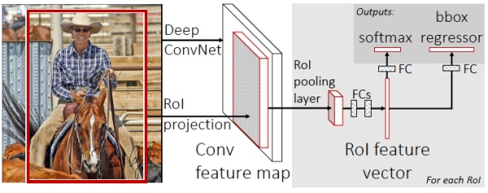
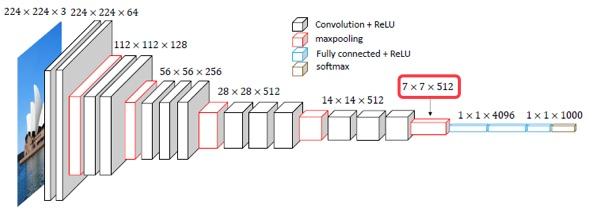

# 简介

Fast R-CNN 论文地址[《Fast R-CNN》](https://arxiv.org/pdf/1504.08083.pdf)，论文发表于2015年，是对 R-CNN 的升级。论文给出了使用 python 与 C++实现的可用的开源代码，GitHub 的地址为 [fast-rcnn](https://github.com/rbgirshick/fast-rcnn)。Fast R-CNN 的全称为 Fast Region-based Convolutional Network，采用了新方法来提高训练和测试的速度，同时提高了检测的精确度。与 R-CNN 训练 VGG16 相比，Fast-RCNN 是他的速度的 9 被，测试速度更达到了 213 倍，也获得了更高的 mAP。与 SPPnet 在训练 VGG16 相比，Fast R-CNN 是他速度的 3 倍，测试时间的 10 倍。

把之前分散的过程统一成一个阶段，在一个阶段内完成所有的工作。在运行时处理一张图片只需要 0.3 秒，但可以获得 66% 的 mAP。

R-CNN 的缺点：
- 训练是多阶段的：首先使用log loss 在目标建议（object proposal）上微调ConvNet；然后让 SVM 适应 ConvNet 的特征；最后训练 bounding-box regressor。
- 在时间和空间上训练代价昂贵
- 目标检测速度慢：使用 VGG16 在 GPU 上每张图片需要 47秒

R-CNN 之所以这么慢，是因为他要对每一个候选区（object proposal）执行向前传播，而没有分享计算。SPPNet 通过分享计算来加速 R-CNN 的计算，他在整个输入图片上计算特征映射（feature map），然后使用从共享特征映射上提取的特征向量（feature vector）进行候选区域的分类。但 SPPNet 依然存在 R-CNN 类似的多阶段训练问题，提取特征、使用 log loss 微调网络、训练 SVMs、最后匹配 bounding-box regressor。

论文中提出了新的方法来改善这些问题，这个方法叫 Fast R-CNN 她有以下几个优势：
- 比 R-CNN、SPPNet 更高的检测质量（mAP）
- 训练只有一个阶段，使用多任务 loss（multi-task loss）
- 训练可以更新所有的网络层
- 对于特征缓存（feature caching）没有硬盘存储

[参考]

- [Ross Girshick - fast r-cnn slides](http://link.zhihu.com/?target=http%3A//www.robots.ox.ac.uk/%7Etvg/publications/talks/fast-rcnn-slides.pdf)
- [CSDN - 【目标检测】Fast RCNN算法详解](http://link.zhihu.com/?target=https%3A//blog.csdn.net/shenxiaolu1984/article/details/51036677)

# 结构

他把整个图片和一组候选区域（object proposal）作为输入。首先通过几个卷积层和最大池化层在整个图片上产生卷积特征映射（conv feature map）。对于每个候选区域，RoI（region of interest） 池化层从特征映射（feature map）中提取固定长度的特征向量（feature vector）。每个特征向量被喂入全卷积序列层中，最终全卷积序列层会分成两股，一个是在 K 个类别和全方位的背景类上进行评估的 softmax，和另一个对每一个 K 类产生 4 个实数值，这四个值用来修正 bounding-box 的位置。

实验使用三个在 ImageNet 上预训练的模型，每个模型包含五个池化层和5~13个卷积层。在初始化 Fast R-CNN 是需要做三次转换：

- 首先，最后一层 max pooling 使用 RoI max pooling 替代，为了适应第一层全连接层（VGG16 最后一层 max pool 的输出为 7×7 ）RoI max pooling 的 H 和 W要和他兼容，即 H×W 为 7×7。

- 其次，最后一个全连接层和 softmax 被替换成两个前文描述的子层:

  

- 最后，网络被修改成接收两类数据：一组图片和这些图片的一组 RoIs

代价函数的构成如下图:

# 操作

## ROI 池化

论文中提到使用 RoI 池化，RoI 池化层使用最大化池化层将任何有效的 RoI 区域内的特征转换成固定的空间范围 H×W。H、W 是依赖于特殊 RoI 的超参，在论文中 RoI 是转换成卷积特征映射的矩形窗口。每一个 RoI 通过四元组定义（r，c，h，w），指定左上角为（r，c），高宽为（h，w）。

RoI 的具体操作如下，使用 h×w 大小的 RoI窗口划分成 H×W 的子窗口，每个子窗口的大小近似为 h/H × w/W ，然后在每个子区域上使用最大池化操作，得到大小为 H×W 的输出。池化的操作是在每个特征映射channel 独立操作，池化是标准的最大池化操作。

如一张320×320的图片，经过 VGG16 特征提取，累积的 stride 的为32（经过了5个池化层，每个池化层的 stride 为2），最终的输出为 10×10 大小的特征映射。其中的一个 RoI 在原图大小为 224×224 那么在最终的输出就为 7×7，在 10×10 中坐标为（1，2，7，7）如下图：

 因为最终输出的 feature map 的大小为 2×2（H×W），原 h、w 的大小为 7×7，因此每个子窗格的大小为 7/2×7/2 ，可以看到没有得到整数，因此这里就有了两种划分方式一种是舍去小数部分，即每个子窗口的大小为3×3，不舍的则是编程划分成3和4两种长度，然后在每个子窗口中进行 max pooling 操作，如下图：

有舍的操作会有问题，可以通过 RoI align 解决，过程可查看参考资料。

[参考]

- [reddit - I am struggling to understand the difference between max pooling and RoI max pooling.](http://link.zhihu.com/?target=https%3A//www.reddit.com/r/MachineLearning/comments/4wsv4e/i_am_struggling_to_understand_the_difference/)
- [reddit - Why does Mask RCNN use Max ROI Pooling? Why not average?](http://link.zhihu.com/?target=https%3A//www.reddit.com/r/computervision/comments/8wowmu/why_does_mask_rcnn_use_max_roi_pooling_why_not/)
- [个站 - Region of interest pooling explained](http://link.zhihu.com/?target=https%3A//deepsense.ai/region-of-interest-pooling-explained/)
- [CSDN - ROI Pooling层详解](http://link.zhihu.com/?target=https%3A//blog.csdn.net/AUTO1993/article/details/78514071) 对上文的翻译，可以看看评论
- [leanote - 详解 ROI Align 的基本原理和实现细节](http://link.zhihu.com/?target=http%3A//blog.leanote.com/post/afanti.deng%40gmail.com/b5f4f526490b)
- [github - deepsense-ai/roi-pooling](http://link.zhihu.com/?target=https%3A//github.com/deepsense-ai/roi-pooling) 动图与实现

# 问题

## 什么是端对端（end-to-end）

看了几篇论文中都有提到 end-to-end，看论文中也没明白这个是什么意思，在网上找找资料，发现各说纷纭也不知道谁的更准确。根据 QUORA 和知乎上的回答，下面是我自己的理解，紧局限在 RCNN 或者物体检测领域，其他领域我也不太清楚他们是怎么定义的。

在 RCNN 中，进行物体检测需要分两个步奏，首先要进行提取候选区域（region proposals），然后使用 CNN 进行判断、bbox regression 确定位置。这就是说前期我需要对输入数据进行很多的预处理，经过预处理之后我在使用这些数据。而在 end-to-end 中，输入数据不需要进行预处理，通过模型我就可以直接得到结果，即给你输入你给我输出。
在 quora 的回答中，提到并没有 end-to-end model 这一说，但在知乎的回答中有提到，具体那个更正确，这个就是仁者见仁智者见智了。

在 Coursera 上 Andrew ng 有一个关于 end-to-end 深度学习模型的视频，介绍的比较清楚。里面提到 end-to-end 就是整合之前分散的过程到一个里面，所有的工作都由深度模型来完成，直接学习从输入 x 到 y 的映射。但 end-to-end 需要较多的数据，只有在非常大的数据量的时候才会有更好的表现。在数据量较小的情况下，传统的方法会更有优势。具体哪个方法更好，还需要看应用的场景。

[参考]

- [coursera - What is end-to-end deep learning?](http://link.zhihu.com/?target=https%3A//www.coursera.org/lecture/machine-learning-projects/what-is-end-to-end-deep-learning-k0Klk)
- [知乎 - 什么是 end-to-end 神经网络？](https://www.zhihu.com/question/51435499)
- [quora - What does end to end mean in deep learning methods?](http://link.zhihu.com/?target=https%3A//www.quora.com/What-does-end-to-end-mean-in-deep-learning-methods/answer/Alan-Lockett-2)
- [简书 - end-to-end 究竟是什么意思](http://link.zhihu.com/?target=https%3A//www.jianshu.com/p/3702dcda603c)

## 从预训练模型中初始化

使用 SVD 与不是用 SVD 对比图

训练与测试时间对比图

模型结构微调对比图

可以看到从 conv2_1 开始训练只比 conv3_1 提高了 0.3 个百分点，且耗费的时间更长，因此从 conv3_1 开始训练时更好的选择。

对比多种方法的影响

multi-task training

Multi-task training (forth column per group) improves mAP over piecewise training (third column per group).

Scale invariance

Table 7. Multi-scale(5) vs. single scale(1)

more training data

SVMs or softmax

more proposals

[参考汇总]

- [Ross Girshick - fast r-cnn slides](http://link.zhihu.com/?target=http%3A//www.robots.ox.ac.uk/%7Etvg/publications/talks/fast-rcnn-slides.pdf)
- [CSDN - 【目标检测】Fast RCNN算法详解](http://link.zhihu.com/?target=https%3A//blog.csdn.net/shenxiaolu1984/article/details/51036677)
- [Ross Girshick - fast r-cnn slides](http://link.zhihu.com/?target=http%3A//www.robots.ox.ac.uk/%7Etvg/publications/talks/fast-rcnn-slides.pdf)
- [reddit - I am struggling to understand the difference between max pooling and RoI max pooling.](http://link.zhihu.com/?target=https%3A//www.reddit.com/r/MachineLearning/comments/4wsv4e/i_am_struggling_to_understand_the_difference/)
- [reddit - Why does Mask RCNN use Max ROI Pooling? Why not average?](http://link.zhihu.com/?target=https%3A//www.reddit.com/r/computervision/comments/8wowmu/why_does_mask_rcnn_use_max_roi_pooling_why_not/)
- [个站 - Region of interest pooling explained](http://link.zhihu.com/?target=https%3A//deepsense.ai/region-of-interest-pooling-explained/)
- [CSDN - ROI Pooling层详解](http://link.zhihu.com/?target=https%3A//blog.csdn.net/AUTO1993/article/details/78514071) 对上文的翻译，可以看看评论
- [leanote - 详解 ROI Align 的基本原理和实现细节](http://link.zhihu.com/?target=http%3A//blog.leanote.com/post/afanti.deng%40gmail.com/b5f4f526490b)
- [github - deepsense-ai/roi-pooling](http://link.zhihu.com/?target=https%3A//github.com/deepsense-ai/roi-pooling) 动图与实现
- [coursera - What is end-to-end deep learning?](http://link.zhihu.com/?target=https%3A//www.coursera.org/lecture/machine-learning-projects/what-is-end-to-end-deep-learning-k0Klk)
- [知乎 - 什么是 end-to-end 神经网络？](https://www.zhihu.com/question/51435499)
- [quora - What does end to end mean in deep learning methods?](http://link.zhihu.com/?target=https%3A//www.quora.com/What-does-end-to-end-mean-in-deep-learning-methods/answer/Alan-Lockett-2)
- [简书 - end-to-end 究竟是什么意思](http://link.zhihu.com/?target=https%3A//www.jianshu.com/p/3702dcda603c)

