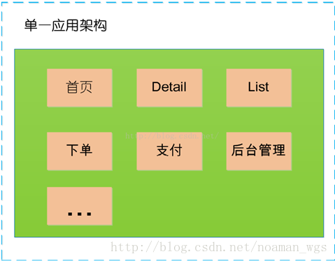
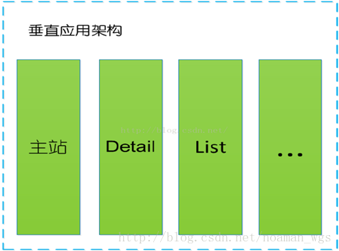
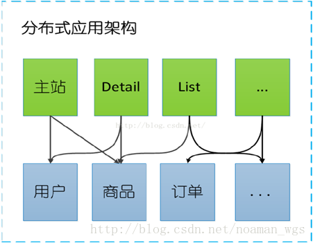
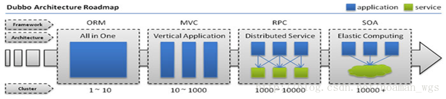

# Dubbo背景和简介

- [Dubbo入门---搭建一个最简单的Demo框架](https://blog.csdn.net/noaman_wgs/article/details/70214612)

Dubbo开始于电商系统，因此在这里先从电商系统的演变讲起。

**1、单一应用框架(ORM)**
当网站流量很小时，只需一个应用，将所有功能如下单支付等都部署在一起，以减少部署节点和成本。
缺点：单一的系统架构，使得在开发过程中，占用的资源越来越多，而且随着流量的增加越来越难以维护

**2、垂直应用框架(MVC)**
垂直应用架构解决了单一应用架构所面临的扩容问题，流量能够分散到各个子系统当中，且系统的体积可控，一定程度上降低了开发人员之间协同以及维护的成本，提升了开发效率。
*缺点：但是在垂直架构中相同逻辑代码需要不断的复制，不能复用。*

**3、分布式应用架构(RPC)**
当垂直应用越来越多，应用之间交互不可避免，将核心业务抽取出来，作为独立的服务，逐渐形成稳定的服务中心

**4、流动计算架构(SOA)**
随着服务化的进一步发展，服务越来越多，服务之间的调用和依赖关系也越来越复杂，诞生了面向服务的架构体系(SOA)，也因此衍生出了一系列相应的技术，如对服务提供、服务调用、连接处理、通信协议、序列化方式、服务发现、服务路由、日志输出等行为进行封装的服务框架

从以上是电商系统的演变可以看出架构演变的过程：

- 单一应用架构
  - 当网站流量很小时，只需一个应用，将所有功能都部署在一起，以减少部署节点和成本。
  - 此时，用于简化增删改查工作量的 数据访问框架(ORM) 是关键。

- 垂直应用架构
  - 当访问量逐渐增大，单一应用增加机器带来的加速度越来越小，将应用拆成互不相干的几个应用，以提升效率。
  - 此时，用于加速前端页面开发的 Web框架(MVC) 是关键。
- 分布式服务架构
  - 当垂直应用越来越多，应用之间交互不可避免，将核心业务抽取出来，作为独立的服务，逐渐形成稳定的服务中心，使前端应用能更快速的响应多变的市场需求。
  - 此时，用于提高业务复用及整合的 分布式服务框架(RPC) 是关键。
- 流动计算架构
  - 当服务越来越多，容量的评估，小服务资源的浪费等问题逐渐显现，此时需增加一个调度中心基于访问压力实时管理集群容量，提高集群利用率。
  - 此时，用于提高机器利用率的 资源调度和治理中心(SOA) 是关键。

