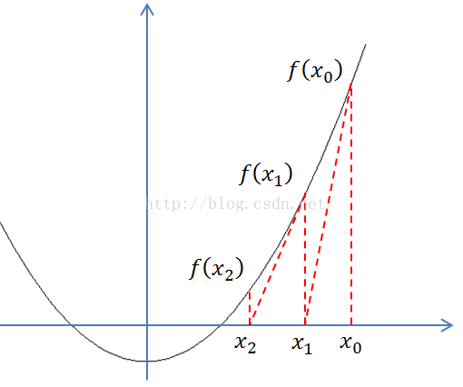
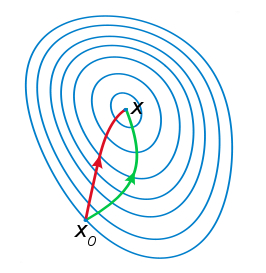

# 牛顿法
【参考】
- [csdn - 机器学习中常见的几种最优化方法](https://blog.csdn.net/owen7500/article/details/51601627)
- [掘金 - 机器学习之牛顿法](https://juejin.im/post/5a0cefe36fb9a045030fa176)

牛顿法是一种在实数域和复数域上近似求解方程的方法。方法使用函数 $f(x)$ 的泰勒级数的前面几项来寻找方程 $f(x) = 0$ 的根和极值的方法。**牛顿法最大的特点就在于它的收敛速度很快。**

## 泰勒公式

首先看泰勒公式，对于函数，如果函数平滑且某点存在各阶导数，则可以用一个多项式来描述该点邻域的近似值。公式如下：
$$
\large{
\begin{split}
f(x) = \sum_{n=0}^{\infty}f^{(n)}(x_0)\times \frac{1}{n!}(x - x_0)^{n}
\end{split}
}\tag{1}
$$

## 牛顿法步骤

首先，选择一个接近函数 $f(x)$ 零点的 $x_0$，计算相应的 $f(x_0)$ 和切线斜率 $f'(x_0)$。然后计算穿过点$(x_0, f(x_0))$并且斜率为 $f'(x_0)$ 的直线和 x 轴的交点 x 坐标，也就是求解方程：
$$
\large{
\begin{split}
x·f'(x) + f(x_0) - x_0·f'(x_0) = 0
\end{split}
}\tag{2}
$$

我们将新求得的点的 x 坐标命名为 $x_1$，通常 $x_1$ 会比 $x_0$ 更接近方程 $f(x) = 0$ 的解。因此我们现在可以利用$x_1$ 开始下一轮迭代。迭代公式可化简为如下所示：
$$
\large{
\begin{split}
x_{n + 1} = x_n - \frac{f(x_n)}{f'(x_n)}
\end{split}
}\tag{3}
$$

已经证明，如果 $f'$ 是连续的，并且待求的零点 x 是孤立的，那么在零点x周围存在一个区域，只要初始值 $x_0$ 位于这个邻近区域内，那么牛顿法必定收敛。 并且，如果 $f'(x)$ 不为0, 那么牛顿法将具有平方收敛的性能. 粗略的说，这意味着每迭代一次，牛顿法结果的有效数字将增加一倍。下图为一个牛顿法执行过程的例子。

由于牛顿法是基于当前位置的切线来确定下一次的位置，所以牛顿法又被很形象地称为是 **"切线法"**。牛顿法的搜索路径（二维情况）如下图所示：

## 牛顿法与 SGD 比较
- [知乎 - 最优化问题中，牛顿法为什么比梯度下降法求解需要的迭代次数更少？](https://www.zhihu.com/question/19723347/answer/104366845)

从本质上去看，牛顿法是二阶收敛，梯度下降是一阶收敛，所以牛顿法就更快。为什么牛顿法是二阶收敛呢？

首先这是牛顿的基本公式：
$$
\large{
\begin{split}
x_{n + 1} = x_n - \frac{f(x_n)}{f'(x_n)}
\end{split}
}
$$
上面这个标准式子是为了求 $f(x) = 0$ 的时候，x 的值。但是迭代收敛的时候我们用的不是这个式子。最优化问题时，一般是为了求 $min\left(f(x)\right)$ ，即 $f'(x) = 0$, 极值点 x。也就是实际迭代我们用的是下面这个式子：
$$
\large{
\begin{split}
x_{n+1} = x_{n} - \frac{f'(x)}{f''(x)} 
\end{split}
}\tag{4}
$$

这样对二阶收敛就比较直观了。

推到过程如下：假设函数 $f(x)$ 二次可微，则$f(x)$在 $x=x_0$处二次泰勒展开，
$$
\large{
\begin{split}
f(x) \approx g(x) = f(x_0) + f'(x_0)(x - x_0) + \frac{1}{2}f''(x_0)(x-x_0)^2
\end{split}
}\tag{5}
$$

$g(x)$ 多项式则为 $f(x)$ 的近似，求函数 $f(x)$ **极值**则可以转化为求导函数为 0，对 $g(x)$ 求导并令其为 0:
$$
\large{
\begin{split}
f'(x_0) + f''(x_0)(x-x_0) = 0
\end{split}
}
$$

得到：
$$
\large{
\begin{split}
x = x_{0} - \frac{f'(x_0)}{f''(x_0)} 
\end{split}
}
$$

即：
$$
\large{
\begin{split}
x_{n+1} = x_{n} - \frac{f'(x)}{f''(x)} 
\end{split}
}
$$

新的点$x_{k+1}$不断逼近极值，直到一次导数小于某误差。

如果更通俗地说的话，比如你想找一条最短的路径走到一个盆地的最底部，梯度下降法每次只从你当前所处位置选一个坡度最大的方向走一步，牛顿法在选择方向时，不仅会考虑坡度是否够大，还会考虑你走了一步之后，坡度是否会变得更大。所以，可以说牛顿法比梯度下降法看得更远一点，能更快地走到最底部。（**牛顿法目光更加长远，所以少走弯路；相对而言，梯度下降法只考虑了局部的最优，没有全局思想**）

根据wiki上的解释，从几何上说，牛顿法就是用一个二次曲面去拟合你当前所处位置的局部曲面，而梯度下降法是用一个平面去拟合当前的局部曲面，通常情况下，二次曲面的拟合会比平面更好，所以牛顿法选择的下降路径会更符合真实的最优下降路径。如下图（红色的牛顿法的迭代路径，绿色的是梯度下降法的迭代路径。）：

## 牛顿法与 Hessian 的关系
【参考】
- [csdn - 牛顿法与Hessian矩阵](https://blog.csdn.net/linolzhang/article/details/60151623)

以上牛顿法的推导 是针对 单变量问题，对于多变量的情况，牛顿法 演变为：
$$
\large{
\begin{split}
x_{n+1} &= x_{n} - \frac{f'(x)}{f''(x)} = x_{n} - \frac{J_f(x_n)}{H(x_n)}\\
&= x_n - H^{-1}(x_n)·J_f(x_n)
\end{split}
}\tag{6}
$$

或者是如下形式：
$$
\large{
\begin{split}
x_{n+1} &= x_n - [Hf(x_n)]^{-1}\nabla f(x_n),\; n \ge 0
\end{split}
}\tag{7}
$$

其中 J 定义为 **雅克比矩阵**，对应一阶偏导数：
$$
\large{
\begin{split}
J_f(x_n) = \begin{bmatrix}
\frac{\partial y_1}{\partial x_1} & \cdots & \frac{\partial y_1}{\partial x_n} \\
\vdots & \ddots & \vdots \\
\frac{\partial y_m}{\partial x_1} & \cdots & \frac{\partial y_m}{\partial x_n} \\
\end{bmatrix}
\end{split}
}\tag{8}
$$

H 为 Hessian矩阵，对应二阶偏导：
$$
\large{
\begin{split}
H(f) = \begin{bmatrix}
\frac{\partial^2 f}{\partial^2 x_1} & \frac{\partial^2 f}{\partial x_1 \partial x_2} & \cdots & \frac{\partial^2 f}{\partial x_1 \partial x_n} \\
\frac{\partial^2 f}{\partial x_2\partial x_1} & \frac{\partial^2 f}{\partial^2 x_2} & \cdots & \frac{\partial^2 f}{\partial x_2 \partial x_n} \\
\vdots & \vdots & \ddots & \vdots \\
\frac{\partial^2 f}{\partial x_n\partial x_1} & \frac{\partial^2 f}{\partial x_n\partial x_2} & \cdots & \frac{\partial^2 f}{\partial^2 x_n}
\end{bmatrix}
\end{split}
}\tag{9}
$$

牛顿法 在多变量问题上仍然适用迭代求解，但Hessian矩阵的引入增加了复杂性，特别是当：
- Hessian 矩阵非正定（非凸）导致无法收敛；
- Hessian 矩阵维度过大带来巨大的计算量。

针对这个问题，在 牛顿法无法有效执行的情况下，提出了很多改进方法，比如 拟牛顿法（Quasi-Newton Methods）可以看作是牛顿法的近似。**拟牛顿法 只需要用到一阶导数，不需要计算Hessian矩阵 以及逆矩阵，因此能够更快收敛**。拟牛顿法常见的算法有， DFP、BFGS、L-BFGS等算法等。总体来讲，拟牛顿法 都是用来解决牛顿法本身的**复杂计算、难以收敛、局部最小值**等问题。

## 牛顿法优缺点

- 优点：**二阶收敛，收敛速度快；**

- 缺点：**牛顿法是一种迭代算法，每一步都需要求解目标函数的Hessian矩阵的逆矩阵，计算比较复杂。**

# 拟牛顿法
【参考】
- [cnblogs - 拟牛顿法 分析与推导](https://www.cnblogs.com/liuwu265/p/4714396.html)
- [个站 - 牛顿法与拟牛顿法](https://www.zybuluo.com/evilking/note/973214)

拟牛顿法是求解非线性优化问题最有效的方法之一，于20世纪50年代由美国Argonne国家实验室的物理学家W.C.Davidon所提出来。Davidon设计的这种算法在当时看来是非线性优化领域最具创造性的发明之一。不久R. Fletcher和M. J. D. Powell证实了这种新的算法远比其他方法快速和可靠，使得非线性优化这门学科在一夜之间突飞猛进。

**拟牛顿法的本质思想是改善牛顿法每次需要求解复杂的Hessian矩阵的逆矩阵的缺陷，它使用正定矩阵来近似Hessian矩阵的逆，从而简化了运算的复杂度**。拟牛顿法和梯度下降算法一样只要求每一步迭代时知道目标函数的梯度。通过测量梯度的变化，构造一个目标函数的模型使之足以产生超线性收敛性。这类方法大大优于梯度下降算法，尤其对于困难的问题。另外，因为拟牛顿法不需要二阶导数的信息，所以有时比牛顿法更为有效。如今，优化软件中包含了大量的拟牛顿算法用来解决无约束，约束，和大规模的优化问题。

## 拟牛顿条件

针对牛顿法中海塞矩阵的计算问题，拟牛顿法主要是使用一个海塞矩阵的近似矩阵来代替原来的还塞矩阵，通过这种方式来减少运算的复杂度。其主要过程是先推导出海塞矩阵需要满足的条件，即拟牛顿条件（也可以称为拟牛顿方程）。然后我们构造一个满足拟牛顿条件的近似矩阵来代替原来的海塞矩阵。

那么，如何构造一个近似海塞矩阵呢？即构造出来的近似海塞矩阵需要满足哪些条件呢？为此，我们先来看下牛顿法中的海塞矩阵是如何推导出来的。在牛顿法中，首先对函数$f(x)$在$x=x_{k+1}$处进行泰勒展开，即：
$$
\large{
\begin{split}
f(x) &= f(x_{k+1}) + f'(x_{k+1})(x - x_{k+1}) + \frac{1}{2}f''(x_{k+1})(x-x_{k+1})^2 + R_n(x) \\
&\approx f(x_{k+1}) + f'(x_{k+1})(x - x_{k+1}) + \frac{1}{2}f''(x_{k+1})(x-x_{k+1})^2
\end{split}
}\tag{10}
$$

然后对f(x)求偏导：
$$
\large{
\begin{split}
f'(x) &\approx 0 + f'(x_{k+1})(1-0) + f''(x_{k+1})(x - x_{k+1})\\
&= f'(x_{k+1}) + f''(x_{k+1})(x - x_{k+1})
\end{split}
}\tag{11}
$$

在牛顿法中，到此步后我们就已经得到了海塞矩阵，然后对 $f(x)$ 的导数赋值为0，得到x的值。但是我们这次是为了得到海塞矩阵需要满足的条件，于是我们令$x=x_k$得到：
$$
\large{
\begin{split}
f'(x_k) = f'(x_{k+1}) + f''(x_{k+1})(x_k - x_{k+1})
\end{split}
}\tag{12}
$$

即：
$$
\large{
\begin{split}
g_k = g_{k+1} + H_{k+1}(x_k - x_{k+1})\\
\therefore g_{k+1} - g_k = H_{k+1}(x_{k+1} - x_k)
\end{split}
}\tag{13}
$$

其中，令：
$$
\large{
\begin{split}
y_k &= g_{k+1} - g_k \\
s_k &= x_{k+1} - x_k \\
B_{k+1} &= f''(x_{k+1}) \\
D_{k+1} &= (B_{k+1})^{-1}
\end{split}
}\tag{14}
$$

于是有：
$$
\large{
\begin{split}
y_k &= B_{k+1}s_k \\
s_k &= D_{k+1}y_k
\end{split}
}\tag{15}
$$

上式中 $B_{k+1}$为海塞矩阵，$D_{k+1}$为海塞矩阵的逆矩阵。到了此步，我们可以看出海塞矩阵需要满足上面这个条件。那么在满足此条件的基础上如何构造近似海塞矩阵呢？

## DFP 算法
### 推导

著名的 `DFP` 方法是 `Davidon` 首先提出，后来又被 `Feltcher` 和 `Powell` 改进的算法，又称为变尺度法。

该算法的核心思想在于通过迭代的方法，逐步改善近似海塞矩阵。我们使用D来表示近似海塞矩阵的逆矩阵，即对$H_{k+1}^{-1}$做近似。其迭代公式为：
$$
\large{
\begin{split}
D_{k+1} = D_k + \Delta D_k
\end{split}
}\tag{16}
$$

该算法最核心的就是每次迭代的海塞矩阵的变化量如何计算？由于海塞矩阵是正定矩阵，所以可以将其变化量设为：
$$
\large{
\begin{split}
\Delta D_k = \alpha \mathcal{uu}^{\mathsf{T}} + \beta vv^{T}
\end{split}
}\tag{17}
$$

其中向量u,v为待定向量，其维数为：n×1。（n为x的维度）。通过这种方式得到矩阵变化量一定是对称矩阵。根据（15）式，有：

$$
\large{
\begin{split}
s_k &= D_{k+1}y_k = (D_k + \Delta D_k)y_k = (D_k + \alpha \mathcal{uu}^{\mathsf{T}} + \beta vv^{T})y_k \\
&= D_ky_k + \alpha \mathcal{uu}^{\mathsf{T}}y_k + \beta vv^{T}y_k
\end{split}
}\tag{18}
$$

其中 $u^{T}y_k, v^{T}y_k$ 是 1×1 的矩阵，即是一个数，于是上式可以继续转换：
$$
\large{
\begin{split}
s_k &= D_ky_k + \alpha uu^{\mathsf{T}}y_k + \beta vv^{T}y_k \\
&= D_ky_k + \alpha u^{\mathsf{T}}y_ku + \beta v^{T}y_kv
\end{split}
}\tag{19}
$$

令：
$$
\large{
\begin{split}
\alpha u^{\mathsf{T}}y_k = 1， \beta v^{T}y_k=-1
\end{split}
}\tag{19}
$$

即：
$$
\large{
\begin{split}
\alpha = \frac{1}{u^{\mathsf{T}}y_k},\;\beta = -\frac{1}{v^{T}y_k}
\end{split}
}\tag{20}
$$

上面两个数中，一个赋1，一个赋-1，这可能是先辈们探索出来的，尤其是-1在后面恰好用到。这大大简化了问题。于是：
$$
\large{
\begin{split}
s_k = D_ky_k + u - v
\end{split}
}\tag{21}
$$

即：
$$
\large{
\begin{split}
s_k - D_ky_k = u - v
\end{split}
}\tag{22}
$$

再令：
$$
\large{
\begin{split}
u=s_k, v = D_ky_k
\end{split}
}
$$

于是有：
$$
\large{
\begin{split}
\alpha &= \frac{1}{u^Ty_k} = \frac{1}{s_k^Ty_k} \\
\beta &= -\frac{1}{v^Ty_k}=-\frac{1}{(D_ky_k)^Ty_k} = -\frac{1}{y_k^TD_ky_k}
\end{split}
}\tag{23}
$$

于是有：
$$
\large{
\begin{split}
\Delta D_k &= \alpha \mathcal{uu}^{\mathsf{T}} + \beta vv^{T} =  \frac{1}{s_k^Ty_k}{uu}^{\mathsf{T}} - \frac{1}{y_k^TD_ky_k}vv^{T} \\
&= \frac{1}{s_k^Ty_k}{s_ks_k}^{\mathsf{T}} - \frac{1}{y_k^TD_ky_k}D_ky_k(D_ky_k)^{T} \\
&= \frac{{s_ks_k}^{\mathsf{T}}}{s_k^Ty_k} - \frac{D_ky_ky_k^{T}D_k^T}{y_k^TD_ky_k}
\end{split}
}\tag{24}
$$

### 流程

1.初始化 $x=x_0$，阈值为 $\epsilon$，并令$ D_0 = I，k=0$

2.计算搜索方向：
$$\large{d_k = -D_kg_k}$$

3.搜索步长 $\lambda_k$，使得 
$$\large{f(x_k + \lambda_kd_k) = min\; f(x_k + \lambda d_k)}$$

4.令 $s_k=\lambda_kd_k,x_{k+1}=x_k+s_k$，计算 $g_{k+1}=g(x_{k+1})$，若$\Arrowvert g_{k+1} \Arrowvert \lt \epsilon$则停止计算，并得到近似的解 $x=x_{k+1}$

5.计算 $y_k = g_{k+1} - g_k$，然后计算
$$\large{D_{k+1} = D_k + \frac{{s_ks_k}^{\mathsf{T}}}{s_k^Ty_k} - \frac{D_ky_ky_k^{T}D_k^T}{y_k^TD_ky_k}}$$

6.令 $k=k+1$ 从第二步开始重复计算

## BFGS 算法

### 推导过程
`BFGS` 算法是由`Broyden`,`Fletcher`,`Goldfard`和`Shanno`于1970年提出的，所以简称为`BFGS`。数值计算经验表明，它比DFP公式还好，因此目前得到广泛应用。

**`BFGS`算法是用直接逼近海塞矩阵的方式来构造近似海塞矩阵**，同样，我们使用迭代的方式来逐步逼近。我们使用B来表示海塞矩阵的近似矩阵，即$B_k \approx H_k$，而在DFP算法中我们是直接使用D来构造近似海塞矩阵的**逆矩阵**。与 `DFP` 算法相比，`BFGS` 算法性能更佳，目前它已成为求解无约束非线性优化问题最常用的方法之一.近似海塞矩阵的迭代公式为：
$$
\large{
\begin{split}
B_{k+1} = B_k + \Delta B_k,k = 0,1,2,\cdots
\end{split}
}\tag{25}
$$

与`DFP`一样，我们设：
$$
\large{
\begin{split}
\Delta B_k = \alpha \boldsymbol{u} \boldsymbol{u}^T + \beta \boldsymbol{v} \boldsymbol{v}^T
\end{split}
}\tag{26}
$$

利用（15）（25）式，有：
$$
\large{
\begin{split}
y_k &= B_{k+1}s_k = (B_k + \Delta B_k)s_k = (B_k + \alpha \boldsymbol{u} \boldsymbol{u}^T + \beta \boldsymbol{v} \boldsymbol{v}^T) s_k \\
&= B_ks_k + \alpha \boldsymbol{u} \boldsymbol{u}^Ts_k + \beta \boldsymbol{v} \boldsymbol{v}^Ts_k \\
&= B_ks_k + \alpha \boldsymbol{u}^Ts_k\boldsymbol{u} + \beta \boldsymbol{v}^Ts_k \boldsymbol{v}
\end{split}
}\tag{27}
$$

令:
$$
\large{
\alpha \boldsymbol{u}^T s_k = 1, \beta \boldsymbol{v}^T s_k = -1
}
$$

有：
$$
\large{
\begin{split}
y_k = B_ks_k + u - v \\
\therefore y_k - B_ks_k = u - v 
\end{split}
}
$$

令：
$$
\large{
\begin{split}
\boldsymbol{u} = y_k, \boldsymbol{v} = B_k s_k
\end{split}
}
$$

可得：
$$
\large{
\begin{split}
\alpha = \frac{1}{u^T s_k} =\frac{1}{y_k^T s_k}, \beta = -\frac{1}{v^Ts_k} = -\frac{1}{s_k^T B_k s_k}
\end{split}
}\tag{28}
$$

最终得到：
$$
\large{
\begin{split}
\Delta B_k &= \alpha \boldsymbol{u} \boldsymbol{u}^T + \beta \boldsymbol{v} \boldsymbol{v}^T = \frac{1}{y_k^T s_k} \boldsymbol{u} \boldsymbol{u}^T - \frac{1}{s_k^T B_k s_k} \boldsymbol{v} \boldsymbol{v}^T \\
&= \frac{y_ky_k^T}{y_k^T s_k} \boldsymbol{u} \boldsymbol{u}^T - \frac{1}{s_k^T B_k s_k}B_ks_k(B_ks_k)^T \boldsymbol{v} \boldsymbol{v}^T \\
&= \frac{y_k y_k^T}{y_k^T s_k} - \frac{B_k s_k s_k^T B_k}{s_k^T B_k s_k}
\end{split}
}\tag{29}
$$

由于上面计算得到的是海塞矩阵的近似矩阵，而在算法中我们需要用到海塞矩阵的逆矩阵，因而我们还需要对已经得到的近似海塞矩阵求逆矩阵。海塞矩阵的迭代公式为：
$$
\large{
\begin{split}
B_{k+1} = B_k + \frac{y_k y_k^T}{y_k^T s_k} - \frac{B_k s_k s_k^T B_k}{s_k^T B_k s_k}
\end{split}
}
$$

利用Sherman-Morrison公式，我们可以将上式转化成：
$$
\large{
\begin{split}
B_{k+1}^{-1} = \left( I - \frac{s_k y_k^T}{y_k^T s_k} \right) B_k^{-1} \left( I - \frac{y_k s_k^T}{y_k^T s_k} \right) + \frac{s_k s_k^T}{y_k^T s_k}
\end{split}
}
$$

通过这种方法，我们就可以更加方便的使用近似海塞矩阵的逆矩阵来进行计算。

### 流程

1.初始化 $x=x_0$，阈值为 $\epsilon$，并令$ D_0 = I，k=0$

2.计算搜索方向：
$$\large{d_k = -D_kg_k}$$

3.搜索步长 $\lambda_k$，使得 
$$\large{f(x_k + \lambda_kd_k) = min\; f(x_k + \lambda d_k)}$$

4.令 $s_k=\lambda_kd_k,x_{k+1}=x_k+s_k$，计算 $g_{k+1}=g(x_{k+1})$，若$\Arrowvert g_{k+1} \Arrowvert \lt \epsilon$则停止计算，并得到近似的解 $x=x_{k+1}$

5.计算 $y_k = g_{k+1} - g_k$，然后计算
$$D_{k+1} = \left( I - \frac{s_k y_k^T}{y_k^T s_k} \right) D_k \left( I - \frac{y_k s_k^T}{y_k^T s_k} \right) + \frac{s_k s_k^T}{y_k^T s_k}$$

6.令 $k=k+1$ 从第二步开始重复计算

对比下 `BFGS` 和 `DFP` 算法，唯一不同的仅在于 $D_{k+1}$ 的迭代公式不同罢了.

## L-BFGS 算法

### 简介
在 BFGS 算法中，需要用到一个 $N \times N$ 的矩阵 $D_k$，当 $N$ 很大时，存储这个矩阵将变得很耗计算机资源。例如考虑 为 10 万 的情形，且用 double 型（8 字节）来存储 ，需要多大的内存呢？我们来计算一下:
$$
\frac{N 阶矩阵的字节数}{1 GB 的字节数} = \frac{10^5 \times 10^5 \times 8}{2^{10} \times 2^{10} \times 2^{10}} = 74.5(GB)
$$

74.5 GB，很惊人是吧，这对于一般的服务器是很难承受的。当然，考虑到矩阵 $D_k$ 的对称性，内存还可以降一半，但是，在机器学习问题中，像 10 万这样的规模还只能算是中小规模。那么，是否可以通过对 `BFGS` 算法进行改造，从而减少其迭代过程中所需的内存开销呢？

答案是肯定的，`L-BFGS`(Limited-memory BFGS 或 Limited-storage BFGS) 算法就是这样一种算法.它对 `BFGS` 算法进行了近似.

### 推导过程
其基本思想是：不再存储完整的矩阵 $D_k$，而是存储计算过程中的向量序列 $\{s_i\},\{y_i\}$，需要矩阵 $D_k$ 时，利用向量序列 $\{s_i\},\{y_i\}$ 的计算来代替. 而且，向量序列 $\{s_i\},\{y_i\}$ 也不是所有的都存，而是固定存最新的 $m$ 个（参数 $m$ 可由用户根据自己机器的内存自行指定）. 每次计算 $D_k$ 时，只利用最新的 $m$ 个 $\{s_i\},\{y_i\}$ . 显然，这样做就将存储由原来的 $O(N^2)$ 降到了 $O(mN)$ .

接下来，讨论 L-BFGS 算法的具体实现过程.我们的出发点是修改如下迭代式:
$$
\large{
\begin{split}
D_{k+1} = \left( I - \frac{s_k y_k^T}{y_k^T s_k} \right) D_k \left( I - \frac{y_k s_k^T}{y_k^T s_k} \right) + \frac{s_k s_k^T}{y_k^T s_k}
\end{split}
}
$$

若记 $\rho_k = \frac{1}{y_k^T s_k},V_k = I - \rho_k y_k s_k^T$，则上式可写成：
$$
\large{
\begin{split}
D_{k+1} = V_k^T D_k V_k + \rho_k s_k s_k^T
\end{split}
}
$$

如果给定初始矩阵 $D_0$ （通常为正定的对角矩阵，如 $D_0=I$），则依次可得：
$$
\large{
\begin{split}
\begin{array} & D_1 &=& V_0^T D_0 V_0 + \rho_0 s_0 s_0^T \\ 
D_2 &=& V_1^T D_1 V_1 + \rho_1 s_1 s_1^T \\ &=& V_1^T (V_0^T D_0 V_0 + \rho_0 s_0 s_0^T) V_1 + \rho_1 s_1 s_1^T \\ &=& V_1^T V_0^T D_0 V_0 V_1 + V_1^T \rho_0 s_0 s_0^T V_1 + \rho_1 s_1 s_1^T \\ D_3 &=& V_2^T D_2 V_2 + \rho_2 s_2 s_2^T \\ &=& V_2^T (V_1^T V_0^T D_0 V_0 V_1 + V_1^T \rho_0 s_0 s_0^T V_1 + \rho_1 s_1 s_1^T) V_2 + \rho_2 s_2 s_2^T \\ &=& V_2^T V_1^T V_0^T D_0 V_0 V_1 V_2 + V_2^T V_1^T \rho_0 s_0 s_0^T V_1 V_2 + V_2^T \rho_1 s_1 s_1^T V_2 + \rho_2 s_2 s_2^T \\ \cdots  \end{array}
\end{split}
}
$$

一般地，我们有:
$$
\large{
\begin{split}
\begin{array} & D_{k+1} &=& (V_k^T V_{k-1}^T \cdots V_1^T V_0^T) D_0 (V_0 V_1 \cdots V_{k-1} V_k) \\&+& (V_k^T V_{k-1}^T \cdots V_2^T V_1^T)(\rho_0 s_0 s_0^T)(V_1 V_2 \cdots V_{k-1} V_k) \\&+& (V_k^T V_{k-1}^T \cdots V_3^T V_2^T)(\rho_1 s_1 s_1^T)(V_2 V_3 \cdots V_{k-1} V_k) \\&+& \cdots \\ &+& (V_k^T V_{k-1}^T)(\rho_{k-2} s_{k-2} s_{k-2}^T) (V_{k-1} V_{k}) \\&+& V_k^T (\rho_{k-1} s_{k-1} s_{k-1}^T) V_k \\ &+& \rho_k s_k s_k^T  \end{array}
\end{split}
}
$$

由上式可见，计算 $D_{k+1}$ 需用到 $\{s_i,y_i\}_{i=0}^k$，因此，若从 $s_0,y_0$ 开始连续地存储 $m$ 组的话，只能存储到 $s_{m-1},y_{m-1}$，亦即，只能依次计算 $D_m$ 直到 . 那么，$D_{m+1},D_{m+2}$ 该如何计算呢？

自然地，如果一定要丢掉一些向量，那么肯定优先考虑那些最早生成的向量. 具体来说，计算 $D_{m+1}$ 时，我们保存 $\{s_i,y_i\}_{i=1}^m$，丢掉了 $s_0,y_0$ ；计算 $D_{m+2}$ 时，我们保存 $\{s_i,y_i\}_{i=2}^{m+1}$，丢掉了 $\{s_i,y_i\}_{i=2}^1;\cdots$ 

但是舍弃掉一些向量后，就只能 近似计算 了，当 $k+1 > m$ 时，可以构造近似计算公式:
$$
\large{
\begin{split}
\begin{array} & D_{k+1} &=& (V_k^T V_{k-1}^T \cdots V_{k-m+2}^T V_{k-m+1}^T) D_0 (V_{k-m+1} V_{k-m+2} \cdots V_{k-1} V_k) \\&+& (V_k^T V_{k-1}^T \cdots V_{k-m+3}^T V_{k-m+2}^T)(\rho_0 s_0 s_0^T)(V_{k-m+2} V_{k-m+3} \cdots V_{k-1} V_k) \\&+& (V_k^T V_{k-1}^T \cdots V_{k-m+4}^T V_{k-m+3}^T)(\rho_1 s_1 s_1^T)(V_{k-m+3} V_{k-m+4} \cdots V_{k-1} V_k) \\&+& \cdots \\ &+& (V_k^T V_{k-1}^T)(\rho_{k-2} s_{k-2} s_{k-2}^T) (V_{k-1} V_{k}) \\&+& V_k^T (\rho_{k-1} s_{k-1} s_{k-1}^T) V_k \\ &+& \rho_k s_k s_k^T  \end{array}
\end{split}
}
$$

这被称为 `special BFGS matrices`. 若引入 $\hat{m} = \min\{k,m-1\}$，则还可以推出：
$$
\large{
\begin{split}
\begin{array} & D_{k+1} &=& (V_k^T V_{k-1}^T \cdots V_{k-m+1}^T V_{k-m}^T) D_0 (V_{k-m} V_{k-m+1} \cdots V_{k-1} V_k) \\&+& (V_k^T V_{k-1}^T \cdots V_{k-m+2}^T V_{k-m+1}^T)(\rho_0 s_0 s_0^T)(V_{k-m+1} V_{k-m+2} \cdots V_{k-1} V_k) \\&+& (V_k^T V_{k-1}^T \cdots V_{k-m+3}^T V_{k-m+2}^T)(\rho_1 s_1 s_1^T)(V_{k-m+2} V_{k-m+3} \cdots V_{k-1} V_k) \\&+& \cdots \\ &+& (V_k^T V_{k-1}^T)(\rho_{k-2} s_{k-2} s_{k-2}^T) (V_{k-1} V_{k}) \\&+& V_k^T (\rho_{k-1} s_{k-1} s_{k-1}^T) V_k \\ &+& \rho_k s_k s_k^T  \end{array}
\end{split}
}
$$

事实上，由 `BFGS` 算法流程易知，$D_k$ 的作用仅用来计算 $D_kg_k$ 获取搜索方向，因此，若能利用上述表达式设计出一种计算  的快速算法，则大功告成。

### 算法流程

第一步，初始化：
$$
\large{
\begin{split}
\begin{array} 
&\delta = \begin{cases} 
0, &  k \leq m \\ 
k-m, &  k > m 
\end{cases} \\ 
L = \begin{cases} 
k, &  k \leq m \\ 
m, &  k > m 
\end{cases} \\ 
\boldsymbol{q}_L = g_k 
\end{array}
\end{split}
}
$$

第二步，向后循环：  
$ \large{FOR \; i = L-1,L-2,\cdots,1,0 \;DO:}$  
$\large{\qquad j = i + \delta;}$  
$\large{\qquad \alpha_i = \rho_j \boldsymbol{s}_j^T \boldsymbol{q}_{i+1};}$  
$\large{\qquad \boldsymbol{q}_i = \boldsymbol{q}_{i+1} - \alpha_i \boldsymbol{y}_j}$

第三步，向前循环$\boldsymbol{r}_0 = D_0 \boldsymbol{q}_0$:  
$ \large{FOR \;i = 0,1,\cdots,L-2,L-1 \quad DO:}$  
$\large{\qquad j = i + \delta;}$  
$\large{\qquad \beta_j = \rho_j \boldsymbol{y}_j^T \boldsymbol{r}_i ;}$  
$\large{\qquad \boldsymbol{r}_{i+1} = \boldsymbol{r}_i + (\alpha_i - \beta_i)\boldsymbol{s}_j}$

最后算出的 $r_l$ 即为 $H_kg_k$ 的值.

# 梯度下降算法与拟牛顿法比较
【参考】
- [知乎 - 梯度下降or拟牛顿法？](https://www.zhihu.com/question/46441403)

在大规模数据中，能够使用的拟牛顿法也就只有 `L-BFGS`。其他方法均需要维持一个完整的approximated Hessian matrix或者它的逆矩阵，在大规模数据中显然不现实。

虽然也有工作在神经网络中使用`L-BFGS`的，但主流还是`SGD`. `L-BFGS`(在机器学习中都用的是它的随机版本stochastic L-BFGS)在神经网络中使用有几个这样的问题:
-  **收敛速度虽然很快，但只有在迭代点足够靠近最优值点时才会体现出优势**。在大部分机器学习应用中，对最优值精度要求并不高，比如$10^{-3}$甚至$10^{-2}$这个量级一般就足够了。在这个精度，与`SGD`相比，`L-BFGS`带来的加速效果很有可能还不如额外计算带来的overhead大。
- **很难调参**。`SGD`只有一个步长参数，步长只要够小就一定能收敛，而且现在有一些自动调整步长的方法，不需要怎么调参也能跑的还不错。但用过`stochastic L-BFGS`的就知道，先不说收敛不收敛，参数稍微设偏大或者偏小一点都很容易在计算时溢出。在传统的`BFGS`中，有一个定理是说经过若干步迭代后，取 1 的固定步长一定能保证收敛。但非常不幸的是，stochastic版本没有这个性质，参数一大堆，还基本只能靠手调。
- Logistic regression 是 convex 的，神经网络是 non-convex 的。SGD在两种情况下都能保证收敛（虽然在后一种只能保证收敛到一个 stationary point，并不一定是局部最优值点）。但是，L-BFGS在non-convex下是有可能不收敛的。
