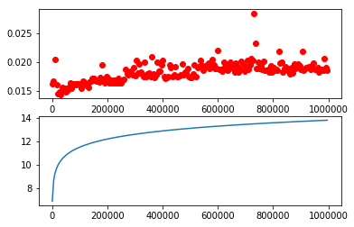
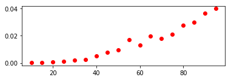
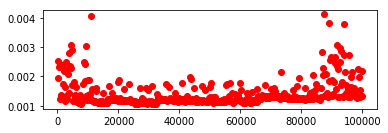
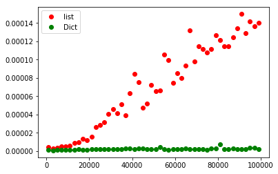

# python 数据结构与算法

**ADT**：abstract data type。 --> **data structure**

**implementation-independent**：实现无关

封装（encapsulation）、数据隐藏（information hiding）：


```python
# / 整数除法为浮点数
print(6/3) 
print(7/3)
print(3/6)

# // 取整数
print(7//3)
print(3//6)

# % 取模（取余数）
print(7%3)
print(3%6)
```

    2.0
    2.3333333333333335
    0.5
    2
    0
    1
    3


## 基准测试
### 执行时间
使用 for 循环的计算方式


```python
import time

def sumOfN(n):
   start = time.time()
   theSum = 0
   for i in range(1,n+1):
      theSum = theSum + i
   end = time.time()

   return theSum,end-start

# 测试执行时间
for i in range(5):
       print("Sum is %d required %10.7f seconds"%sumOfN(10000))
        
for i in range(5):
       print("Sum is %d required %10.7f seconds"%sumOfN(100000))

for i in range(5):
       print("Sum is %d required %10.7f seconds"%sumOfN(1000000))
```

    Sum is 50005000 required  0.0010004 seconds
    Sum is 50005000 required  0.0009997 seconds
    Sum is 50005000 required  0.0010002 seconds
    Sum is 50005000 required  0.0020015 seconds
    Sum is 50005000 required  0.0010011 seconds
    Sum is 5000050000 required  0.0100057 seconds
    Sum is 5000050000 required  0.0080070 seconds
    Sum is 5000050000 required  0.0130076 seconds
    Sum is 5000050000 required  0.0160108 seconds
    Sum is 5000050000 required  0.0070062 seconds
    Sum is 500000500000 required  0.0730469 seconds
    Sum is 500000500000 required  0.0680463 seconds
    Sum is 500000500000 required  0.0730479 seconds
    Sum is 500000500000 required  0.0800521 seconds
    Sum is 500000500000 required  0.0710492 seconds


适应公式计算的方式


```python
import time

def sumOfN(n):
   start = time.time()
   theSum =  (n*(n+1))/2
   end = time.time()

   return theSum,end-start

# 测试执行时间
for n in (10000, 100000, 1000000, 10000000, 100000000):
    print("Sum is %d required %10.7f seconds"%sumOfN(n))

```

    Sum is 50005000 required  0.0000000 seconds
    Sum is 5000050000 required  0.0000000 seconds
    Sum is 500000500000 required  0.0000000 seconds
    Sum is 50000005000000 required  0.0000000 seconds
    Sum is 5000000050000000 required  0.0000000 seconds


## Big-O Notation

A good basic unit of computation for comparing the summation algorithms shown earlier might be to count *the number of assignment statements performed to compute the sum*. In the function sumOfN, the number of assignment statements is 1 (theSum=0) plus the value of n (the number of times we perform **theSum=theSum+i**). We can denote this by a function, call it T, where **T(n)=1+n**. The parameter n is often referred to as the **“size of the problem,”** and we can read this as “T(n) is the time it takes to solve a problem of size n, namely 1+n steps.”

The **order of magnitude** function describes the part of **T(n)** that increases the fastest as the value of n increases. Order of magnitude is often called Big-O notation (for “order”) and written as O(f(n)). It provides a useful approximation to the actual number of steps in the computation. The function f(n) provides a simple representation of the dominant part of the original T(n).

In the above example, **T(n)=1+n**. As n gets large, the constant 1 will become less and less significant to the final result. If we are looking for an approximation for T(n)T(n), then we can drop the 1 and simply say that the running time is **O(n)**. It is important to note that the 1 is certainly significant for **T(n)**. However, as n gets large, our approximation will be just as accurate without it.

As another example, suppose that for some algorithm, the exact number of steps is **T(n)=5n<sup>2</sup>+27n+1005**. When n is small, say 1 or 2, the constant 1005 seems to be the dominant part of the function. However, as n gets larger, the **n<sup>2</sup>** term becomes the most important. In fact, when n is really large, the other two terms become insignificant in the role that they play in determining the final result. Again, to approximate **T(n)** as n gets large, we can ignore the other terms and focus on **5n<sup>2</sup>**. In addition, the coefficient **5** becomes insignificant as n gets large. We would say then that the function T(n)has an order of magnitude **f(n)=n<sup>2</sup>**, or simply that it is **O(n<sup>2</sup>)**.


常见算法数量级及其执行时间变化图：


```python
# 第一部分
a=5
b=6
c=10
# 第二部分
for i in range(n):
   for j in range(n):
      x = i * i
      y = j * j
      z = i * j
# 第三部分
for k in range(n):
   w = a*k + 45
   v = b*b
# 第四部分
d = 33
```

The number of assignment operations is the sum of four terms. 
- The first term is the constant **3**, representing the three assignment statements at the start of the fragment. 
- The second term is **3n<sup>2</sup>** since there are three statements that are performed **n<sup>2</sup>** times due to the nested iteration. 
- The third term is **2n**, two statements iterated n times. 
- Finally, the fourth term is the constant **1**, representing the final assignment statement. 

This gives us **T(n)=3+3n<sup>2</sup>+2n+1=3n<sup>2</sup>+2n+4**. By looking at the exponents, we can easily see that the **n<sup>2</sup>** term will be dominant and therefore this fragment of code is **O(n<sup>2</sup>)**. Note that all of the other terms as well as the coefficient on the dominant term can be ignored as n grows larger.

below shows a few of the common Big-O functions as they compare with the **T(n)** function discussed above. Note that **T(n)** is initially larger than the cubic function. However, as n grows, the cubic function quickly overtakes **T(n)**. It is easy to see that **T(n)** then follows the quadratic function as nn continues to grow.


## self check
Write two Python functions to find the minimum number in a list. The first function should compare each number to every other number on the list. **O(n<sup>2</sup>)**. The second function should be linear **O(n)**


```python
nlist = [34,23,6,11,7,9,32,54]

# 二次时间复杂度
n2value = nlist[0]
for i in nlist:
    issamllest = True
    for j in nlist:
        if i > j:
            issamllest = False
    if issamllest:
        n2value = i
print("n2value", n2value)

# 现行时间复杂度
nvalue = nlist[0] 
for item in nlist:
    if item < nvalue:
        nvalue = item
print("nvalue",nvalue)
```

    n2value 6
    nvalue 6


```python
from datetime import datetime
days = list(range(1,29))
months = list(range(1,13))
noweekday = []
nextyear = 1
for day in days:
    noweek = True
    for month in months:
        i = 0
        while i < nextyear:
            week = datetime(2018 + i, month, day).weekday()
            if week == 6:
                noweek = False
                break
            i += 1
    if noweek:
        noweekday.append(day)

print(noweekday)
```


# python中常见数据结构评估

## List
### 多种方法生成List比较
在 list 中索引操作与为索引位置分配的操作的时间复杂度都是线性的 **O(1)** ，扩展 list 的操作 appped 的时间复杂度为 **O(1)** ，而连接操作则是 **O(k)** （k是被连接 list 的大小）。如下四个生成list的方法：


```python
# 使用连接操作
def test1():
    l = []
    for i in range(1000):
        l = l + [i]
# 使用append方法
def test2():
    l = []
    for i in range(1000):
        l.append(i)
# 使用列表推导
def test3():
    l = [i for i in range(1000)]
# 使用list包裹range
def test4():
    l = list(range(1000))
    
# 使用 timeit 测试代码
from timeit import Timer

t1 = Timer("test1()", "from __main__ import test1")
print("concat ",t1.timeit(number=1000), "milliseconds")
t2 = Timer("test2()", "from __main__ import test2")
print("append ",t2.timeit(number=1000), "milliseconds")
t3 = Timer("test3()", "from __main__ import test3")
print("comprehension ",t3.timeit(number=1000), "milliseconds")
t4 = Timer("test4()", "from __main__ import test4")
print("list range ",t4.timeit(number=1000), "milliseconds")

```

    concat  1.8479930273260834 milliseconds
    append  0.09362109296989729 milliseconds
    comprehension  0.04085787887652259 milliseconds
    list range  0.016793391117516876 milliseconds


在这个案例中，语句 `from __main__ import test1` 将方法 `test1` 从 `__main__` 空间导入到了 `timeit` 设置的用于测试的空间。`timeit`之所以这么做，是为了在测试的时候避免你随意创建变量的影响，这些变量可能会以一些遇见不到的方式影响到程序的执行。

从上面的运行结果可以看到，`concat` 方法比其他方法要满了很多，`append` 方法又比列表推导与`range`方法慢，而是用`range`方法是最快的。

List 常见操作的时间复杂度：

### POP操作
由上图可以看到`pop()`与`pop(i)`的操作相差很大，这是因为`pop()`是弹出最后一个，而`pop(i)`从第一个弹出的同时还需要将后续数据的索引相应的前移一位。

可以做一个如下的测试，在固定大小的list中测试`pop()`与`pop(1)`测试花费时间，然后再次在不同大小的list上测试`pop()`与`pop(1)`的时间消耗。希望得到的结果是，无论list的大小是多少`pop()`操作时间消耗都是固定的，而`pop(1)`的时间消耗是线性增长的。


```python
popzero = timeit.Timer("x.pop(0)",
                       "from __main__ import x")
popend = timeit.Timer("x.pop()",
                      "from __main__ import x")

x = list(range(2000000))
print('pop from zero: ', popzero.timeit(number=1000))

x = list(range(2000000))
print('pop from end: ', popend.timeit(number=1000))
```

    pop from zero:  3.2996193134854366
    pop from end:  0.000121184943964181


由上述输出的结果可以看到 pop end 是 pop zero 性能的27000倍。从上述代码也可以注意到两点：
1. 我们没有定义方法，而是使用了 `from __main__ import x` 。这样做是为了能够单独测量某一个操作，是测量的结果更加精确。
2. 我们让测试执行了 1000 次，每执行完一次操作之后，x 的大小都会减 1，但因为 x 的总大小是 2000000 ，所以执行完成之后的 x 的大小也只减少了**0.05%**

上述的输出可以看到，`pop(0)` 的速度慢于 `pop()`，但是并没有展示出 `pop(0)` 是 **O(n)** ，`pop()` 是 **O(1)** 。所我们需要做如下的测试：


```python
popzero = Timer("x.pop(0)",
                "from __main__ import x")
popend = Timer("x.pop()",
               "from __main__ import x")
print("pop(0)   pop()")
for i in range(1000000,100000001,1000000):
    x = list(range(i))
    pt = popend.timeit(number=1000)
    x = list(range(i))
    pz = popzero.timeit(number=1000)
    print("%15.5f, %15.5f" %(pz,pt))
```

上述运行的结果绘成图之后如下：


可以看到`pop(0)` 是 **O(n)** ，`pop()` 是 **O(1)** 。

## Dict
不同于 list 使用 索引访问数据，Dict 是依据 key 来访问数据。Dict 的取值与赋值都是**O（1）** 操作；判断 key 值是否存在于 Dict中也是**O（1）** ，只有在极少数情况下会退化成 **O（n）** 。Dict 常见的操作的 **Big-O** 如下：


**Dict 与 list 包含操作的对比**

通过实现预期得到的结果为：Dict的为 **O(1)** ，list的为 **O(n)** 。


```python
import timeit
import random

for i in range(10000,1000001,20000):
    t = timeit.Timer("random.randrange(%d) in x"%i,"from __main__ import random,x")
    x = list(range(i))
    lst_time = t.timeit(number=1000)
    x = {j:None for j in range(i)}
    d_time = t.timeit(number=1000)
    print("%d,%10.3f,%10.3f" % (i, lst_time, d_time))
```

上述代码的输出结果为：
```
10000,     0.101,     0.001
30000,     0.228,     0.002
50000,     0.394,     0.001
...
510000,     3.977,     0.002
530000,     3.958,     0.002
550000,     4.250,     0.002
570000,     4.261,     0.002
...
950000,     8.044,     0.002
970000,     7.862,     0.003
990000,     7.783,     0.003
```

将上述结果以图表的形式输出，可以得到如下图：


从上面的输出结果可以看到，Dict的包含操作为 **O(1)** ，list的包含炒作为 **O(n)** 。下面的连接给出了python 中常见结合操作的时间复杂度：https://wiki.python.org/moin/TimeComplexity

## Bog-O练习
- [评估程序](http://interactivepython.org/runestone/static/pythonds/AlgorithmAnalysis/DiscussionQuestions.html)


```python
import numpy as np
import matplotlib.pyplot as plt
%matplotlib inline

# 对数
def mytest1(n):
    i = n
    while i > 0:
        k = 2 + 2
        i = i // 2

x = []
y = []
for n in range(1000,1000000,5000):
    x.append(n)
    t1 = Timer("mytest1(%d)"%n, "from __main__ import mytest1")
    y.append(t1.timeit(number=10000))
    
yy = np.log(x)

plt.subplot(2, 1, 1)
plt.plot(x,y,'or')
plt.subplot(2, 1, 2)
plt.plot(x,yy)
plt.show()
```





```python
# 三次方
def mytest1(n):
    for i in range(n):
        for j in range(n):
            for k in range(n):
                k = 2 + 2
                
x = []
y = []
for n in range(10,100,5):
    x.append(n)
    t1 = Timer("mytest1(%d)"%n, "from __main__ import mytest1")
    y.append(t1.timeit(number=2))
    
plt.subplot(2, 1, 1)
plt.plot(x,y,'or')
plt.show()
```





## Programming Exercises
### list index operator
Devise an experiment to verify that the list index operator is **O(1)**


```python
import random
import timeit

x = []
y = []
for n in range(100,100000,200):
    t = timeit.Timer("l[random.randrange(%d)]"%n,"from __main__ import random,l")
    x.append(n) 
    l = list(range(n))
    y.append(t.timeit(number=1000))

print(len(x))
print(len([i for i in y if 0.001<i and i < 0.002]))
print(np.average(y))
plt.subplot(2, 1, 1)
plt.plot(x,y,'or')
plt.show()
```

    500
    458
    0.0013969150339180488




### del on list and dict
Devise an experiment that compares the performance of the del operator on lists and dictionaries.


```python
import timeit
import random
import numpy as np
import matplotlib.pyplot as plt
%matplotlib inline

yd = []
yl = []
xx = []
for i in range(1000,100001,2000):
    xx.append(i)
    r = random.randrange(i)
    t = timeit.Timer("del x[%d]"%0, "from __main__ import random,x")
    x = list(range(i))
    lst_time = t.timeit(number=1)
    
    td = timeit.Timer("del x[%d]"%0, "from __main__ import random,x")
    x = {j:None for j in range(i)}
    d_time = td.timeit(number=1)
    
    yl.append(lst_time)
    yd.append(d_time)

plt.plot(xx,yl,'or',label='list')
plt.plot( xx,yd,'og',label='Dict')
plt.legend(loc='upper left')
plt.show()
```





由上图可以看到 list 的 `del` 操作是**O(n)** ，而 dict 的 del 操作是 **O(1)** 。


```python
t = [1,2,4,4]
del t[0]
print(t)

d = {0: None, 1: None, 2: None, 3: None, 4: None, 5: None, 6: None, 7: None, 8: None, 9: None}
del d[2]
print(d)
```

    [2, 4, 4]
    {0: None, 1: None, 3: None, 4: None, 5: None, 6: None, 7: None, 8: None, 9: None}

```python
random.randint(0,10)
random.randrange(2)
```


    0


# 参考
## 算法参考
- [Big-O Notation](http://interactivepython.org/runestone/static/pythonds/AlgorithmAnalysis/BigONotation.html)
- [Lists](http://interactivepython.org/runestone/static/pythonds/AlgorithmAnalysis/Lists.html)
- [Dictionaries](http://interactivepython.org/runestone/static/pythonds/AlgorithmAnalysis/Dictionaries.html)


## 工具参考
- [timeit — 测量小代码片的执行时间](http://python.usyiyi.cn/translate/python_278/library/timeit.html)
- [Python图表绘制：matplotlib绘图库入门](https://www.cnblogs.com/wei-li/archive/2012/05/23/2506940.html)
- [Matplotlib 教程](https://liam0205.me/2014/09/11/matplotlib-tutorial-zh-cn/)
- [十分钟入门Matplotlib](http://codingpy.com/article/a-quick-intro-to-matplotlib/)
