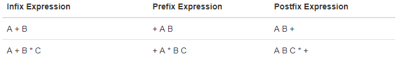

# 线性数据结构
Stacks、queues、deques、 和 lists 等集合元素的顺序是由元素的插入顺序来决定，一个元素在另一个元素的前面或者后面，这样的数据结构就称为**线性数据结构** 。

线性结构有两个结尾（`end`），可以叫做`left`或者`right`，也可以叫做`front`或者`rear`，也可以叫做`top`或者`bottom`。给结尾（`end`）的名字并没有实际的意义，一个线性结构与另一个是通过添加`add`与`remove`操作来区分，特别是这些操作发生的位置。如，有的线性结构只允许从一个结尾添加，另一个可能两个结尾都允许。

这些变体在计算机科学上产生了很多有用的数据结构。

## 栈（stack）
栈（有时候也成为“下推栈”[push-down stack]）是一个有序的集合，添加和移除已存在的元素都在同一个`end`，此`end`被称为`top`，而相对的另一边称为`base`。<sup>[2]</sup>

栈的`base`的意义在于，元素存贮位置越接近`base`表示在栈中存在的时间越久，最新添加的元素，在位置上会最先被移除。这种排序规则有时候也被称为后入先出（LIFO-last in first out），在集合中提供了基于时间长度的排序，越新的元素越接近`top`，越久的元素越接近`base`。

栈在生活中有很多应用的案例，如自主餐厅的盘子，你总是拿走`top`的盘子，然后将下一个盘子暴露给另一个顾客。又如，浏览器浏览网页，并点击后退按钮后退的例子。再如，桌子上有一摞书，我们只能看到在`top`的书，为了能看到其他书，我们需要移除`top`的书，示意图如下：


One of the most useful ideas related to stacks comes from the simple observation of items as they are added and then removed. Assume you start out with a clean desktop. Now place books one at a time on top of each other. You are constructing a stack. Consider what happens when you begin removing books. The order that they are removed is exactly the reverse of the order that they were placed. **Stacks are fundamentally important, as they can be used to reverse the order of items**. The order of insertion is the reverse of the order of removal.


### 栈抽象数据类型

可以通过以下操作和结构来定义一个抽象的栈。
- `Stack()`：创建一个栈，不需要参数，返回一个空栈
- `push(item)`：向栈的顶部`top`添加一个元素，需要参数且无返回值
- `pop()`：从栈顶移除一个元素，不需要参数同时返回被移除的元素。栈被修改
- `peek()`：返回处在栈顶的元素，但不移出。栈没有被修改
- `isEmpty()`：判断栈是否为空，不需要参数，返回boolean值
- `size()`：返回栈中元素的个数

如下示例IMG-1：


### 使用python实现一个栈
我们选择使用 list 来实现栈，因为 list 是一个有序元素的集合，且 python 的 list 提供了一系列的方法。我们只需要决定list的那一边作为 stack 的 `top`，哪一边作为`base`，一定决定了，就可以使用 list 的 `append`与`pop`来操作 stack。

此处我么选择 list 的 `end` 作为stack 的 `top`，一个实现方法如下：


```python
class Stack:
    def __init__(self):
        self.items = []

    def isEmpty(self):
        return self.items == []

    def push(self, item):
        self.items.append(item)

    def pop(self):
        return self.items.pop()

    def peek(self):
        return self.items[len(self.items)-1]

    def size(self):
        return len(self.items)
```


```python
# 使用栈
s=Stack()

print(s.isEmpty())
s.push(4)
s.push('dog')
print(s.peek())
s.push(True)
print(s.size())
print(s.isEmpty())
s.push(8.4)
print(s.pop())
print(s.pop())
print(s.size())
```

    True
    dog
    3
    False
    8.4
    True
    2


以上我们实现是使用 list 的`end`作为 stack 的 `top`，如果选择 list 的 `begging` 作为 stack 的`top`，那么就要现实的使用list的 `pop()`与`insert`方法，实现如下：


```python
class Stack:
    def __init__(self):
        self.items = []

    def isEmpty(self):
        return self.items == []

    def push(self, item):
        self.items.insert(0,item)

    def pop(self):
        return self.items.pop(0)

    def peek(self):
        return self.items[0]

    def size(self):
        return len(self.items)

s = Stack()
s.push('hello')
s.push('true')
print(s.pop())
```

    true


Recall that the `append` and `pop()` operations were both **O(1)** . This means that the first implementation will perform `push` and `pop` in constant time no matter how many items are on the stack. The performance of the second implementation suffers in that the `insert(0)` and `pop(0)` operations will both require **O(n)** for a stack of size n. Clearly, even though the implementations are logically equivalent, they would have very different timings when performing benchmark testing.

### 练习
Write a function revstring(mystr) that uses a stack to reverse the characters in a string.


```python
def revstring(mystr):
    source = Stack()
    for ch in mystr:
        source.push(ch)
        
    new = ''
    while not source.isEmpty():
        new += source.pop()
    return new

print(revstring('weduoo'))
```

    ooudew


### 应用 - 简单平衡圆括号
此应用可以用于检测程序或者数学公式中圆括号“（）”使用是否正确，平衡圆括号的示意图如下：


使用stack实现此方法的思路如下：
- 遇到 `"("` 将其放入到stack中
- 遇到 `")"`就进行出栈操作，在执行弹栈操作之前判断stack是否为空，如果此时为空则圆括号不平衡
- 一直遍历字符串，直到字符串结束，如果此时stack为空，则圆括号是平衡的，若不为空则是不平衡的


```python
def parChecker(symbolString):
    # 初始化参数
    s = Stack()
    balanced = True
    index = 0
    while index < len(symbolString) and balanced:
        symbol = symbolString[index]
        if symbol == "(":
            # 入栈
            s.push(symbol)
        else:
            # 出栈先判断是否为空
            if s.isEmpty():
                balanced = False
            else:
                s.pop()

        index = index + 1

    if balanced and s.isEmpty():
        return True
    else:
        return False

print(parChecker('((()))'))
print(parChecker('(()'))
```

    True
    False


### 应用 - 通用平衡圆括号
上面的的只是匹配了圆括号，但在一般的程序中会含有更多类型的括号，如`{ { ( [ ] [ ] ) } ( ) }`。为了实现更通用的方法，我们只需修改上述代码的这部分就可以：
```python
if s.isEmpty():
    balanced = False
else:
    s.pop()
```


```python
def parChecker(symbolString):
    s = Stack()
    balanced = True
    index = 0
    while index < len(symbolString) and balanced:
        symbol = symbolString[index]
        if symbol in "([{":
            s.push(symbol)
        else:
            if s.isEmpty():
                balanced = False
            else:
                top = s.pop()
                if not matches(top,symbol):
                       balanced = False
        index = index + 1
    if balanced and s.isEmpty():
        return True
    else:
        return False

def matches(open,close):
    opens = "([{"
    closers = ")]}"
    return opens.index(open) == closers.index(close)

print(parChecker('{{([][])}()}'))
print(parChecker('[{()]'))
```

    True
    False


### 应用 - 十进制数转二进制数
可以使用`Divide by 2`算法来实现，如下图：


实现代码如下：


```python
def divideBy2(decNumber):
    remstack = Stack()

    while decNumber > 0:
        # 取余数然后入栈
        rem = decNumber % 2
        remstack.push(rem)
        # 取整
        decNumber = decNumber // 2

    binString = ""
    while not remstack.isEmpty():
        binString = binString + str(remstack.pop())

    return binString

print(divideBy2(42))
print(divideBy2(233))
print(divideBy2(17))
print(divideBy2(45))
print(divideBy2(96))
```

    101010
    11101001
    10001
    101101
    1100000


### 应用 - 十进制数转任意（1-16）进制数
只需要将上面代码代码稍作转换即可。


```python
def baseConverter(decNumber,base):
    digits = "0123456789ABCDEF"

    remstack = Stack()

    while decNumber > 0:
        rem = decNumber % base
        remstack.push(rem)
        decNumber = decNumber // base

    newString = ""
    while not remstack.isEmpty():
        newString = newString + digits[remstack.pop()]

    return newString

print(baseConverter(25,2))
print(baseConverter(25,16))
print(baseConverter(25,10))
```

    11001
    19
    25


## 中缀、前缀、后缀表达式

### 操作解析
**中缀**
如 B * C，其中的 `*` 就是中缀表达式，因为 `*` 位于操作数的两端。

**前缀**
`A+B` 在前缀表达式中可以写成 `+AB`

**后缀**
`A+B` 在前缀表达式中可以写成 `AB+`

三者不含括号的操作如下：



含有括号的操作：


多元复杂操作：


从上面的列表操作结果可以总结出规律，在前缀中与靠前的符号优先级越低，在后缀中则是越靠后优先级越低。如下图:


从前后缀表达式推导中缀表达式：


### 中缀转成为前缀与后缀表达式

**第一种方法：全括号法**

实现方法为将表达式修改为全括号表达式，在后缀表达式中将右括号替换为相应配对括号里面的符号，如下：


前缀表达式操作方式则如下：


如下示例，将: (A + B) * C - (D - E) * (F + G)转换为前缀或者后缀表达式：


**第二种：通用转后缀方法**

此处依然使用stack来完成操作：
1. 创建一个空的stack，如`opstack`，用于存储操作符；创建一个空的 list 用于存储输出
2. 将输入的表达式字符串使用`split`的切分（此处假设使用空格来分割表达式的每个符号与操作出）转成 list
3. 从左到右扫描被转成 list 的字符串
    - 如果遇到操作数，就将其放入输出list中
    - 如果是左圆括号，则将其放入stack中
    - 如果遇到右圆括号，进行弹栈操作，直到相关的左括号被移除，并追加每一个操作符到输出list的末尾
    - 如果是操作符 `+`、`-`、`*`、`/` 则进行入栈操作。但，首先需要移除在`opstack`栈中具有较高或者相同等级的操作符，然后将它添加到输出list中。
4. 当表达式被全部处理以后，检查opstack，仍然在栈中的操作符，可以直接追加到输出list中

以`A * B + C * D`为例，处理过程如下：


代码如下：


```python
def infixToPostfix(infixexpr):
    prec = {}
    prec["**"] = 4
    prec["*"] = 3
    prec["/"] = 3
    prec["+"] = 2
    prec["-"] = 2
    prec["("] = 1
    opStack = Stack()
    postfixList = []
    tokenList = infixexpr.split()

    for token in tokenList:
        if token in "ABCDEFGHIJKLMNOPQRSTUVWXYZ" or token in "0123456789":
            # 将操作数放入 list 中
            postfixList.append(token)
        elif token == '(':
            # 左括号放入 stack 中
            opStack.push(token)
        elif token == ')':
            # 右括号 进行 弹栈操作
            topToken = opStack.pop()
            while topToken != '(':
                # 若弹出的不是左括号，则将其追缴到 list中
                # 并继续弹栈操作，直到遇到左括号
                postfixList.append(topToken)
                topToken = opStack.pop()
        else:
            # 遇到操作符的处理
            while (not opStack.isEmpty()) and \
               (prec[opStack.peek()] >= prec[token]):
                # 比当前操作符优先级高的操作符进行出站操作
                # 并将其加入到输出list中
                  postfixList.append(opStack.pop())
            opStack.push(token)
    
    # 判断 stack是否为空，不为空则将说有的元素弹出
    # 并将其加入到 list 中
    while not opStack.isEmpty():
        postfixList.append(opStack.pop())
    
    # 输出最终救过
    return " ".join(postfixList)

print(infixToPostfix("A * B + C * D"))
print(infixToPostfix("( A + B ) * C - ( D - E ) * ( F + G )"))
print(infixToPostfix("5 * 3 ** ( 4 - 2 )"))
```

    A B * C D * +
    A B + C * D E - F G + * -
    5 3 4 2 - ** *


### 后缀表表达式的计算
此处依然使用 stack 作为存储的数据结构，具体计算步奏如下：
1. 创建一个空的`operandStack` 栈
2. 通过 split 方法将后缀表达式字符串转成 list
3. 从左到右扫描list
    - 如果标识只一个操作数则，将字符串转成int类型放入到 `operandStack` 中
    - 如果标识是 `*`、 `/`、 `+`、 `-` ，需要从 `operandStack` 中弹出两个数进行算数计算，弹出的第一个数作为操作的第二个数，弹出的第二个数作为操作的第二个数(在做除法时很中要)，然后把结果重新放入 `operandStack` 中。
4. 当处理完成所有的输入，`operandStack` 中只有一个数，将其弹出既是最后的值

如计算`4 5 6 * +`的过程：


计算`7 8 + 3 2 + /` 的过程：


代码实现如下：


```python
def postfixEval(postfixExpr):
    operandStack = Stack()
    tokenList = postfixExpr.split()

    for token in tokenList:
        if token in "0123456789":
            operandStack.push(int(token))
        else:
            operand2 = operandStack.pop()
            operand1 = operandStack.pop()
            result = doMath(token,operand1,operand2)
            operandStack.push(result)
    return operandStack.pop()

def doMath(op, op1, op2):
    if op == "*":
        return op1 * op2
    elif op == "/":
        return op1 / op2
    elif op == "+":
        return op1 + op2
    else:
        return op1 - op2

print(postfixEval('7 8 + 3 2 + /'))
```

    3.0


## 队列（Queue）

队列是有序集合，元素在一端添加，通常称为`rear`，在另一端移除元素，通常称为`front`。通常在 `front` 端的元素出现的时间较长，在`rear`端的元素都是最近添加的。此种规则被称为FIFO（First In First Out），也被称为“先到先服务”原则（First-come，First-served）。如下图：


在购物店排队，看电影等着检票都可以看做是队列。这些场景的特点就是只有一条线可以排，不能在中间插队。计算机的打印、任务调度，也都需要用到队列。

### 队列抽象数据类型
队列抽象数据类型由数据结构与操作类定义，结构如上所述，且有如下操作：
- `Queue()` 创建一个空的队列，不需要参数
- `enqueue(item)` 添加一个元素到`rear`，参数为待添加元素，无返回值
- `dequeue()` 从队列的 `front` 移除一个元素，不需要参数，返回被移除的元素
- `isEmpty()` 判断队列是否为空，不需要参数，返回一个布尔值
- `size()` 返回队列的大小，不需要参数

示例操作如下：


### 使用python实现Queue
依然使用 list 来构建 queue，我们只需要决定那一段作为`rear`，哪一段作为`front`。此处适应 `0` 位置作为 `rear`，可以使用 list 的 insert 做 enqueue 操作，也可知 enqueue操作的时间复杂度为O(n)。另一端作为 `front` ，dequeue 使用 list 的 pop 操作完成，可以知道 dequeue 的时间复杂度为 O(1)。

代码实现如下：


```python
class Queue:
    def __init__(self):
        self.items = []

    def isEmpty(self):
        return self.items == []

    def enqueue(self, item):
        self.items.insert(0,item)

    def dequeue(self):
        return self.items.pop()

    def size(self):
        return len(self.items)

```

### 情景模拟 - 烫手山芋（Hot Potato）
即有一个山芋，几个人排成一圈，将山芋依次从一个人传到下一临近的人，喊停的时候，山芋在谁的手里就将谁剔除。循环往复，直到只剩下一个人为止。如下示意图：


此情景与现代的约瑟夫斯问题类似，可参考：[百度百科](https://baike.baidu.com/item/%E7%BA%A6%E7%91%9F%E5%A4%AB%E9%97%AE%E9%A2%98)、[wiki](https://zh.wikipedia.org/wiki/%E7%BA%A6%E7%91%9F%E5%A4%AB%E6%96%AF%E9%97%AE%E9%A2%98)

使用队列实现的大致流程如下：


Assume that the child holding the potato will be at the front of the queue. Upon passing the potato, the simulation will simply dequeue and then immediately enqueue that child, putting her at the end of the line. She will then wait until all the others have been at the front before it will be her turn again. After num dequeue/enqueue operations, the child at the front will be removed permanently and another cycle will begin. This process will continue until only one name remains (the size of the queue is 1).


```python
def hotPotato(namelist, num):
    simqueue = Queue()
    # 将数据放入队列中，保证与原始顺序一致
    for name in namelist:
        simqueue.enqueue(name)
        
    # 队列大小等于 1 时停止
    while simqueue.size() > 1:
        # 按照设定的循环次数循环
        for i in range(num):
            # 出队与入队操作
            simqueue.enqueue(simqueue.dequeue())
        # 让拿着 potato 的人出队
        print(simqueue.dequeue())
    # 返回最后的元素
    return simqueue.dequeue()

print(hotPotato(["Bill","David","Susan","Jane","Kent","Brad"],7))
```

    David
    Kent
    Jane
    Bill
    Brad
    Susan


### 情景模拟 - 打印任务

主要模拟步奏如下：
1. Create a queue of print tasks. Each task will be given a timestamp upon its arrival. The queue is empty to start.
2. For each second (`currentSecond`):
    - Does a new print task get created? If so, add it to the queue with the `currentSecond` as the timestamp.
    - If the printer is not busy and if a task is waiting,
        - Remove the next task from the print queue and assign it to the printer.
        - Subtract the timestamp from the `currentSecond` to compute the waiting time for that task.
        - Append the waiting time for that task to a list for later processing.
        - Based on the number of pages in the print task, figure out how much time will be required.
    - The printer now does one second of printing if necessary. It also subtracts one second from the time required for that task.
    - If the task has been completed, in other words the time required has reached zero, the printer is no longer busy.
3. After the simulation is complete, compute the average waiting time from the list of waiting times generated.


```python
# 用于追踪是否有打印任务
class Printer:
    def __init__(self, ppm):
        # 每分钟处理的打印页数
        self.pagerate = ppm # pages-per-minute
        self.currentTask = None
        self.timeRemaining = 0

    # 减少内部计时器
    def tick(self):
        if self.currentTask != None:
            self.timeRemaining = self.timeRemaining - 1
            # 任务完成置空
            if self.timeRemaining <= 0:
                self.currentTask = None
    
    # 判断队列中是否有任务
    def busy(self):
        if self.currentTask != None:
            return True
        else:
            return False

    def startNext(self,newtask):
        self.currentTask = newtask
        self.timeRemaining = newtask.getPages() * 60/self.pagerate
```


```python
import random
# 打印任务
class Task:
    def __init__(self,time):
        # 任务时间戳，表示任务被创建的时间
        self.timestamp = time
        # 随机生成需要打印的页数
        self.pages = random.randrange(1,21)

    def getStamp(self):
        return self.timestamp

    def getPages(self):
        return self.pages

    def waitTime(self, currenttime):
        # 返回当前任务当代的时间
        return currenttime - self.timestamp
```


```python
import random
# 住模拟函数
def simulation(numSeconds, pagesPerMinute):
    labprinter = Printer(pagesPerMinute)
    printQueue = Queue()
    waitingtimes = []

    for currentSecond in range(numSeconds):

        if newPrintTask():
            # 创建新任务
            task = Task(currentSecond)
            printQueue.enqueue(task)

        if (not labprinter.busy()) and (not printQueue.isEmpty()):
            nexttask = printQueue.dequeue()
            waitingtimes.append(nexttask.waitTime(currentSecond))
            labprinter.startNext(nexttask)

        labprinter.tick()

    averageWait=sum(waitingtimes)/len(waitingtimes)
    print("Average Wait %6.2f secs %3d tasks remaining."%(averageWait,printQueue.size()))

def newPrintTask():
    # 判断一个新任务是否被创建
    num = random.randrange(1,181)
    if num == 180:
        return True
    else:
        return False

for i in range(10):
    simulation(3600,5)
print()    
for i in range(10):
    simulation(3600,10)
```

    Average Wait 179.95 secs   0 tasks remaining.
    Average Wait 146.94 secs   2 tasks remaining.
    Average Wait 232.65 secs   0 tasks remaining.
    Average Wait 180.45 secs   0 tasks remaining.
    Average Wait  50.67 secs   0 tasks remaining.
    Average Wait  38.67 secs   1 tasks remaining.
    Average Wait  63.29 secs   0 tasks remaining.
    Average Wait 219.91 secs   2 tasks remaining.
    Average Wait  76.44 secs   0 tasks remaining.
    Average Wait 123.79 secs   1 tasks remaining.
    
    Average Wait  36.04 secs   0 tasks remaining.
    Average Wait  12.53 secs   0 tasks remaining.
    Average Wait   9.71 secs   0 tasks remaining.
    Average Wait  38.54 secs   1 tasks remaining.
    Average Wait   0.00 secs   0 tasks remaining.
    Average Wait  19.65 secs   0 tasks remaining.
    Average Wait   0.00 secs   0 tasks remaining.
    Average Wait   2.68 secs   0 tasks remaining.
    Average Wait   4.00 secs   0 tasks remaining.
    Average Wait  67.15 secs   0 tasks remaining.


We were trying to answer a question about whether the current printer could handle the task load if it were set to print with a better quality but slower page rate. The approach we took was to write a simulation that modeled the printing tasks as random events of various lengths and arrival times.

The output above shows that with 5 pages per minute printing, the average waiting time varied from a low of 17 seconds to a high of 376 seconds (about 6 minutes). With a faster printing rate, the low value was 1 second with a high of only 28. In addition, in 8 out of 10 runs at 5 pages per minute there were print tasks still waiting in the queue at the end of the hour.

Therefore, we are perhaps persuaded that slowing the printer down to get better quality may not be a good idea. Students cannot afford to wait that long for their papers, especially when they need to be getting on to their next class. A six-minute wait would simply be too long.

This type of simulation analysis allows us to answer many questions, commonly known as “what if” questions. All we need to do is vary the parameters used by the simulation and we can simulate any number of interesting behaviors. For example,
- What if enrollment goes up and the average number of students increases by 20?
- What if it is Saturday and students are not needing to get to class? Can they afford to wait?
- What if the size of the average print task decreases since Python is such a powerful language and programs tend to be much shorter?

These questions could all be answered by modifying the above simulation. However, it is important to remember that the simulation is only as good as the assumptions that are used to build it. Real data about the number of print tasks per hour and the number of students per hour was necessary to construct a robust simulation.

## 双队列（deque）
### 操作与实现

双队列也被称为双端队列，元素也是按顺序存放在其中，在性质上与stack类似，但在添加与移除元素上又与stack不同。在deque中，既可以在front添加元素又可以在rear中添加。deque兼有stack与Queue特性，但把deque当做那种类型使用有你自己决定。deque的示意图如下：


deque应该具有以下操作：
- `Deque()` 创建一个空的双队列，不需要参数，并返回一个空的双队列。
- `addFront(item)` 从`front`向双队列添加元素， 参数为被添加的元素，无返回。
- `addRear(item)` 从`rear`向双队列添加元素， 参数为被添加的元素，无返回。
- `removeFront()` 从`front`从双队列删除元素， 无参数，返回被移除的元素。
- `removeRear()` 从`rear`从双队列删除元素， 无参数，返回被移除的元素。
- `isEmpty()` 判断双队里是否为空，不需要参数，返回布尔值。
- `size()` 返回双队列的大小，不需要参数，返回一个int值。

操作示例如下（将右侧定义为front）：


使用python实现如下：


```python
# 假设 list 的 0 位置为 rear
class Deque:
    def __init__(self):
        self.items = []

    def isEmpty(self):
        return self.items == []
    # 时间复杂度为 O(1)
    def addFront(self, item):
        self.items.append(item)
    
    # 时间复杂度为 O(n)
    def addRear(self, item):
        self.items.insert(0,item)
        
    # 时间复杂度为 O(1)
    def removeFront(self):
        return self.items.pop()

    # 时间复杂度为 O(n)
    def removeRear(self):
        return self.items.pop(0)

    def size(self):
        return len(self.items)

```

### 应用 - 回文检测
回文即一个单词从前往后读与从后往前读都是同一个单词，如 radar、toot等。此功能使用deque可以很好地实现，示意图如下：


```python
def palchecker(aString):
    chardeque = Deque()

    for ch in aString:
        chardeque.addRear(ch)

    stillEqual = True

    while chardeque.size() > 1 and stillEqual:
        first = chardeque.removeFront()
        last = chardeque.removeRear()
        if first != last:
            stillEqual = False

    return stillEqual

print(palchecker("lsdkjfskf"))
print(palchecker("radar"))
```

    False
    True


## List
### 无序Llist（unorder list）
无序list应该具有以下操作：
- `List()` creates a new list that is empty. It needs no parameters and returns an empty list.
- `add(item)` adds a new item to the list. It needs the item and returns nothing. Assume the item is not already in the list.
- `remove(item)` removes the item from the list. It needs the item and modifies the list. Assume the item is present in the list.
- `search(item)` searches for the item in the list. It needs the item and returns a boolean value.
- `isEmpty()` tests to see whether the list is empty. It needs no parameters and returns a boolean value.
- `size()` returns the number of items in the list. It needs no parameters and returns an integer.
- `append(item)` adds a new item to the end of the list making it the last item in the collection. It needs the item and returns nothing. Assume the item is not already in the list.
- `index(item)` returns the position of item in the list. It needs the item and returns the index. Assume the item is in the list.
- `insert(pos,item)` adds a new item to the list at position pos. It needs the item and returns nothing. Assume the item is not already in the list and there are **enough existing items to have position pos**.
- `pop()` removes and returns the last item in the list. It needs nothing and returns an item. Assume the list has at least one item.
- `pop(pos)` removes and returns the item at position pos. It needs the position and returns the item. Assume the item is in the list.

### 实现无序List：Linked List

虽然在无序list中每个元素的相对为中需要我们维护，但是考虑到在连续的内存中其实是不需要的，如下图，我们只需要知道其中一个元素的位置及其下一个元素的位置，这样我们就能确定整个linked list中元素的位置。


这样我们只需要知道第一个（head）元素的位置，就可以找到第二个元素的位置，通过第二个元素的位置又可以找到第三个元素的位置，依次类推。当然最后一个元素也应该知道再没有下一个元素了。

#### Node类
`node`类是实现 linked list 的基本单元，`node` 包含有两类信息，一种是元素自己本身的信息也就是数据字段（data field），一种是下一个节点的引用。实现如下：


```python
class Node:
    def __init__(self,initdata):
        self.data = initdata
        self.next = None
    # 获取节点数据
    def getData(self):
        return self.data
    # 获取下一个节点的引用
    def getNext(self):
        return self.next

    def setData(self,newdata):
        self.data = newdata

    def setNext(self,newnext):
        self.next = newnext

temp = Node(93)
print(temp.getData())
```

    93

`None`引用是一个特殊的引用，在 linked list 的实现中起着重要的作用。当 `self.next = None` 时，表明没有下一个节点，当前节点就是最后一个节点（end）。当初始化一个Node是，next的值为none，意思是当前节点是“接地”的，在画图时也是用接地符号表示，如下图：


#### 无序Linked List类
Linked list 就是一组 node 集合，每个节点含有下一个节点的引用，只要找到了第一个（head）node，就可以持续的找到下一个node。因此，Linked List 必须要维护第一个节点的引用。所以，Linked List 的初始代码如下：
```python
class UnorderedList:

    def __init__(self):
        self.head = None
```
当构建一个list的时候，里面并没有元素，`mylist = UnorderedList()`，如下图：


list只含有对第一个元素的引用，并不包含其他信息，如下：


`isEmpty`用于判断list是否为空，如下：
```python
def isEmpty(self):
    return self.head == None
```
当head为`None`时，说明当前list还没有元素。

So, how do we get items into our list? We need to implement the `add` method. However, before we can do that, we need to address the important question of where in the linked list to place the new item. Since this list is unordered, the specific location of the new item with respect to the other items already in the list is not important. The new item can go anywhere. With that in mind, it makes sense to place the new item in the easiest location possible.

Recall that the linked list structure provides us with only one entry point, the head of the list. All of the other nodes can only be reached by accessing the first node and then following `next` links. This means that the easiest place to add the new node is right at the head, or beginning, of the list. In other words, we will make the new item the first item of the list and the existing items will need to be linked to this new first item so that they follow.
```python
mylist.add(31)
mylist.add(77)
mylist.add(17)
mylist.add(93)
mylist.add(26)
mylist.add(54)
```

添加方法实现如下：
```python
def add(self,item):
    temp = Node(item)
    temp.setNext(self.head)
    self.head = temp
```
当执行`add`方法时，执行的流程如下：


但当把最后两行代码反过来，就会导致后面的元素无法访问，示意图如下：


`size`、 `search` 和 `remove`– 都是基于链表遍历技术（**linked list traversal**）。
```python
def size(self):
    current = self.head
    count = 0
    while current != None:
        count = count + 1
        current = current.getNext()

    return count
```
示意图如下：


`search` 方法的实现如下：
```python	
def search(self,item):
    current = self.head
    found = False
    while current != None and not found:
        if current.getData() == item:
            found = True
        else:
            current = current.getNext()

    return found
```
如执行`mylist.search(17)`那么流程就如下：


`remove`方法如下：
```python
def remove(self,item):
    current = self.head
    previous = None
    found = False
    while not found:
        if current.getData() == item:
            found = True
        else:
            previous = current
            current = current.getNext()

    if previous == None:
        self.head = current.getNext()
    else:
        previous.setNext(current.getNext())

```
执行的流程如下：


需要考虑在第一个位置找到需要删除的元素情况，如下：


#### Linked List完整代码


```python
class UnorderedList:

    def __init__(self):
        self.head = None
        
    # 判断 Linked List 是否为空
    def isEmpty(self):
        return self.head == None

    # 添加元素
    def add(self,item):
        temp = Node(item)
        # 将新添加的节点，添加到head的位置
        temp.setNext(self.head)
        self.head = temp
        
    # linked list 大小
    def size(self):
        current = self.head
        count = 0
        while current != None:
            count = count + 1
            current = current.getNext()

        return count
    
    # 查找元素
    def search(self,item):
        current = self.head
        found = False
        while current != None and not found:
            if current.getData() == item:
                found = True
            else:
                current = current.getNext()

        return found
    
    # 移除元素
    def remove(self,item):
        current = self.head
        previous = None
        found = False
        while not found:
            if current.getData() == item:
                found = True
            else:
                previous = current
                current = current.getNext()

        if previous == None:
            self.head = current.getNext()
        else:
            previous.setNext(current.getNext())
    
    # 在end 处追加一个元素
    def append(self, item):
        current = self.head
        temp = Node(item)
        last = None
        while current != None:
            last = current
            current = current.getNext()
            
        if last == None:
            self.head = temp
        else:
            last.setNext(temp)
    
    # 指定节点插入元素，追加的为止大于list的大小
    # 则将其追加到最后
    def insert(self, pos ,item):
        temp = Node(item)
        current = self.head
        if pos >= self.size():
            self.append(item)
        else:
            index = 0
            while current != None and index < pos - 1:
                current = current.getNext()
                index = index + 1
            next_node = current.getNext()
            if pos == 0:
                temp.setNext(self.head)
                self.head = temp
            else:
                temp.setNext(next_node)
                current.setNext(temp)
    
    # 返回元素在 list 中的位置
    def index(self, item):
        current = self.head
        index = 0
        isFound = True
        while current.getData()!=item and current != None:
            current = current.getNext()
            index += 1
        return index
    
    # 弹出最后一个元素
    def poplast(self):
        current = self.head
        index = 1
        previous = current
        while current != None and index < self.size():
            previous = current
            current = current.getNext()
            index += 1
        previous.setNext(None)
        return current.getData()
    
    # 弹出指定位置的元素
    def pop(self, pos=-1):
        current = self.head
        if pos == -1 or pos >= self.size():
            pos = self.size() - 1
        index = 0
        previous = None
        while current != None and index < pos:
            previous = current
            current = current.getNext()
            index += 1
        if pos == 0:
            self.head = current.getNext()
        else:
            previous.setNext(current.getNext())
        current.setNext = None
        return current.getData()
    
    def __str__(self):
        current = self.head
        l = []
        while current != None:
            l.append(current.getData())
            current=current.getNext()
        return str(l)
```


```python
# 测试
mylist = UnorderedList()
mylist.add(31)
mylist.add(77)
mylist.add(17)
mylist.add(93)
mylist.add(26)
mylist.add(54)
print(mylist)
print(mylist.isEmpty())
print(mylist.size())
print(mylist.search(17))
mylist.append(59)
print(mylist, mylist.size())
mylist.insert(2,25)
print(mylist, "mylist.insert(2,25)")
mylist.insert(12,100)
print(mylist, "mylist.insert(12,100)")
mylist.insert(0,95)
print(mylist, "mylist.insert(0,95)")
mylist.insert(1,97)
print(mylist, "mylist.insert(1,97)")
print(mylist.index(97))
print(mylist.pop(), mylist)
print(mylist.pop(1), mylist)
print(mylist.pop(0), mylist)
```

    [54, 26, 93, 17, 77, 31]
    False
    6
    True
    [54, 26, 93, 17, 77, 31, 59] 7
    [54, 26, 25, 93, 17, 77, 31, 59] mylist.insert(2,25)
    [54, 26, 25, 93, 17, 77, 31, 59, 100] mylist.insert(12,100)
    [95, 54, 26, 25, 93, 17, 77, 31, 59, 100] mylist.insert(0,95)
    [95, 97, 54, 26, 25, 93, 17, 77, 31, 59, 100] mylist.insert(1,97)
    1
    100 [95, 97, 54, 26, 25, 93, 17, 77, 31, 59]
    97 [95, 54, 26, 25, 93, 17, 77, 31, 59]
    95 [54, 26, 25, 93, 17, 77, 31, 59]


### 有序 List
实现方法与Linked List类似，数据按照顺序排列，含有以下方法：
- `OrderedList()` creates a new ordered list that is empty. It needs no parameters and returns an empty list.
- `add(item)` adds a new item to the list making sure that the order is preserved. It needs the item and returns nothing. Assume the item is not already in the list.
- `remove(item)` removes the item from the list. It needs the item and modifies the list. Assume the item is present in the list.
- `search(item)` searches for the item in the list. It needs the item and returns a boolean value.
- `isEmpty()` tests to see whether the list is empty. It needs no parameters and returns a boolean value.
- `size()` returns the number of items in the list. It needs no parameters and returns an integer.
- `index(item)` returns the position of item in the list. It needs the item and returns the index. Assume the item is in the list.
- `pop()` removes and returns the last item in the list. It needs nothing and returns an item. Assume the list has at least one item.
- `pop(pos)` removes and returns the item at position pos. It needs the position and returns the item. Assume the item is in the list.

`isEmpty()`、`size()`、`remove(item)`与 Linked List的实现类似，`search(item)`与`add`会有所不同。如`search(item)`，当我们在搜索时，应为是有序List我们不一定要搜索整个list，如当我们在下面list中查找45，但当我们查找到54是其实就可以停止了。


添加则需要把元素添加到他大于前面的但有小于后面值的位置，如下：


```python
class OrderedList:
    def __init__(self):
        self.head = None

    def search(self,item):
        current = self.head
        found = False
        stop = False
        while current != None and not found and not stop:
            if current.getData() == item:
                found = True
            else:
                if current.getData() > item:
                    stop = True
                else:
                    current = current.getNext()

        return found

    def add(self,item):
        current = self.head
        previous = None
        stop = False
        while current != None and not stop:
            if current.getData() > item:
                stop = True
            else:
                previous = current
                current = current.getNext()

        temp = Node(item)
        # 在 list 中不含有值和含有一个值且大于被添加的值
        if previous == None:
            temp.setNext(self.head)
            self.head = temp
        else:
            temp.setNext(current)
            previous.setNext(temp)

    def isEmpty(self):
        return self.head == None

    def size(self):
        current = self.head
        count = 0
        while current != None:
            count = count + 1
            current = current.getNext()

        return count


mylist = OrderedList()
mylist.add(31)
mylist.add(77)
mylist.add(17)
mylist.add(93)
mylist.add(26)
mylist.add(54)

print(mylist.size())
print(mylist.search(93))
print(mylist.search(100))
        
```

### 对于Linked List 与Ordered List 的分析
To analyze the complexity of the linked list operations, we need to consider whether they require traversal. Consider a linked list that has n nodes. The `isEmpty` method is O(1) since it requires one step to check the head reference for `None`. `size`, on the other hand, will always require n steps since there is no way to know how many nodes are in the linked list without traversing from head to end. Therefore, `length` is O(n). Adding an item to an unordered list will always be O(1) since we simply place the new node at the head of the linked list. However, `search` and `remove`, as well as `add` for an ordered list, all require the traversal process. Although on average they may need to traverse only half of the nodes, these methods are all O(n) since in the worst case each will process every node in the list.

You may also have noticed that the performance of this implementation differs from the actual performance given earlier for Python lists. This suggests that linked lists are not the way Python lists are implemented. The actual implementation of a Python list is based on the notion of an array. 

## 章节讨论
http://interactivepython.org/runestone/static/pythonds/BasicDS/DiscussionQuestions.html

## 编程练习
http://interactivepython.org/runestone/static/pythonds/BasicDS/ProgrammingExercises.html

# 参考
1. [What Are Linear Structures?](http://interactivepython.org/runestone/static/pythonds/BasicDS/WhatAreLinearStructures.html)
1. [What is a Stack?](http://interactivepython.org/runestone/static/pythonds/BasicDS/WhatisaStack.html)
1. [Implementing a Stack in Python](http://interactivepython.org/runestone/static/pythonds/BasicDS/ImplementingaStackinPython.html)
1. [Simple Balanced Parentheses](http://interactivepython.org/runestone/static/pythonds/BasicDS/SimpleBalancedParentheses.html?lastPosition=300)
1. [Balanced Symbols (A General Case)](http://interactivepython.org/runestone/static/pythonds/BasicDS/BalancedSymbols%28AGeneralCase%29.html?lastPosition=0)
1. [Converting Decimal Numbers to Binary Numbers](http://interactivepython.org/runestone/static/pythonds/BasicDS/ConvertingDecimalNumberstoBinaryNumbers.html)
1. [Infix, Prefix and Postfix Expressions](http://interactivepython.org/runestone/static/pythonds/BasicDS/InfixPrefixandPostfixExpressions.html?lastPosition=1000)
1. [The Queue Abstract Data Type](http://interactivepython.org/runestone/static/pythonds/BasicDS/TheQueueAbstractDataType.html)
1. [Simulation: Hot Potato](http://interactivepython.org/runestone/static/pythonds/BasicDS/SimulationHotPotato.html)
1. [Simulation: Printing Tasks](http://interactivepython.org/runestone/static/pythonds/BasicDS/SimulationPrintingTasks.html)
1. [The Deque Abstract Data Type](http://interactivepython.org/runestone/static/pythonds/BasicDS/TheDequeAbstractDataType.html)
1. [Implementing an Ordered List](http://interactivepython.org/runestone/static/pythonds/BasicDS/ImplementinganOrderedList.html#fig-orderinsert)

