# 递归

**Recursion** is a method of solving problems that involves breaking a problem down into smaller and smaller subproblems until you get to a small enough problem that it can be solved trivially. Usually recursion involves a function calling itself. 

递归的关键就是把大的问题不断地划分为小的问题，知道不能在小为止。

## 求一组数的和
### 使用 while 或者 for 循环
一组数如：`[1, 3, 5, 7, 9]`进行求和，我们可以使用循环计算数组的和，如下：


```python
def listsum(numList):
    theSum = 0
    for i in numList:
        theSum = theSum + i
    return theSum

print(listsum([1,3,5,7,9]))
```

    25


### 使用递归
但当我们不使用循环应该怎么计算呢？考虑如下的场景，我们一对数为单位进行计算，并使用全括号表达式书写，形式如下：`((((1+3)+5)+7)+9)`，或者从右边开始计算：`(1+(3+(5+(7+9))))`。可以看到最里面的小括号`(7+9)`是不需要循环或者其他数据结构，因此可以使用下面的简化序列来计算组中的和：


转换成python程序就是，用list的第一个值（`numList[0]`）与后面的值相加（`numList[1:]`），写成函数的形式如下：`listSum(numList)=first(numList)+listSum(rest(numList))`


```python
def listsum(numList):
    # 检查 list 的长度，跳出递归的关键
    if len(numList) == 1:
        return numList[0]
    else:
        return numList[0] + listsum(numList[1:])

print(listsum([1,3,5,7,9]))
```

    25

以上递归调用的过程，及其最终计算的过程如下：

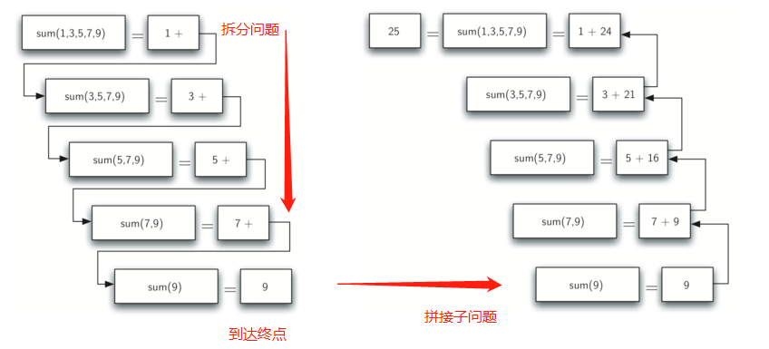

开始我们不断把问题划分为小的问题，直到问题不能再继续划分为止。当到达了划分的终点，我们就是可以把这些小问题拼接起来，直到把最初的问题解决。当最顶层的问题返回时，我们就得到了最终的答案。动态效果可以参考：[Calculating the Sum of a List of Numbers](http://interactivepython.org/runestone/static/pythonds/Recursion/pythondsCalculatingtheSumofaListofNumbers.html)

## 递归三原则
就如阿西莫夫机器人原则一样，递归也有三个原则：
1. 递归算法必须要有一个基本情况（即最小问题）
2. 递归算法必须改变状态并向着基本情况移动
3. 递归算法必须调用自己，即递归

基本情况就是可以让递归算法可以停止的情况，一个基本情况就是一个典型的足够小的可以直接解决的问题。在求数组和的例子中，基本情况就是 list 的长度为 1 。

状态的改变意味着算法使用的某些数据被修改了，这些数据意味着我们的问题以某种方式变得越来越小。在数组求和的例子中，我们的基本数据结构是 list，因此我们更关注 list 状态的改变。在数组求和情况中，我们的基本情况是 list 的长度为1，因此我们的处理进程就是朝着**缩短 list** 的方向前进，而完成整个操做的正是行代码`numList[0] + listsum(numList[1:])`。

最后一个规则：算法必须调用他自己。

**练习**
`fact(n)` 定义为 n * n-1 * n-2 ... ，且 fact（0）为 1 ，那么此递归的基本情况是什么？

此问题的基本情况为 n <= 1，此情况既可以满足 fact（0）为 1，又可以满足 fact（1）为 1。

## 应用 - 将整数转为以任意数为基底的字符串
在前面使用 stack 做过类似的转换，此处将使用递归来完成类似的操作。例如整数769转为字符串'769'，对于单个数字我们可以使用一个整数序列`convString = '0123456789'`，从中查找需要转换的数即可`convString[7]`。而通过除 10 取余的方式可以将 769 转为单个数字，且递归的基本情况就是整数小于基底。示意图如下：

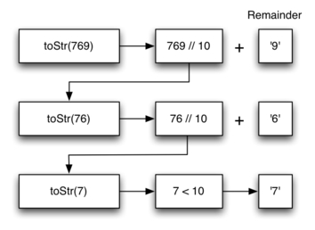

因此，转换的步骤可以总结为如下：
1. 将原始数字转为一串单个数字
2. 通过查找将单个数字转为字符串
3. 将单个字符串连接成最终的结果

以十六进制转换为例，代码如下：


```python
def toStr(n,base):
    convertString = "0123456789ABCDEF"
    # 检查基本情况
    if n < base:
        return convertString[n]
    else:
        # 递归调用
        return toStr(n//base,base) + convertString[n%base]

print(toStr(1453,16))
```

    5AD


### 练习
#### 字符串反转
输入一个字符串返回一个顺序相反的字符串，如输入'weduoo' 返回 'ooudew'


```python
def revelStr(string):
    if len(string) == 1 or len(string) == 0:
        return string
    else:
        return revelStr(string[1:]) + string[0]

print(revelStr('weduoo'))
print(revelStr(''))
```

    ooudew


#### 回文判断
需要移除特殊的字符如：`madam i'm adam`。


```python
def removeWhite(s):
    reps = [" ", ",","'","-",";","."]
    for i in reps:
        s = s.replace(i,"")
    return s.lower()

def isPal(s):
    new = removeWhite(s)
    revStr = revelStr(new)
    return new == revStr

print(isPal("Go hang a salami; I'm a lasagna hog."))
print(isPal("radar"))
print(isPal("hello"))
print(isPal(""))
print(isPal("hannah"))
print(isPal("madam i'm adam"))
```

    True
    True
    False
    True
    True
    True


## 栈帧（Stack Frames）：实现递归
使用栈实现递归调用如下：


```python
# 从 线性结构一章导入
rStack = Stack()

def toStr(n,base):
    convertString = "0123456789ABCDEF"
    while n > 0:
        if n < base:
            rStack.push(convertString[n])
        else:
            rStack.push(convertString[n % base])
        n = n // base
    res = ""
    while not rStack.isEmpty():
        res = res + str(rStack.pop())
    return res

print(toStr(1453,16))
```

上面程序没循环一次就向 stack 中添加一个值，最终只要把数据从 stack 中弹出，然后连接起来就是我们的最终结果，stack 中的值如下：

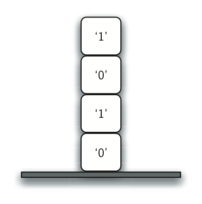

上面程序的实现可以一窥 python 如何实现递归调用的。在python中，当一个函数被调用，一个栈帧（Stack Frames）就被分配用于处理函数的局部变量。当函数返回时，返回值被留在栈帧的顶部，供调用函数去访问。如下展示了返回语句之后的调用栈：

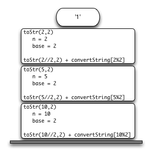

从上可以看到`toStr(2//2,2) `调用在栈上产生一个`1`返回值，这个返回值又会在表达式` "1" + convertString[2%2]`中来替代函数（`toStr(1,2)`）的调用，这会又会在栈顶产生一个`10`值。通过这种方式，python调用栈来代替我们显示的使用栈。

栈帧为函数使用的变量提供了作用域，虽然重复的调用了相同的函数，但每次调用都为函数局部变量创建了新的作用域。

## 递归可视化
可视化使用 python 的标准图形模块`turtle`。如下绘画一个螺旋形的示例：


```python
import turtle
import random
turtle.colormode(255)
myTurtle = turtle.Turtle()
myWin = turtle.Screen()

def drawSpiral(myTurtle, lineLen):
    if lineLen > 0:
        r = random.randint(0,255)
        g = random.randint(0,255)
        b = random.randint(0,255)
        myTurtle.color(int(r),int(g),int(b))
        myTurtle.forward(lineLen)
        myTurtle.right(90)
        drawSpiral(myTurtle,lineLen-1)
myTurtle.setposition(-200,200)
myTurtle.speed(0)
drawSpiral(myTurtle,450)
myWin.exitonclick()
```

### 分形树
使用递归实现的分形树如下：

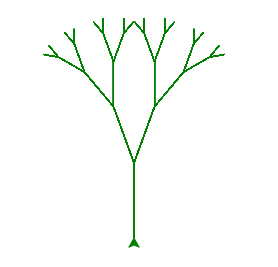

树中的每一个节点都是一次递归调用，每个最终节点都是当前递归的结束。


```python
# 原始代码
import turtle

def tree(branchLen,t):
    if branchLen > 5:
        t.forward(branchLen)
        t.right(20)
        tree(branchLen-15,t)
        t.left(40)
        tree(branchLen-15,t)
        t.right(20)
        t.backward(branchLen)

def main():
    t = turtle.Turtle()
    myWin = turtle.Screen()
    t.left(90)
    t.up()
    t.backward(100)
    t.down()
    t.color("green")
    t.speed(1)
    tree(75,t)
    myWin.exitonclick()

main()
```


```python
import turtle
import random

def tree(branchLen,t):
    if branchLen > 5:
        r = random.randint(0,255)
        g = random.randint(0,255)
        b = random.randint(0,255)
        t.color(int(r),int(g),int(b))
        t.forward(branchLen)
        t.right(20)
        # 递归调用生成右侧
        tree(branchLen-5,t)
        t.left(40)
        # 递归调用生成左侧
        tree(branchLen-5,t)
        t.right(20)
        t.backward(branchLen)
        
def main():
    turtle.colormode(255)
    t = turtle.Turtle()
    myWin = turtle.Screen()
    
    t.left(90)
    t.up()
    t.backward(100)
    t.setx(-150)
    t.down()
    t.color("green")
    t.speed(0)
    tree(100,t)
    myWin.exitonclick()

main()
```

### 谢尔宾斯基三角(Sierpinski Triangle)
其形式如下：

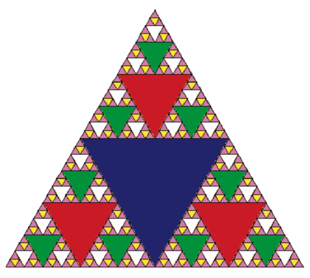


```python
import turtle
import random
def drawst(Linelen, t):
    if Linelen > 10:
        r = random.randint(0, 255)
        g = random.randint(0, 255)
        b = random.randint(0, 255)
        t.color(r,g,b)
        t.forward(Linelen)
        t.left(120)
        drawst(Linelen/2, t)
        t.forward(Linelen)
        t.left(120)
        drawst(Linelen/2, t)
        t.forward(Linelen)
        t.left(120)
        drawst(Linelen/2, t)
    
def main():
    t = turtle.Turtle()
    myWin = turtle.Screen()
    turtle.colormode(255)
    t.speed(0)
    t.backward(100)
    drawst(300,t)
    myWin.exitonclick()
main()
```


```python
import turtle

def drawTriangle(points,color,myTurtle):
    myTurtle.fillcolor(color)
    myTurtle.up()
    myTurtle.goto(points[0][0],points[0][1])
    myTurtle.down()
    myTurtle.begin_fill()
    myTurtle.goto(points[1][0],points[1][1])
    myTurtle.goto(points[2][0],points[2][1])
    myTurtle.goto(points[0][0],points[0][1])
    myTurtle.end_fill()

def getMid(p1,p2):
    return ( (p1[0]+p2[0]) / 2, (p1[1] + p2[1]) / 2)

def sierpinski(points,degree,myTurtle):
    colormap = ['blue','red','green','white','yellow',
                'violet','orange']
    drawTriangle(points,colormap[degree],myTurtle)
    if degree > 0:
        sierpinski([points[0],
                        getMid(points[0], points[1]),
                        getMid(points[0], points[2])],
                   degree-1, myTurtle)
        sierpinski([points[1],
                        getMid(points[0], points[1]),
                        getMid(points[1], points[2])],
                   degree-1, myTurtle)
        sierpinski([points[2],
                        getMid(points[2], points[1]),
                        getMid(points[0], points[2])],
                   degree-1, myTurtle)

def main():
    myTurtle = turtle.Turtle()
    myWin = turtle.Screen()
    myPoints = [[-100,-50],[0,100],[100,-50]]
    myTurtle.speed(0)
    sierpinski(myPoints,6,myTurtle)
    myWin.exitonclick()
main()
```

上述代码运行的过程如下：

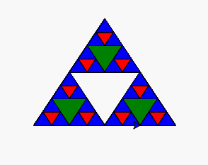

具体绘制的过程与初始化设置有关，假设执行上的顺序为左下、顶部、右下。`sierpinski` 函数会调用他自己，开始先绘制左下角，一直绘制到允许的最小值，然后再退回去绘制其他部分。接着去绘制最顶部的部分，知道绘制到允许到的最小值，最后是右下角。

使用图形可以很好地展示递归的调用过程，以左下角部分的绘制为例，递归的调用示意图如下：

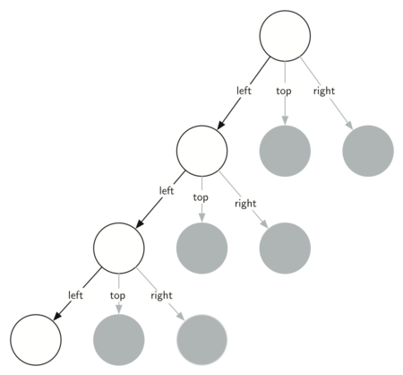

## 汉诺塔
可参考[Tower of Hanoi](http://interactivepython.org/runestone/static/pythonds/Recursion/TowerofHanoi.html?lastPosition=2164)。代码如下：


```python
def moveTower(height,fromPole, toPole, withPole):
    if height >= 1:
        moveTower(height-1,fromPole,withPole,toPole)
        moveDisk(fromPole,toPole)
        moveTower(height-1,withPole,toPole,fromPole)

def moveDisk(fp,tp):
    print("moving disk from",fp,"to",tp)

moveTower(3,"A","B","C")
```

    moving disk from A to B
    moving disk from A to C
    moving disk from B to C
    moving disk from A to B
    moving disk from C to A
    moving disk from C to B
    moving disk from A to B


## 迷宫探索
把小乌龟放在一个迷宫中，让其探索自由的探索，如下：

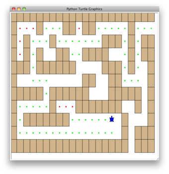

具体过程的探索，可以查看此文章[Exploring a Maze](http://interactivepython.org/runestone/static/pythonds/Recursion/ExploringaMaze.html)

迷宫的形式如下（S 为开始探索的起点，从左侧读取数据转成数组）：

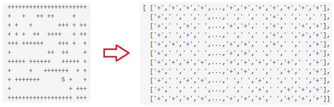

完整代码如下：


```python
import turtle

PART_OF_PATH = 'O'
TRIED = '.'
OBSTACLE = '+'
DEAD_END = '-'

class Maze:
    # 初始化一个迷宫
    def __init__(self,mazeFileName):
        rowsInMaze = 0
        columnsInMaze = 0
        self.mazelist = []
        # 读取迷宫的文件
        mazeFile = open(mazeFileName,'r')
        rowsInMaze = 0
        for line in mazeFile:
            rowList = []
            col = 0
            for ch in line[:-1]:
                rowList.append(ch)
                if ch == 'S':
                    self.startRow = rowsInMaze
                    self.startCol = col
                col = col + 1
            rowsInMaze = rowsInMaze + 1
            self.mazelist.append(rowList)
            columnsInMaze = len(rowList)

        self.rowsInMaze = rowsInMaze
        self.columnsInMaze = columnsInMaze
        self.xTranslate = -columnsInMaze/2
        self.yTranslate = rowsInMaze/2
        self.t = Turtle(shape='turtle')
        setup(width=600,height=600)
        setworldcoordinates(-(columnsInMaze-1)/2-.5,
                            -(rowsInMaze-1)/2-.5,
                            (columnsInMaze-1)/2+.5,
                            (rowsInMaze-1)/2+.5)
    # 绘制迷宫
    def drawMaze(self):
        self.t.speed(6)
        self.wn.tracer(0)
        for y in range(self.rowsInMaze):
            for x in range(self.columnsInMaze):
                if self.mazelist[y][x] == OBSTACLE:
                    self.drawCenteredBox(x+self.xTranslate,
                                         -y+self.yTranslate,
                                         'tan')
        self.t.color('black','blue')
    
    # 绘制砖块
    def drawCenteredBox(self,x,y,color):
        tracer(0)
        self.t.up()
        self.t.goto(x-.5,y-.5)
        self.t.color('black',color)
        self.t.setheading(90)
        self.t.down()
        self.t.begin_fill()
        for i in range(4):
            self.t.forward(1)
            self.t.right(90)
        self.t.end_fill()
        update()
        tracer(1)
    
    # 移动乌龟
    def moveTurtle(self,x,y):
        self.t.up()
        self.t.setheading(self.t.towards(x+self.xTranslate,
                                         -y+self.yTranslate))
        self.t.goto(x+self.xTranslate,-y+self.yTranslate)
        
    # 绘制面包屑（用于标识是否已走过）
    def dropBreadcrumb(self,color):
        self.t.dot(color)
    
    # 更新位置
    def updatePosition(self,row,col,val=None):
        if val:
            self.mazelist[row][col] = val
        self.moveTurtle(col,row)

        if val == PART_OF_PATH:
            color = 'green'
        elif val == OBSTACLE:
            color = 'red'
        elif val == TRIED:
            color = 'black'
        elif val == DEAD_END:
            color = 'red'
        else:
            color = None

        if color:
            self.dropBreadcrumb(color)
    
    # 判断是否已经找到出口
    def isExit(self,row,col):
         return (row == 0 or
                 row == self.rowsInMaze-1 or
                 col == 0 or
                 col == self.columnsInMaze-1 )

    def __getitem__(self,idx):
         return self.mazelist[idx]

    
```


```python
def searchFrom(maze, startRow, startColumn):
    # try each of four directions from this point until we find a way out.
    # base Case return values:
    #  1. We have run into an obstacle, return false
    maze.updatePosition(startRow, startColumn)
    if maze[startRow][startColumn] == OBSTACLE :
        return False
    #  2. We have found a square that has already been explored
    if maze[startRow][startColumn] == TRIED or maze[startRow][startColumn] == DEAD_END:
        return False
    # 3. We have found an outside edge not occupied by an obstacle
    if maze.isExit(startRow,startColumn):
        maze.updatePosition(startRow, startColumn, PART_OF_PATH)
        return True
    maze.updatePosition(startRow, startColumn, TRIED)
    # Otherwise, use logical short circuiting to try each direction
    # in turn (if needed)
    found = searchFrom(maze, startRow-1, startColumn) or \
            searchFrom(maze, startRow+1, startColumn) or \
            searchFrom(maze, startRow, startColumn-1) or \
            searchFrom(maze, startRow, startColumn+1)
    if found:
        maze.updatePosition(startRow, startColumn, PART_OF_PATH)
    else:
        maze.updatePosition(startRow, startColumn, DEAD_END)
    return found

# maze2.txt中存着迷宫的地图
myMaze = Maze('maze2.txt')
myMaze.drawMaze()
myMaze.updatePosition(myMaze.startRow,myMaze.startCol)

searchFrom(myMaze, myMaze.startRow, myMaze.startCol)
```

运行代码可以看到如下的效果：

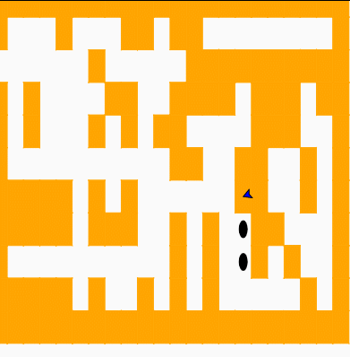

修改移动方向的顺序，可以得到不同的路线图，如下：

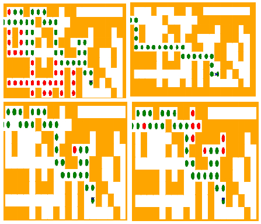

## 动态规划 - 硬币面值组合
参考[Dynamic Programming](http://interactivepython.org/runestone/static/pythonds/Recursion/DynamicProgramming.html)


## 总结
- All recursive algorithms must have a base case.
- A recursive algorithm must change its state and make progress toward the base case.
- A recursive algorithm must call itself (recursively).
- Recursion can take the place of iteration in some cases.
- Recursive algorithms often map very naturally to a formal expression of the problem you are trying to solve.
- Recursion is not always the answer. Sometimes a recursive solution may be more computationally expensive than an alternative algorithm.


## 讨论
1. Draw a call stack for the Tower of Hanoi problem. Assume that you start with a stack of three disks.
2. Using the recursive rules as described, draw a Sierpinski triangle using paper and pencil.
3. Using the dynamic programming algorithm for making change, find the smallest number of coins that you can use to make 33 cents in change. In addition to the usual coins assume that you have an 8 cent coin.

# 编程练习
[Programming Exercises](http://interactivepython.org/runestone/static/pythonds/Recursion/pythondsProgrammingExercises.html)

# 参考
1. [The Three Laws of Recursion](http://interactivepython.org/runestone/static/pythonds/Recursion/TheThreeLawsofRecursion.html?lastPosition=0)
1. [Stack Frames: Implementing Recursion](http://interactivepython.org/runestone/static/pythonds/Recursion/StackFramesImplementingRecursion.html#lst-recstack)
1. [Introduction: Visualizing Recursion](http://interactivepython.org/runestone/static/pythonds/Recursion/pythondsintro-VisualizingRecursion.html#fig-tree2)
1. [Sierpinski Triangle](http://interactivepython.org/runestone/static/pythonds/Recursion/pythondsSierpinskiTriangle.html)
