# 搜索
## 顺序检索（Sequential Search）

## 二分查找（Binary Search）

**分治策略**:`divide and conquer strategy`


```python
# 使用循环的方法
def binarySearch(alist, item):
    first = 0
    last = len(alist)-1
    found = False

    while first<=last and not found:
        midpoint = (first + last)//2
        if alist[midpoint] == item:
            found = True
        else:
            if item < alist[midpoint]:
                last = midpoint-1
            else:
                first = midpoint+1
    return found

testlist = [0, 1, 2, 8, 13, 17, 19, 32, 42,]
print(binarySearch(testlist, 3))
print(binarySearch(testlist, 13))
```


```python
# 使用递归方法
def binarySearch(alist, item):
    if len(alist) == 0:
        return False
    else:
        midpoint = len(alist)//2
        if alist[midpoint]==item:
              return True
        else:
            if item<alist[midpoint]:
                return binarySearch(alist[:midpoint],item)
            else:
                return binarySearch(alist[midpoint+1:],item)

testlist = [0, 1, 2, 8, 13, 17, 19, 32, 42,]
print(binarySearch(testlist, 3))
print(binarySearch(testlist, 13))

```

## 哈希（Hashing）
**哈希函数（Hash Function）**，用于将元素与位置对应的函数，如把54、26、93、17、77、和 31 映射到一个长度为11的list中：


可以简单地使用模除的方式来映射**h(item)=item%11**，然后将之放入相应的位置，如下每个元素模除之后值：

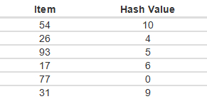

**负载系数（Load Factor）**，通常记为$$\lambda = \frac {numberofitems}{tablesize}$$
如下λ的值就为 6 / 11 :


但对于上面的哈希哈数实现有一个问题，就是只有当每个元素只对应哈希表中的唯一位置时才是有效的，当有多个元素对应同一个位置时就会出现问题，如下 44 % 11 = 0 此时就和 77 在同一个位置，这种情况称为**哈希碰撞（hash collision）**。

### 哈希函数
**完美哈希函数** 即将元素能够将元素映射到唯一的槽位（slot）。

#### 解决Hash Collision的几种方法
- 折叠法（folding method）

即把一组数拆分为相同（最后一段可能小于切片大小）大小的片段，然后把这些值相加，返回相加结果的哈希值。如电话号码436-555-4601拆分为两个一个组`43,65,55,46,01`，然后把每一组值相加**`43+65+55+46+01 = 210`** ，然后再用 210 模除 11 得到 1 。

- 平方取中法

即取元素的平方，然后再取平方结果的中间两个值，再去取中间值的哈希值。如 44 <sup>2</sup> = 1936 ，中间值为 93 ，然后再用 93 去模除 11 。

除了对数字取哈希，还可以对字符串去哈希，如 `cat` 通过 `ord` 函数将每个字串转成数字，如 `ord('c')` 为 99 ，然后将转成数字的值相加，得到的结果再去模除哈希表的长度。具体流程如下：


```python
def hash(astring, tablesize):
    sum = 0
    for pos in range(len(astring)):
        sum = sum + ord(astring[pos])

    return sum%tablesize
```

因为字母在字母表中的顺序是不变的，所有生成的哈希值也是不变的，我们可以根据字母在单词中的位置，添加权重信息，使得每个字母得到的哈希值都是不同的。如下：

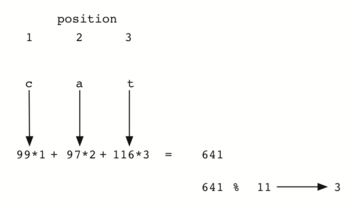

虽然有很多方式可以实现哈希哈数，但需要注意哈希函数的效率，如果效率太低或者太复杂以至于哈希函数把大部分时间都用在了计算上，那么这样的函数实现就违背了哈希函数的初衷。

#### 碰撞解决
参考[Collision Resolution](http://interactivepython.org/runestone/static/pythonds/SortSearch/Hashing.html#collision-resolution)

- 开放寻址法（open addressing）

线性探测（linear probing）

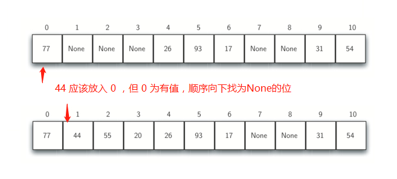

线性探测的缺点是聚类的倾向，具有相同哈希值的数会聚集在一起，这样就有可能占据了本应该再次位置的值。

一种解决办法是，当发生哈希碰撞时，不是一个一个的顺序查找，而是跳过固定的值，如隔两个查找一个，看看是否可以将其放在此处。

上面的处理过程也被称为重新哈希（rehashing），对于线性探测来说rehashing函数为：**newhashvalue=rehash(oldhashvalue)** ，其中 **rehash(pos)=(pos+1)%sizeoftable** ，对于加3的情况则为：**rehash(pos)=(pos+3)%sizeoftable** 。两种方法可以通用写为：**rehash(pos)=(pos+skip)%sizeoftable** 。

需要注意的是，在设置跳过步（skip）时，必须能让所有的位置都能被访问到。为了确保所有的位置都被访问到，一般建议把表的大小设置为素数，这就是为什么上面的案例是以11为大小。

**二次探测（quadratic probing）**

是线性探测的一个变种。

**链接（Chaining）**
此方法允许具有相同哈希值的元速度处在同一个位置。当碰撞发生时，元素仍然正确的放在了哈希表中。当越来越多的值放在了形同到的位置，在搜索元素时也会变得困难。链的实现示意图如下：


## 实现Map抽象数据结构
map 抽象数据结构可以做如下的定义，在键与数据值之间进行关联的集合。键在Map中是唯一的，因此键与值的对应关系为一一对应，可以进行的操作有如下几个：
- `Map()` 创建一个新的空map，返回一个空的Map
- `put(key,val)` 添加一个新的键值对到Map中，如果key在Map中已经存在了，则使用新的值替换已有的值
- `get(key)` 给定一个键，返回存储在map中的键的值或者None
- `del` 使用`del map[key]` 从Map中删除键值对 
- `len()` 返回 Map 中存储的键值对个数
- `in` 如果给定的 key 在 map 中 `key in map` 返回 True ，否则返回 False 

使用两个 list 来创建 HashTable 类，并用其实现 map 抽象数据类型。其中一个 list 叫 slots ，用来存储 key，另一个 list 叫 data ，用于存储 value。初始化的 list 大小应为一个素数，这样可以最大程度的避免碰撞。


```python
# 初始化 HashTable
class HashTable:
    def __init__(self):
        self.size = 11
        self.slots = [None] * self.size
        self.data = [None] * self.size
    # 向Map中添加数据
    def put(self,key,data):
        # 获取 hash 值
        hashvalue = self.hashfunction(key,len(self.slots))

        if self.slots[hashvalue] == None:
            self.slots[hashvalue] = key
            self.data[hashvalue] = data
        else:
            if self.slots[hashvalue] == key:
                # 新数据替换旧数据
                self.data[hashvalue] = data  #replace
            else:
                # 按步长为 1 来更新hash值
                nextslot = self.rehash(hashvalue,len(self.slots))
                while self.slots[nextslot] != None and \
                          self.slots[nextslot] != key:
                    nextslot = self.rehash(nextslot,len(self.slots))

                if self.slots[nextslot] == None:
                    # 新的槽位上无值在放入
                    self.slots[nextslot]=key
                    self.data[nextslot]=data
                else:
                    # 替换原有可以的数据
                    self.data[nextslot] = data #replace

    # 使用模除余数取hash
    def hashfunction(self,key,size):
         return key%size
        
    # 使用step 为1 来更新 hash
    def rehash(self,oldhash,size):
        return (oldhash+1)%size
    
    # 获取Hash表中的值
    def get(self,key):
        # 获取hash值
        startslot = self.hashfunction(key,len(self.slots))

        data = None
        stop = False
        found = False
        position = startslot
        while self.slots[position] != None and  \
                           not found and not stop:
            if self.slots[position] == key:
                found = True
                data = self.data[position]
            else:
                # 重新得到下一位的Hash值
                position=self.rehash(position,len(self.slots))
                if position == startslot:
                    # 表名已经遍历了整个hash表
                    stop = True
        return data

    def __getitem__(self,key):
        return self.get(key)

    def __setitem__(self,key,data):
        self.put(key,data)
```


```python
H=HashTable()
H[54]="cat"
H[26]="dog"
H[93]="lion"
H[17]="tiger"
H[77]="bird"
H[31]="cow"
H[44]="goat"
H[55]="pig"
H[20]="chicken"
print(H.slots)
print(H.data)
# 访问数据
print(H[20])
print(H[17])
# 修改数据
H[20]='duck'
print(H[20])
print(H.data)
print(H[99])
H.put(22,'spiral')
print(H.slots)
print(H.data)
```

    [77, 44, 55, 20, 26, 93, 17, None, None, 31, 54]
    ['bird', 'goat', 'pig', 'chicken', 'dog', 'lion', 'tiger', None, None, 'cow', 'cat']
    chicken
    tiger
    duck
    ['bird', 'goat', 'pig', 'duck', 'dog', 'lion', 'tiger', None, None, 'cow', 'cat']
    None
    [77, 44, 55, 20, 26, 93, 17, 22, None, 31, 54]
    ['bird', 'goat', 'pig', 'duck', 'dog', 'lion', 'tiger', 'spiral', None, 'cow', 'cat']


### Hashing分析
We stated earlier that in the best case hashing would provide a **O(1)**, constant time search technique. However, due to collisions, the number of comparisons is typically not so simple. Even though a complete analysis of hashing is beyond the scope of this text, we can state some well-known results that approximate the number of comparisons necessary to search for an item.

The most important piece of information we need to analyze the use of a hash table is the load factor, λ. Conceptually, if λ is small, then there is a lower chance of collisions, meaning that items are more likely to be in the slots where they belong. If λ is large, meaning that the table is filling up, then there are more and more collisions. This means that collision resolution is more difficult, requiring more comparisons to find an empty slot. With chaining, increased collisions means an increased number of items on each chain.

As before, we will have a result for both a successful and an unsuccessful search. For a successful search using open addressing with linear probing, the average number of comparisons is approximately $$\frac{1}{2}\left(1+\frac{1}{1-\lambda}\right)$$ and an unsuccessful search gives $$\frac{1}{2}\left(1+\left(\frac{1}{1-\lambda}\right)^2\right)$$ If we are using chaining, the average number of comparisons is 1+λ/2 for the successful case, and simply λ comparisons if the search is unsuccessful.

# 排序

## 冒泡排序（Bubble Sort）
冒泡排序会遍历整个lis，通过多次遍历排序达到对整个list排序的目的，如下图的第一次遍历：


如上图可以看出，如果list的大小为n，那么第一次遍历就需要比较 n-1 次。从上图的移动过程可以看到，如果list中的最大值是比较对的一部分，那么他就会持续性的移动，一直到完成。如上图的93，一旦他包含在比较的对中，那么93就会一直存在于比较对中，一直到比较完成。

完成第一次交换之后，还剩下 n - 1 个元素需要交换，意味着有 n-2 个交换对。因为每一次都要找到下一个最大的值，因此完成整个排序需要 n - 1 次遍历。经过 n - 1 次排序之后，最小的值已经在正确的位置了，不需要在进行遍历。

在大多数语言中，元素位置的交换都需要一个临时位置，如下：
```
temp = alist[i]
alist[i] = alist[j]
alist[j] = temp
```
但在 python 中可以通过同步分配，一行代码做到：`a,b=b,a`。两者的对比图如下：

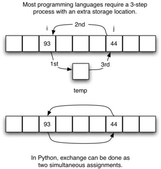


```python
def bubbleSort(alist):
    for passnum in range(len(alist)-1,0,-1):
        for i in range(passnum):
            if alist[i]>alist[i+1]:
                temp = alist[i]
                alist[i] = alist[i+1]
                alist[i+1] = temp

alist = [54,26,93,17,77,31,44,55,20]
bubbleSort(alist)
print(alist)
```

    [17, 20, 26, 31, 44, 54, 55, 77, 93]


由上可以推断冒泡排序的时间复杂度为**O(n<sup>2</sup>)** 。

由于冒泡排序的性能很低，且有时数据已经是排序过的了，就不需要在进行排序。因此可以在排序的时候添加一个是否有交换的判断，只要没有了交换就表明数据已经是有序的了。修改后的代码如下：


```python
def shortBubbleSort(alist):
    exchanges = True
    passnum = len(alist)-1
    while passnum > 0 and exchanges:
        exchanges = False
        for i in range(passnum):
            if alist[i]>alist[i+1]:
                exchanges = True
                temp = alist[i]
                alist[i] = alist[i+1]
                alist[i+1] = temp
        passnum = passnum-1

alist=[20,30,40,90,50,60,70,80,100,110]
shortBubbleSort(alist)
print(alist)
```

    [20, 30, 40, 50, 60, 70, 80, 90, 100, 110]


## 选择排序（Selection Sort）
选择排序是在冒泡排序的基础之上改进而来，在每次遍历的过程中只进行一次交换。流程如下：


```python
def selectionSort(alist):
    for fillslot in range(len(alist)-1,0,-1):
        positionOfMax=0
        for location in range(1,fillslot+1):
            # 寻找此次最大值
            if alist[location]>alist[positionOfMax]:
                positionOfMax = location
        # 把最大值交换到正确的位置
        temp = alist[fillslot]
        alist[fillslot] = alist[positionOfMax]
        alist[positionOfMax] = temp

alist = [54,26,93,17,77,31,44,55,20]
selectionSort(alist)
print(alist)
```

    [17, 20, 26, 31, 44, 54, 55, 77, 93]

上述代码的执行过程大致如下：

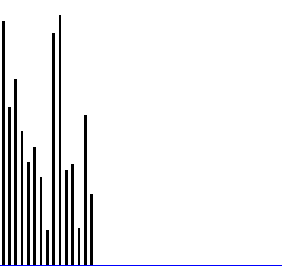

可以看到选择排序执行的次数与冒泡排序是一样的时间复杂度都是**O（n<sup>2</sup>）**，但是选择排序值进行 n - 1 次交换，效率要比冒泡排序高了很多。

## 插入排序（Insertion Sort）
插入排序与前两个排序稍有不同，但时间复杂度依然为**O（n<sup>2</sup>）** 。插入每次只维护一个有序的子集在底位置上，每个新的元素插入到前面的子集中。插入排序的处理过程如下图：


在进行第五次遍历时，整个情景如下：

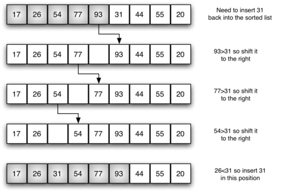


```python
def insertionSort(alist):
    # 从第二个元素开始
    for index in range(1,len(alist)):
        currentvalue = alist[index]
        position = index

        while position>0 and alist[position-1]>currentvalue:
            # 进行位置交换
            alist[position]=alist[position-1]
            position = position-1

        alist[position]=currentvalue

alist = [54,26,93,17,77,31,44,55,20]
insertionSort(alist)
print(alist)
```

    [17, 20, 26, 31, 44, 54, 55, 77, 93]


上面代码执行的过程如下：

## 希尔排序（Shell Sort）
希尔排序也叫减小增量排序（diminishing increment sort），他是对插入排序改进而得来。每次都会选择一个 key ，key 值用于将 list 分割成非连续的字 list。如选择 key 为 3 ，那么切分的结果将如下：

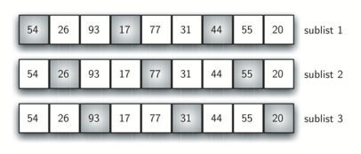

每一个子list使用插入排序，那么得到的结果将如下：

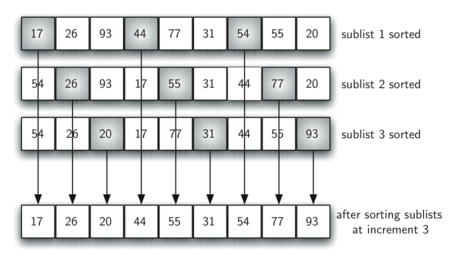

最终在只用步长为 1 的插入排序，如下图：

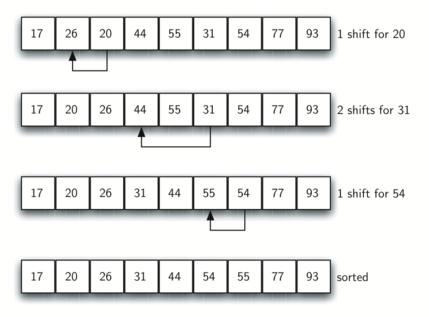


```python
def shellSort(alist):
    sublistcount = len(alist)//2
    while sublistcount > 0:

        for startposition in range(sublistcount):
            gapInsertionSort(alist,startposition,sublistcount)

        print("After increments of size",sublistcount,
                                   "The list is",alist)

        sublistcount = sublistcount // 2

# 特定步长的插入排序
def gapInsertionSort(alist,start,gap):
    for i in range(start+gap,len(alist),gap):

        currentvalue = alist[i]
        position = i
        
        while position>=gap and alist[position-gap]>currentvalue:
            alist[position]=alist[position-gap]
            position = position-gap

        alist[position]=currentvalue

alist = [54,26,93,17,77,31,44,55,20]
shellSort(alist)
print(alist)
```

    After increments of size 4 The list is [20, 26, 44, 17, 54, 31, 93, 55, 77]
    After increments of size 2 The list is [20, 17, 44, 26, 54, 31, 77, 55, 93]
    After increments of size 1 The list is [17, 20, 26, 31, 44, 54, 55, 77, 93]
    [17, 20, 26, 31, 44, 54, 55, 77, 93]

上面代买的执行流程如下：

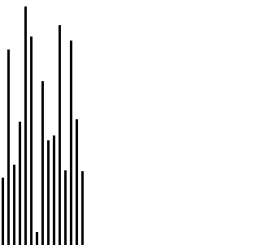

At first glance you may think that a shell sort cannot be better than an insertion sort, since it does a complete insertion sort as the last step. It turns out, however, that this final insertion sort does not need to do very many comparisons (or shifts) since the list has been pre-sorted by earlier incremental insertion sorts, as described above. In other words, each pass produces a list that is “more sorted” than the previous one. This makes the final pass very efficient.

Although a general analysis of the shell sort is well beyond the scope of this text, we can say that it tends to fall somewhere between **O(n)** and **O(n<sup>2</sup>)**, based on the behavior described above. For the increments shown in previous code, the performance is **O(n<sup>2</sup>)**. By changing the increment, for example using **2<sup>k</sup>−1** (1, 3, 7, 15, 31, and so on), a shell sort can perform at **O(n<sup>3/2</sup>)**.

## 归并排序（Merge Sort）
归并排序是一种**分而治之**的方法来提升排序的速度，通过递归持续的将一个 list 分割为原来的一半，如果 list 为空或者只有一个元素，那么就排序。如果 list 中的元素的数量大于1，那么就在两个 list 再次调用归并排序函数。一旦两部分都应是排序过的，那么就调用**merge**这个基础操作，合并是将两个已排序的小的 list 合并成一个单一且排序的更大的list。如下图，首先将大的list且分为小的list：

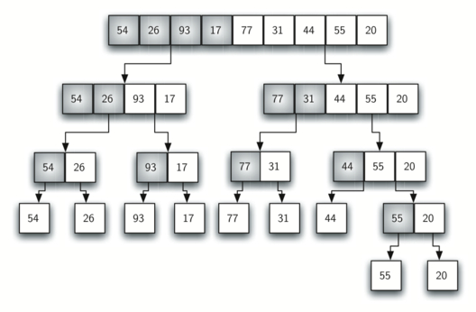

切分完成之后，接着进行归并排序：

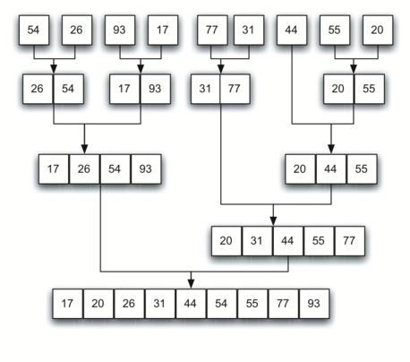


```python
def mergeSort(alist):
    print("Splitting ",alist)
    # 判断基本情况，list 如果长度大于1则进行分割
    if len(alist)>1:
        mid = len(alist)//2
        # 将原有的 list 分为两部分
        lefthalf = alist[:mid]
        righthalf = alist[mid:]
        # 递归调用，继续切分两个部分
        mergeSort(lefthalf)
        mergeSort(righthalf)

        i=0
        j=0
        k=0
        # 合并两个子list
        while i < len(lefthalf) and j < len(righthalf):
            print("both sides has value")
            if lefthalf[i] < righthalf[j]:
                alist[k]=lefthalf[i]
                i=i+1
            else:
                alist[k]=righthalf[j]
                j=j+1
            k=k+1
        # 若左侧还有剩余则直接将其放入到父list中
        while i < len(lefthalf):
            print("left half has value left")
            alist[k]=lefthalf[i]
            i=i+1
            k=k+1
        
        # 若右侧还有剩余则直接将其放入到父list中
        while j < len(righthalf):
            print("right half has value left")
            alist[k]=righthalf[j]
            j=j+1
            k=k+1
    print("Merging ",alist)

alist = [54,26,93,17,77,31,44,55,20]
mergeSort(alist)
print(alist)
```

上述代码的执行过程可以参考5中的Codelens。执行示意图如下：

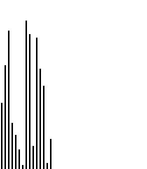

In order to analyze the `mergeSort` function, we need to consider the two distinct processes that make up its implementation. First, the list is split into halves. We already computed (in a binary search) that we can divide a list in half **logn** times where n is the length of the list. The second process is the merge. Each item in the list will eventually be processed and placed on the sorted list. So the merge operation which results in a list of size n requires n operations. The result of this analysis is that logn splits, each of which costs n for a total of nlogn operations. A merge sort is an **O(nlogn)** algorithm.

Recall that the slicing operator is **O(k)** where k is the size of the slice. In order to guarantee that `mergeSort` will be **O(nlogn)** we will need to remove the slice operator. Again, **this is possible if we simply pass the starting and ending indices along with the list when we make the recursive call.**

It is important to notice that the `mergeSort` function requires extra space to hold the two halves as they are extracted with the slicing operations. This additional space can be a critical factor if the list is large and can make this sort problematic when working on large data sets.

## 快速排序（Quick Sort）
快速排序也是使用**分而治之**的方式获得与归并排序（Merge Sort）一样的优势，同时又不占用额外的存储空间。但当数据不能被平均分为两部分时，执行的性能就会有所下降。

快排首选需要选一个**主值（pivot value）**，通常会选择集合的第一个值，主值的主要作用是切分 list，主值在排序过的 list 位置就是用于切分的点。

如下，从前面可以知道 51 最终会在 31 的位置，首先选择 51 作为主值，接着会发生**分区（partition）**操作。


然后将大于或者小于主值的元素各移动到一边，首先分区会选择两个标记`leftmark`和`rightmark`，一个在开始的位置，一个在结尾处。分区的目标是将相对于主值位置错误的元素，同时汇聚分割点，过程如下图：

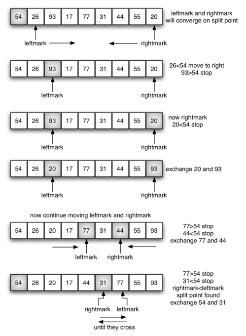

当移动到 `rightmark`小于`leftmark`时就可以停止移动了，且此时`rightmark`所在的位置就是新的切分点，如上图此时 31 就是新的切分点，这时就可以交换`rightmark`与主值，即 31 与 54 交换位置，交换之后左侧都是小于主值的元素，右侧都是大于主值的元素，依据主值所在的位置切分两个新的 list，如下图：


```python
# 快速排序函数
def quickSort(alist):
    # 调用递归函数
    quickSortHelper(alist,0,len(alist)-1)

def quickSortHelper(alist,first,last):
    if first<last:
        # 通过分区过程找到新的切分点
        splitpoint = partition(alist,first,last)
        # 递归调用持续切分（左侧与左侧）
        quickSortHelper(alist,first,splitpoint-1)
        quickSortHelper(alist,splitpoint+1,last)


def partition(alist,first,last):
    # 找到主值
    pivotvalue = alist[first]
    # 找到位置标记
    leftmark = first+1
    rightmark = last
    
    # 是否已完成
    done = False
    while not done:
        # 左侧小于主值持续向右移动
        while leftmark <= rightmark and alist[leftmark] <= pivotvalue:
            leftmark = leftmark + 1

        # 右侧大于主值则持续向左移动
        while alist[rightmark] >= pivotvalue and rightmark >= leftmark:
            rightmark = rightmark -1
        
        if rightmark < leftmark:
            # 说明此时大于主值与小于主值的元素都在正确的位置
            done = True
        else:
            # 交换左右编辑的值
            temp = alist[leftmark]
            alist[leftmark] = alist[rightmark]
            alist[rightmark] = temp
    # 新旧两个主值交换位置
    temp = alist[first]
    alist[first] = alist[rightmark]
    alist[rightmark] = temp
    
    # 返回新的切分点
    return rightmark

alist = [54,26,93,17,77,31,44,55,20]
quickSort(alist)
print(alist)
```

    [17, 20, 26, 31, 44, 54, 55, 77, 93]

上述代码的执行帧栈可以查看**参考6**，执行的流程示意图如下：

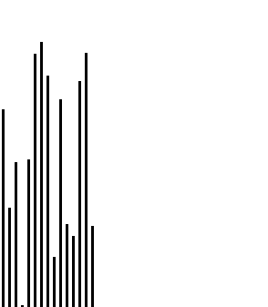

To analyze the quickSort function, note that for a list of length **n**, if the partition always occurs in the middle of the list, there will again be **logn** divisions. In order to find the split point, each of the n items needs to be checked against the pivot value. The result is nlogn. In addition, there is no need for additional memory as in the merge sort process.

Unfortunately, in the worst case, the split points may not be in the middle and can be very skewed to the left or the right, leaving a very uneven division. In this case, sorting a list of n items divides into sorting a list of 0 items and a list of **n−1** items. Then sorting a list of **n−1** divides into a list of size 0 and a list of size **n−2**, and so on. The result is an **O(n<sup>2</sup>)** sort with all of the overhead that recursion requires.

We mentioned earlier that there are different ways to choose the pivot value. In particular, we can attempt to alleviate some of the potential for an uneven division by using a technique called **median of three**. To choose the pivot value, we will consider the first, the middle, and the last element in the list. In our example, those are 54, 77, and 20. Now pick the median value, in our case 54, and use it for the pivot value (of course, that was the pivot value we used originally). The idea is that in the case where the the first item in the list does not belong toward the middle of the list, the median of three will choose a better “middle” value. This will be particularly useful when the original list is somewhat sorted to begin with.

Which of the following sort algorithms are guaranteed to be O(n log n) even in the worst case?
- (A) Shell Sort
- (B) Quick Sort
- (C) **Merge Sort**
- (D) Insertion Sort


- 0: Shell sort is about ``n^1.5``
- 1: Quick sort can be O(n log n), but if the pivot points are not well chosen and the list is just so, it can be O(n^2).
- 2: Merge Sort is the only guaranteed O(n log n) even in the worst case. The cost is that merge sort uses more memory.
- 3: Insertion sort is ``O(n^2)``

## 总结
- A sequential search is **O(n)** for ordered and unordered lists.
- A binary search of an ordered list is **O(logn)** in the worst case.
- Hash tables can provide constant time searching.
- A bubble sort, a selection sort, and an insertion sort are **O(n<sup>2</sup>)** algorithms.
- A shell sort improves on the insertion sort by sorting incremental sublists. It falls between **O(n)** and **O(n<sup>2</sup>)**.
- A merge sort is **O(nlogn)**, but requires additional space for the merging process.
- A quick sort is **O(nlogn)**, but may degrade to **O(n<sup>2</sup>)** if the split points are not near the middle of the list. It does not require additional space.


## 讨论与练习
- [讨论](http://interactivepython.org/runestone/static/pythonds/SortSearch/DiscussionQuestions.html)
- [编程练习](http://interactivepython.org/runestone/static/pythonds/SortSearch/ProgrammingExercises.html)

# 参考
1. [Hashing](http://interactivepython.org/runestone/static/pythonds/SortSearch/Hashing.html)
1. [The Bubble Sort](http://interactivepython.org/runestone/static/pythonds/SortSearch/TheBubbleSort.html)
1. [The Insertion Sort](http://interactivepython.org/runestone/static/pythonds/SortSearch/TheInsertionSort.html)
1. [The Shell Sort](http://interactivepython.org/runestone/static/pythonds/SortSearch/TheShellSort.html)
1. [The Merge Sort](http://interactivepython.org/runestone/static/pythonds/SortSearch/TheMergeSort.html?lastPosition=300)
1. [The Quick Sort](http://interactivepython.org/runestone/static/pythonds/SortSearch/TheQuickSort.html)
