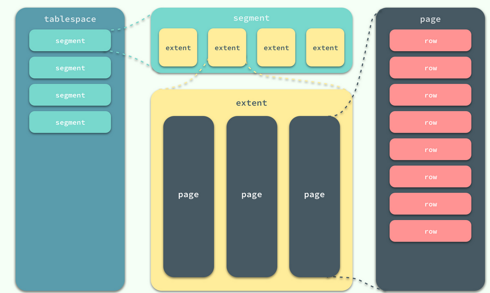
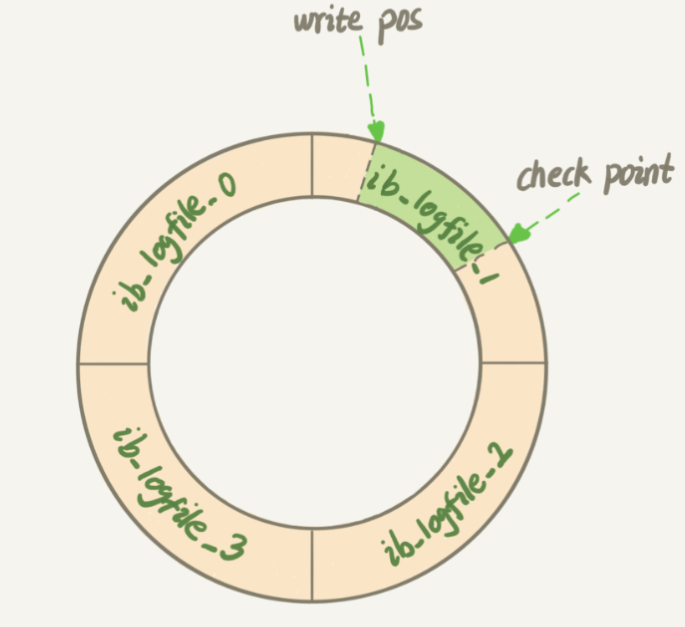
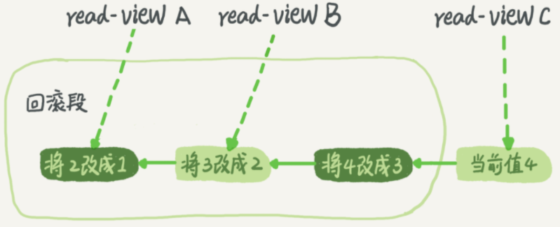

# MySQL基础架构

MySQL基础架构图如下：


MySQL可分为：Server 层和存储层两大部分。其中 Server 层又包括：

- 连接器
- 查询缓存
- 分析器
- 优化器
- 执行器

涵盖MySQL的大多数核心服务功能，以及所有的内置函数(如日期、时间、数学和加密函数等），所有跨存储引擎
的功能（如存储过程、触发器、视图等）都在这一层实现。

而存储引擎层负责数据的存储和提取。其架构模式是插件式的，支持 InnoDB、MyISAM、Memory 等多个存储引擎，不同的存储引擎存储方式也不一样，从上图可以看到不同的存储引擎使公用同一个 `Server 层`。现在最常用的存储引擎是 InnoDB，它从 MySQL 5.5.5 版本开始成为了默认存储引擎。在 `create table` 的时候不指定引擎类型，默认就会使用 InnoDB。

## 连接器

要连接到数据库就需要使用到 连接器，连接器负责跟客户端建立连接、获取权限、维持和管理连接。连接命令一般是这么写的：

```bash
mysql -h$ip -P$port -u$user -p
```

其中的 mysql 命令是客户端工具，用于和服务器建立连接，完成 TCP 握手之后连接器就要进行身份验证。此时会出现两种情况：

- 用户名密码错误，客户端终止连接
- 如果用户名密码认证通过，连接器会到权限表里面查出你拥有的权限。之后，这个连接里面的权限判断逻辑，都将依赖于此时读到的权限。

> 这就意味着，一个用户成功建立连接后，即使你用管理员账号对这个用户的权限做了修改，也不会影响已经存在连接的权限。修改完成后，只有再新建的连接才会使用新的权限设置

客户端如果太长时间没动静，连接器就会自动将它断开。通过 `show processlist` 可以查看线程的状态

```sql
mysql> show processlist;
+----+------+-----------------+------+---------+------+----------+------------------+
| Id | User | Host            | db   | Command | Time | State    | Info             |
+----+------+-----------------+------+---------+------+----------+------------------+
| 12 | root | localhost:30602 | NULL | Sleep   |   70 |          | NULL             |
| 13 | root | localhost:46371 | NULL | Query   |    0 | starting | show processlist |
+----+------+-----------------+------+---------+------+----------+------------------+
2 rows in set (0.00 sec)
```

这个时间是由参数 wait_timeout 控制的，默认值是 8 小时。可以通过变量 `wait_timeout` 来查询这个值：

```sql
mysql> show variables like 'wait_timeout';
+---------------+-------+
| Variable_name | Value |
+---------------+-------+
| wait_timeout  | 28800 |
+---------------+-------+
1 row in set, 1 warning (0.00 sec)
```

连接被断开之后，客户端再次发送请求，就会收到一个错误提醒： Lost connection to MySQL server during query。这时候如果你要继续，就需要重连，然后再执行请求了。

数据库里面，长连接是指连接成功后，如果客户端持续有请求，则一直使用同一个连接。短连接则是指每次执行完很少的几次查询就断开连接，下次查询再重新建立一个。

但是全部是长链接会使得 MySQL 内存占用特别高，这是因为 MySQL 在执行过程中临时使用的内存是管理在连接对象里面，只有断开连接资源才会被释放。所以如果长连接累积下来，可能导致内存占用太大，被系统强行杀掉（OOM），从现象看就是 MySQL 异常重启了。通过以下两种方案可以解决此问题：

- 定期断开长连接。使用一段时间，或者程序里面判断执行过一个占用内存的大查询后，断开连接，之后要查询再重连。
- 如果你用的是 MySQL 5.7 或更新版本，可以在每次执行一个比较大的操作后，通过执行 `mysql_reset_connection` 来重新初始化连接资源。这个过程不需要重连和重新做权限验证，但是会将连接恢复到刚刚创建完时的状态。

## 查询缓存

建立连接之后，就可以执行 `select` 语句，这时就会遇到查询缓存。

MySQL 拿到一个查询请求后，会先到查询缓存看看，之前是不是执行过这条语句。之前执行过的语句及其结果可能会以 key-value 对的形式，被直接缓存在内存中。key 是查询的语句，value 是查询的结果。如果你的查询能够直接在这个缓存中找到 key，那么这个 value 就会被直接返回给客户端。

如果语句不在查询缓存中，就会继续后面的执行阶段。执行完成后，执行结果会被存入查询缓存中。你可以看到，如果查询命中缓存，MySQL 不需要执行后面的复杂操作，就可以直接返回结果，这个效率会很高。

**但是最好我们还是不要使用查询缓存，因为查询缓存往往弊大于利。**

查询缓存的失效非常频繁，只要有对一个表的更新，这个表上所有的查询缓存都会被清空。对于更新压力大的数据库来说，查询缓存的命中率会非常低。除非你的业务就是有一张静态表，很长时间才会更新一次。比如，一个系统配置表，那这张表上的查询才适合使用查询缓存。

> 需要注意的是查询缓存在Mysql 8.0 中不再有此功能。

## 分析器

如果没有命中查询缓存，就要开始真正执行语句了。首先，MySQL 需要知道你要做什么，因此需要对 SQL 语句做解析。

分析器先会做“词法分析”。你输入的是由多个字符串和空格组成的一条 SQL 语句，MySQL 需要识别出里面的字符串分别是什么，代表什么。如语句中包含了不存在的字段或者不存在的关键字此处会报错。

做完了这些识别以后，就要做“语法分析”。根据词法分析的结果，语法分析器会根据语法规则，判断你输入的这个 SQL 语句是否满足 MySQL 语法。

```sql
mysql> elect * from t where ID=1;
ERROR 1064 (42000): You have an error in your SQL syntax; check the manual that corresponds to your
MySQL server version for the right syntax to use near 'elect * from t where ID=1' at line 1
```

## 优化器

- [Sql优化器究竟帮你做了哪些工作？](https://my.oschina.net/u/1859679/blog/1586098)

经过了分析器，MySQL 就知道你要做什么了。在开始执行之前，还要先经过优化器的处理。原则上优化器的目标是：尽可能扫描少的数据库行纪录。

优化器是在表里面有多个索引的时候，决定使用哪个索引；或者在一个语句有多表关联（join）的时候，决定各个表的连接顺序。如下执行两个表 join 的语句：

```sql
mysql> select * from t1 join t2 using(ID) where t1.c=10 and t2.d=20;
```

> 如果连接字段没有索引的话，先将 t1 表的 c=1 0的行和 t2 表 b=20 的进行全表扫描，得到的数据放入到join_buffer 中，然后全表扫描另外一张表，将其和内存中的行进行匹配。

- 既可以先从表  t1 里面取出 c=10 的记录的 ID 值，再根据 ID 值关联到表 t2，再判断 t2 里面 d 的值是否等于 20。
- 也可以先从表 t2 里面取出 d=20 的记录的 ID 值，再根据 ID 值关联到 t1，再判断 t1 里面 c 的值是否等于 10。

这两种执行方法的逻辑结果是一样的，但是执行的效率会有不同，而优化器的作用就是决定选择使用哪一个方案。优化器阶段完成后，这个语句的执行方案就确定下来了，然后进入执行器阶段。

## 执行器

MySQL 通过分析器知道了你要做什么，通过优化器知道了该怎么做，于是就进入了执行器阶段，开始执行语句。

开始执行的时候，要先判断一下你对这个表 T 有没有执行查询的权限，如果没有，就会返回没有权限的错误，如下所示 (在工程实现上，如果命中查询缓存，会在查询缓存返回结果的时候，做权限验证。查询也会在优化器之前调用 precheck 验证权限)。

```mysql
mysql> select * from T where ID=10;
ERROR 1142 (42000): SELECT command denied to user 'b'@'localhost' for table 'T'
```

如果有权限，就打开表继续执行。打开表的时候，执行器就会根据表的**引擎**定义，去使用这个引擎提供的接口

比如我们这个例子中的表 T 中，ID 字段没有索引，那么执行器的执行流程是这样的：

- 调用 InnoDB 引擎接口取这个表的第一行，判断 ID 值是不是 10，如果不是则跳过，如果是则将这行存在结果集中；
- 调用引擎接口取“下一行”，重复相同的判断逻辑，直到取到这个表的最后一行。
- 执行器将上述遍历过程中所有满足条件的行组成的记录集作为结果集返回给客户端。

对于有索引的表，执行的逻辑也差不多。第一次调用的是“取满足条件的第一行”这个接口，之后循环取“满足条件的下一行”这个接口，这些接口都是引擎中已经定义好的。

在数据的慢查询日志中会有一个 `rows_examined` 字段，表示语句执行的过程中扫描了多少行，该值在执行器在每次调用引擎获取数据行的时候累加的。在有些场景下，执行器调用一次，在引擎内部则扫描了多行，因此**引擎扫描行数跟 rows_examined 并不是完全相同**。

## 数据存储结构

在 InnoDB 存储引擎中，所有的数据都被逻辑地存放在表空间中，表空间（tablespace）是存储引擎中最高的存储逻辑单位，在表空间的下面又包括段（segment）、区（extent）、页（page）：



同一个数据库实例的所有表空间都有相同的页大小；默认情况下，表空间中的页大小都为 16KB，当然也可以通过改变 innodb_page_size 选项对默认大小进行修改，需要注意的是不同的页大小最终也会导致区大小的不同：


# MySQL 日志系统

MySQL 可以恢复到半个月内任意一秒的状态，他是怎么做到的呢？为了说明这个问题，我们从一条更新语句说起。这里创建一张表，表有一个主键 ID 和一个整型字段 c：

```sql
mysql> create table T(ID int primary key, c int);
```

我们要更新其中一条 ID 为 2 的数据

```sql
mysql> update T set c=c+1 where ID=2;
```

`update` 语句和上一章的 `select` 流程一样，也会按照上一张图的流程走一遍。

首先，连接器回去连接数据库。在一个表上更新时，该表相应的缓存都会被清空，因此 T 表上的缓存会被清空。

之后，分析器通过词法分析和语法分析知道这是一条更新语句。

然后，优化器决定要使用 ID 这个索引。

最后，执行器负责具体执行，找到这一行，然后更新。

与查询流程不一样的是，更新流程还涉及两个重要的日志模块：`redo log`（重做日志）和 `binlog`（归档日志）

只要我们写的是DML语句（insert，update，delete，create）等等，那么我们在数据库服务端执行的时候就会涉及到redo log(重做日志) 和 binlog(归档日志) 两个日志文件的变动。

## 重要的日志模块：redo log

在 MySQL 中，如果每一次的更新操作都需要写进磁盘，然后磁盘也要找到对应的那条记录，然后再更新，整个过程 IO 成本、查找成本都很高。为了解决这个问题，MySQL 的设计者就用了 WAL 来提升更新效率。WAL 的全称是 Write-Ahead Logging，它的关键点就是先写日志，再写磁盘。

具体来说，当有一条记录需要更新的时候，InnoDB 引擎就会先把记录写到 redo log 里面，并更新内存，这个时候更新就算完成了。同时，InnoDB 引擎会在适当的时候，将这个操作记录更新到磁盘里面，而这个更新往往是在系统比较空闲的时候做。

InnoDB 的 redo log 是固定大小的，比如可以配置为一组 4 个文件，每个文件的大小是 1GB，那么总共就可以记录 4GB 的操作。从头开始写，写到末尾就又回到开头循环写，如下面这个图所示



`write pos` 是当前记录的位置，一边写一边后移，写到第 3 号文件末尾后就回到 0 号文件开头。`checkpoint` 是当前要擦除的位置，也是往后推移并且循环的，擦除记录前要把记录更新到数据文件（也就是把记录更新到磁盘文件上）。

`write pos` 和 `checkpoint` 之间的是文件上还空着的部分，可以用来记录新的操作。如果 `write pos` 追上 `checkpoint`，表示文件已经写满了，这时候不能再执行新的更新，得停下来先擦掉一些记录（写入数据文件），把 `checkpoint` 推进一下。

```
1.后台线程定期会刷脏页
2.清理LRU链表时会顺带刷脏页
3.redoLog写满会强制刷
4.数据库关闭时会将所有脏页刷回磁盘
5.脏页数量过多（默认占缓冲池75%）时，会强制刷
```

有了 redo log，InnoDB 就可以保证即使数据库发生异常重启，之前提交的记录都不会丢失，这个能力称为 crash-safe。

> Redo log不是记录数据页“更新之后的状态”，而是记录这个页 “做了什么改动”。


## 重要的日志模块：binlog

从上面我们可以的看到 `redo log` 为 InnoDB 引擎特有的日志，而 Server 层也有自己的日志，称为 `binlog`（归档日志）。

之所以有两份日志，因为最开始 MySQL 里并没有 InnoDB 引擎。MySQL 自带的引擎是 MyISAM，但是 MyISAM 没有 crash-safe 的能力，binlog 日志只能用于归档。而 InnoDB 是另一个公司以插件形式引入 MySQL 的，既然只依靠 binlog 是没有 crash-safe 能力的，所以 InnoDB 使用另外一套日志系统——也就是 redo log 来实现 crash-safe 能力。

两种日志主要有以下几点不同：

- redo log 是 InnoDB 引擎特有的；binlog 是 MySQL 的 Server 层实现的，所有引擎都可以使用。
- redo log 是**物理日志**，记录的是“在某个数据页上做了什么修改”；binlog 是**逻辑日志**，记录的是这个语句的原始逻辑，比如“给 ID=2 这一行的 c 字段加 1 ”。

- redo log 是循环写的，空间固定会用完；binlog 是可以追加写入的。“追加写”是指 binlog 文件写到一定大小后会切换到下一个，并不会覆盖以前的日志。

Binlog有两种模式，statement 格式的话是记sql语句， row格式会记录行的内容，记两条，更新前和更新后都有。

## 更新语句的执行流程

有了上面对两种日志的认知，我们再看下执行器和 InnoDB 引擎在执行这个简单的 update 语句时的内部流程：

- **执行器**先找**引擎**取 ID=2 这一行。ID 是主键，**引擎**直接用树搜索找到这一行。如果 ID=2 这一行所在的数据页本来就在内存中，就直接返回给执行器；否则，需要先从磁盘读入内存，然后再返回。
- **执行器**拿到**引擎**给的行数据，把这个值加上 1，比如原来是 N，现在就是 N+1，得到新的一行数据，再调用**引擎**接口写入这行新数据。

- **引擎**将这行新数据更新到内存中（是指更新内存中这条数据所在的数据页中的数据，因为在前面的步骤就已经将这条数据所在的数据页读入到了内存中，所以这里说的更新内存指的就是更新内存中对应数据页的这条数据），同时将这个更新操作记录到 redo log 里面，此时 redo log 处于 prepare 状态。然后告知执行器执行完成了，随时可以提交事务。

- **执行器**生成这个操作的 binlog，并把 binlog 写入磁盘。

- **执行器**调用**引擎**的提交事务接口，引擎把刚刚写入的 redo log 改成提交（commit）状态，更新完成。

> 执行器更新从引擎拿到的行数据，更新，调用引擎接口写入新数据--->引擎更新内存，更新记录写入redo log ，状态为prepare状态，通知执行器操作完成，可提交事务--->执行器收到通知生成binlog，将binlog写入磁盘，调用引擎事务处理接口--->引擎将redo log的prepare改为commit
>
> binlog 只记录逻辑操作，并无操作状态，即无法确定该操作是否完成。redo log 是有状态的，所以没办法直接检查binlog。只有在redo log状态为prepare时，才会去检查binlog是否存在，否则只校验redo log是否是 commit就可以啦。 那这个redo log和binlog是如何关联的 通过事务 ID 关联的

Update 语句执行的语句如下图，图中浅色框表示是在 InnoDB 内部执行的，深色框表示是在执行器中执行的


## 两阶段提交

两阶段提交主要是为了让两份日志之间逻辑一致。以怎样让数据库恢复到半个月内任意一秒的状态来说明。

binlog 会记录所有的逻辑操作，并且是采用“追加写”的形式。如果你的 DBA 承诺说半个月内可以恢复，那么备份系统中一定会保存最近半个月的所有 binlog，同时系统会定期做整库备份。

比如某天下午两点发现中午十二点有一次误删表，需要找回数据，那么就可以这么做：

- 首先，找到最近的一次全量备份，如果你运气好，可能就是昨天晚上的一个备份，从这个备份恢复到临时库；
- 然后，从备份的时间点开始，将备份的 binlog 依次取出来，重放到中午误删表之前的那个时刻。

> 在重放binlog之前，需要将binlog中误删除的那个位置前的操作给删除掉，不然还是会执行误删除操作。等于前面的所有操作都白做了，也可以指定重放的位置，重放到误删除操作之前的position。
>

为什么日志需要“两阶段提交”。这里不妨用反证法来进行解释。由于 redo log 和 binlog 是两个独立的逻辑，如果不用两阶段提交，要么就是先写完 redo log 再写 binlog，或者采用反过来的顺序。我们看看这两种方式会有什么问题。

仍然用前面的 update 语句来做例子。假设当前 ID=2 的行，字段 c 的值是 0，再假设执行 update 语句过程中在写完第一个日志后，第二个日志还没有写完期间发生了 crash，会出现什么情况呢？

1、先写 redo log 后写 binlog。假设在 redo log 写完，binlog 还没有写完的时候，MySQL 进程异常重启。由于我们前面说过的，redo log 写完之后，系统即使崩溃，仍然能够把数据恢复回来，所以恢复后这一行 c 的值是 1。但是由于 binlog 没写完就 crash 了，这时候 binlog 里面就没有记录这个语句。因此，之后备份日志的时候，存起来的 binlog 里面就没有这条语句。然后你会发现，如果需要用这个 binlog 来恢复临时库的话，由于这个语句的 binlog 丢失，这个临时库就会少了这一次更新，恢复出来的这一行 c 的值就是 0，与原库的值不同。

2、先写 binlog 后写 redo log。如果在 binlog 写完之后 crash，由于 redo log 还没写，崩溃恢复以后这个事务无效，所以这一行 c 的值是 0。但是 binlog 里面已经记录了“把 c 从 0 改成 1”这个日志。所以，在之后用 binlog 来恢复的时候就多了一个事务出来，恢复出来的这一行 c 的值就是 1，与原库的值不同。

可以看到，如果不使用“两阶段提交”，那么数据库的状态就有可能和用它的日志恢复出来的库的状态不一致。

> redo log 和 binlog 都可以用于表示事务的提交状态，两者本来是独立的逻辑，而两阶段提交就是让这两个状态保持逻辑上的一致。
>
> 本质上是因为 redo log 负责事务； binlog负责归档恢复； 各司其职，相互配合，才提供(保证)了现有功能的完整性。
>
> redolog和binlog具有关联行，在恢复数据时，redolog用于恢复主机故障时的未更新的物理数据，binlog用于备份操作。每个阶段的log操作都是记录在磁盘的，在恢复数据时，redolog 状态为commit则说明binlog也成功，直接恢复数据；如果redolog是prepare，则需要查询对应的binlog事务是否成功，决定是回滚还是执行。


redo log 用于保证 crash-safe 能力。innodb_flush_log_at_trx_commit 这个参数设置成 1 的时候，表示每次事务的 redo log 都直接持久化到磁盘。这个参数我建议你设置成 1，这样可以保证 MySQL 异常重启之后数据不丢失。

sync_binlog 这个参数设置成 1 的时候，表示每次事务的 binlog 都持久化到磁盘。这个参数我也建议你设置成 1，这样可以保证 MySQL 异常重启之后 binlog 不丢失。

# 事务隔离

简单来说，事务就是要保证一组数据库操作，要么全部成功，要么全部失败（。在 MySQL 中，事务支持是在引擎层实现的。你现在知道，MySQL 是一个支持多引擎的系统，但并不是所有的引擎都支持事务。比如 MySQL 原生的 MyISAM 引擎就不支持事务，这也是 MyISAM 被 InnoDB 取代的重要原因之一。

## 隔离性与隔离级别

事务一般原则，ACID（Atomicity、Consistency、Isolation、Durability，即原子性、一致性、隔离性、持久性），这里主要讲隔离性。

当数据库上有多个事务同时执行的时候，就可能出现**脏读（dirty read）**、**不可重复读（non-repeatable read）**、**幻读（phantom read）**的问题，为了解决这些问题，就有了“隔离级别”的概念。隔离级别越高，效率越低。

SQL 标准的事务隔离级别包括：

- 读未提交（read uncommitted）：一个事务还没提交时，它做的变更就能被别的事务看到
- 读已提交（read committed）：一个事务提交之后，它做的变更才会被其他事务看到
- 可重复读（repeatable read）：一个事务执行过程中看到的数据，总是跟这个事务在启动时看到的数据是一致的。在可重复读隔离级别下，未提交变更对其他事务也是不可见的
- 串行化（serializable ）：对于同一行记录，“写”会加“写锁”，“读”会加“读锁”。当出现读写锁冲突的时候，后访问的事务必须等前一个事务执行完成，才能继续执行。

以下面的表为例，表中只有一个字段，其中一行的值为 1 

```mysql
mysql> create table T(c int) engine=InnoDB;
insert into T(c) values(1);
```

按照事件顺序执行下面两个事务：

| 事务A                  | 事务B        |
| ---------------------- | ------------ |
| 启动事务，查询得到值 1 | 启动事务     |
|                        | 查询得到值 1 |
|                        | 将 1 改为 2  |
| 查询得到值为 **V1**    |              |
|                        | 提交事务 B   |
| 查询得到值 **V2**      |              |
| 提交事务 A             |              |
| 查询得到值 **V3**      |              |

下面看下在不同的隔离级别下，事务A会有哪些不同的返回结果，即表里面 V1、V2、V3 的返回值分别是什么：

- 读未提交：V1 的值就是 2。这时候事务 B 虽然还没有提交，但是结果已经被 A 看到了。因此，V2、V3 也都是 2。
- 读已提交：V1 是 1，V2 的值是 2。事务 B 的更新在提交后才能被 A 看到。所以， V3 的值也是 2。
- 可重复读：V1、V2 是 1，V3 是 2。之所以 V2 还是 1，遵循的就是这个要求：事务在执行期间看到的数据前后必须是一致的。
- 串行化：在事务 B 执行“将 1 改成 2”的时候，会被锁住。直到事务 A 提交后，事务 B 才可以继续执行。所以从 A 的角度看， V1、V2 值是 1，V3 的值是 2。

在实现上，数据库里面会创建一个视图，访问的时候**以视图的逻辑结果为准**。在“可重复读”隔离级别下，这个视图是在**事务启动**时创建的，整个事务存在期间都用这个视图。在“读已提交”隔离级别下，这个视图是在每个 **SQL 语句开始执行**的时候创建的。这里需要注意的是，“读未提交”隔离级别下直接返回记录上的最新值，没有视图概念；而“串行化”隔离级别下直接用加锁的方式来避免并行访问。

> Oracle 数据库的默认隔离级别其实就是“读提交”，因此对于一些从 Oracle 迁移到 MySQL 的应用，为保证数据库隔离级别的一致，你一定要记得将 MySQL 的隔离级别设置为“读提交”。
>
> 配置的方式是，将启动参数 transaction-isolation 的值设置成 READ-COMMITTED。你可以用 show variables 来查看当前的值。
>
> ```mysql
> mysql> show variables like 'transaction_isolation';
> +-----------------------+----------------+
> | Variable_name | Value |
> +-----------------------+----------------+
> | transaction_isolation | READ-COMMITTED |
> +-----------------------+----------------+
> ```

可重复读的使用场景：

假设你在管理一个个人银行账户表。一个表存了账户余额，一个表存了账单明细。到了月底你要做数据校对，也就是判断上个月的余额和当前余额的差额，是否与本月的账单明细一致。你一定希望在校对过程中，即使有用户发生了一笔新的交易，也不影响你的校对结果。

## 事务隔离的实现

这里以 “可重复读”来说明。在 MySQL 中，实际上每条记录在更新的时候都会同时记录一条**回滚**操作。记录上的最新值，通过回滚操作，都可以得到前一个状态的值。

> 意思就是除了记录变更记录，还会记录一条变更相反的回滚操作记录，前者记录在redo log，后者记录在undo log

假设一个值从 1 被按顺序改成了 2、3、4，在回滚日志里面就会有类似下面的记录：



当前值是 4，但是在查询这条记录的时候，不同时刻启动的事务会有不同的 read-view。如图中看到的，在视图 A、B、C 里面，这一个记录的值分别是 1、2、4，**同一条记录在系统中可以存在多个版本**，就是数据库的多版本并发控制（MVCC）。对于 read-view A，要得到 1，就必须将当前值依次执行图中所有的回滚操作得到。

> 在可重复读隔离级别中，表中的数据其实已经改变，在前面的视图里，需要查找某条记录时，是通过取当前数据，再取视图对应的回滚段回滚到该视图的值。

同时你会发现，即使现在有另外一个事务正在将 4 改成 5，这个事务跟 read-view A、B、C 对应的事务是不会冲突的。

回滚日志不会一直保留，在不需要的时候会删除，系统会判断，当没有事务再需要用到这些回滚日志时，回滚日志会被删除。什么时候才不需要了呢？就是当系统里没有比这个回滚日志更早的 read-view 的时候。

**尽量不用使用长事务**

长事务意味着系统里面会存在很老的事务视图。由于这些事务随时可能访问数据库里面的任何数据，所以这个事务提交之前，数据库里面它可能用到的回滚记录都必须保留，这就会导致大量占用存储空间。除了对回滚段的影响，长事务还占用锁资源，也可能拖垮整个库。

在 MySQL 5.5 及以前的版本，回滚日志是跟数据字典一起放在 `ibdata` 文件里的，即使长事务最终提交，回滚段被清理，文件也不会变小。

## 事务的启动方式

MySQL事务启动的几种方式：

1、显式启动事务语句， begin 或 start transaction。配套的提交语句是 commit，回滚语句是 rollback。

2、`set autocommit=0`，这个命令会将这个线程的自动提交关掉。意味着如果你只执行一个 select 语句，这个事务就启动了，而且并不会自动提交。这个事务持续存在直到你主动执行 commit 或 rollback 语句，或者断开连接。

> 建议你总是使用 `set autocommit=1`, 通过显式语句的方式来启动事务。

查询长事务的方法：

```mysql
select * from information_schema.innodb_trx where TIME_TO_SEC(timediff(now(),trx_started))>60
```


## 如何避免长事务对业务的影响

这个可以从应用的开发端和数据库端来看

首先，从应用端来看：

- 确认是否使用了 set autocommit=0。这个确认工作可以在测试环境中开展，把 MySQL 的 general_log 开起来，然后随便跑一个业务逻辑，通过 general_log 的日志来确认。一般框架如果会设置这个值，也就会提供参数来控制行为，你的目标就是把它改成 1。
- 确认是否有不必要的只读事务。有些框架会习惯不管什么语句先用 begin/commit 框起来。我见过有些是业务并没有这个需要，但是也把好几个 select 语句放到了事务中。这种只读事务可以去掉。
- 业务连接数据库的时候，根据业务本身的预估，通过 SET MAX_EXECUTION_TIME 命令，来控制每个语句执行的最长时间，避免单个语句意外执行太长时间。

其次，从数据库端来看：

- 监控 information_schema.Innodb_trx 表，设置长事务阈值，超过就报警 / 或者 kill；
- Percona 的 pt-kill 这个工具不错，推荐使用；
- 在业务功能测试阶段要求输出所有的 general_log，分析日志行为提前发现问题；
- 如果使用的是 MySQL 5.6 或者更新版本，把 innodb_undo_tablespaces 设置成 2（或更大的值）。如果真的出现大事务导致回滚段过大，这样设置后清理起来更方便。


