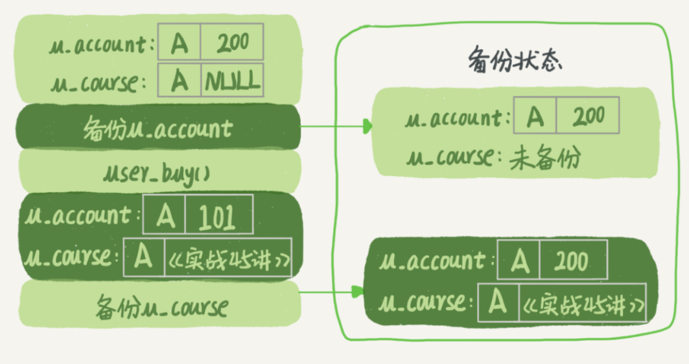
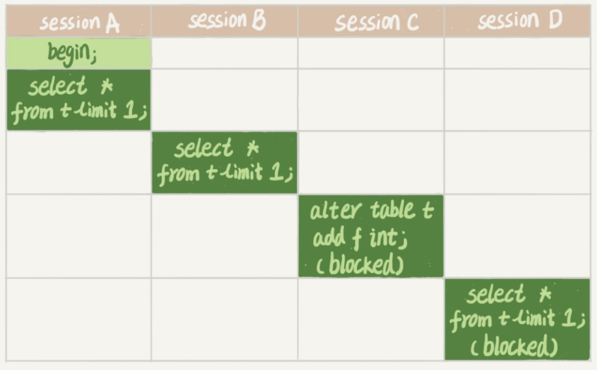

# 全局锁和表锁

**数据库锁设计的初衷是处理并发问题**。作为多用户共享的资源，当出现并发访问的时候，数据库需要合理地控制资源的访问规则。而锁就是用来实现这些访问规则的重要**数据结构**。

根据加锁的范围，MySQL 里面的锁大致可以分成全局锁、表级锁和行锁三类

## 全局锁

全局锁就是对整个数据库实例加锁。MySQL 提供了一个加全局读锁的方法，命令是 Flush tables with read lock (**FTWRL**)。当你需要让整个库处于只读状态的时候，可以使用这个命令，之后其他线程的以下语句会被阻塞：数据更新语句（数据的增删改）、数据定义语句（包括建表、修改表结构等）和更新类事务的提交语句。

> 如果执行flush tables with read lock命令行窗口退出后，则数据库会恢复为执行该命令之前的状态。
>
> unlock tables可以解除。

全局锁的典型使用场景是，做全库逻辑备份。也就是把整库每个表都 select 出来存成文本。在备份过程中整个库完全处于只读状态。

但是让整库都只读，会有以下问题：

- 如果你在主库上备份，那么在备份期间都不能执行更新，业务基本上就得停摆；
- 如果你在从库上备份，那么备份期间从库不能执行主库同步过来的 binlog，会导致主从延迟。

那么备份为什么要加锁呢？假设有这么一个场景，你要维护一个购买系统，关注的是用户账户余额表和用户课程表。

现在发起一个逻辑备份。假设备份期间，有一个用户，他购买了一门课程，业务逻辑里就要扣掉他的余额，然后往已购课程里面加上一门课。如果时间顺序上是先备份账户余额表 (u_account)，然后用户购买，然后备份用户课程表 (u_course)，会怎么样呢？你可以看一下这个图：



可以看到，这个备份结果里，用户 A 的数据状态是“账户余额没扣，但是用户课程表里面已经多了一门课”。如果用这个备份恢复数据，就会出现问题。

也就是说，不加锁的话，备份系统备份的得到的库不是一个逻辑时间点，这个视图是逻辑不一致的。

> 如果不在全局锁，因为不同表之间的执行顺序不同进而备份的时间不同。如果某个表在这个时间差中进行了更新并且成功被备份，而与其有关联的表已经在之前备份完毕已无法更新。此时就发生数据不一致。

前面在将事务隔离的时候提到可重复读可以拿到一个一致性视图，这样我们就可以在可重复读隔离级别下开启一个事务，这样去备份就能保证数据的一致性。

官方自带的逻辑备份工具是 mysqldump。当 mysqldump 使用参数`--single-transaction` 的时候，导数据之前就会启动一个事务，来确保拿到一致性视图。而由于 MVCC 的支持，这个过程中数据是可以正常更新的。

有了这个功能，为什么还需要 FTWRL 呢？一致性读是好，但前提是**引擎要支持这个隔离级别**。比如，对于 MyISAM 这种不支持事务的引擎，如果备份过程中有更新，总是只能取到最新的数据，那么就破坏了备份的一致性。这时，我们就需要使用 FTWRL 命令了。

single-transaction 方法只适用于所有的表使用事务引擎的库。如果有的表使用了不支持事务的引擎，那么备份就只能通过 FTWRL 方法。

**既然要全库只读，为什么不使用 set global readonly=true 的方式呢**？确实 readonly 方式也可以让全库进入只读状态，之所以还是用 FTWRL 主要有以下两点考虑：

- 一是，在有些系统中，readonly 的值会被用来做其他逻辑，比如用来判断一个库是主库还是备库。因此，修改 global 变量的方式影响面更大，我不建议你使用。
- 二是，在异常处理机制上有差异。如果执行 FTWRL 命令之后由于客户端发生异常断开，那么 MySQL 会自动释放这个全局锁，整个库回到可以正常更新的状态。而将整个库设置为 readonly 之后，如果客户端发生异常，则数据库就会一直保持 readonly 状态，这样会导致整个库长时间处于不可写状态，风险较高。


## 表级锁

- [mysql读锁（共享锁）与写锁（排他锁）](https://blog.csdn.net/She_lock/article/details/82022431)

MySQL 里面表级别的锁有两种：一种是表锁，一种是元数据锁（meta data lock，MDL)。

读锁（共享锁）在读取操作时创建，表示其他事务可以进行读取操作，但不能做写入操作。

写锁（排它锁）表示其他事务不能对数据做任何类型的操作，只能等当前事务结束才可做其他操作。

表锁的语法是 `lock tables ... read/write`。与 FTWRL 类似，可以用 `unlock tables` 主动释放锁，也可以在客户端断开的时候自动释放。需要注意，`lock tables` 语法除了会限制别的线程的读写外，也限定了本线程接下来的操作对象。

> 举个例子, 如果在某个线程 A 中执行 `lock tables t1 read, t2 write`; 这个语句，则其他线程写 t1、读写 t2 的语句都会被阻塞。同时，线程 A 在执行 unlock tables 之前，也只能执行读 t1、读写 t2 的操作。连写 t1 都不允许，自然也不能访问其他表。

在还没有出现更细粒度的锁的时候，表锁是最常用的处理并发的方式。InnoDB 支持行锁，因此应变不使用 `lock tables` 命令来控制并发，因为表锁影响的范围过大。

另一类表级的锁是 MDL（metadata lock)。**MDL 不需要显式使用，在访问一个表的时候会被自动加上**。**MDL 的作用是，保证读写的正确性**。比如如果一个查询正在遍历一个表中的数据，而执行期间另一个线程对这个表结构做变更，删了一列，那么查询线程拿到的结果跟表结构对不上。

> 元数据锁是 **server 层的锁**，表级锁，主要用于隔离DML（Data Manipulation Language，数据操纵语言，如select）和DDL（Data Definition Language，数据定义语言，如改表头新增一列）操作之间的干扰。每执行一条DML、DDL语句时都会申请MDL锁，DML操作需要MDL读锁，DDL操作需要MDL写锁（MDL加锁过程是系统自动控制，无法直接干预，读读共享，读写互斥，写写互斥）

在 MySQL 5.5 版本中引入了 MDL，当对一个表（数据）做增删改查操作的时候，加 MDL 读锁（即表数据的增删改查操作都需要先申请 MDL 读锁）；当要对表做结构变更操作的时候，加 MDL 写锁。

- 读锁之间不互斥，因此你可以有多个线程同时对一张表（数据）增删改查。
- 读写锁之间、写锁之间是互斥的，用来保证变更表结构操作的安全性。因此，如果有两个线程要同时给一个表加字段，其中一个要等另一个执行完才能开始执行。

> 加读锁则所有线程可正常读元数据，不影响数据的增删改查操作，只是不能修改表结构；加写锁则只有拥有锁的线程可以读写元数据，也就是修改表结构，其它线程不能执行任何操作，包括修改表结构与数据的增删改查。

给一个表加字段，或者修改字段，或者加索引，需要扫描全表的数据。在对大表操作的时候，需要格外小心，以免对线上的服务造成影响。但有时候对小表操作不慎也会出现问题，如下面的操纵序列：



1、session A 先启动，这时候会对表 t 加一个 MDL 读锁（系统默认添加）。由于 session B 需要的也是 MDL 读锁（读锁共享），因此可以正常执行。

2、之后 session C 会被 blocked，是因为 session A 的 MDL 读锁还没有释放，而 session C 需要 MDL 写锁，因此只能被阻塞。

3、之后所有要在表 t 上新申请 MDL 读锁的请求也会被 session C 阻塞（写锁的获取优先级高于读锁）。

> 申请MDL锁的操作会形成一个队列，**队列中写锁获取优先级高于读锁**。一旦出现写锁等待，不但当前操作会被阻塞，同时还会阻塞后续该表的所有操作。事务一旦申请到MDL锁后，直到事务执行完才会将锁释放。（这里有种特殊情况如果事务中包含DDL操作，mysql会在DDL操作语句执行前，隐式提交commit，以保证该DDL语句操作作为一个单独的事务存在，同时也保证元数据排他锁的释放，例如id 44的语句改为<begin;alter table testok add z varchar(10) not Null;select * from testok;>，此时一旦alter语句执行完成会马上提交事务（autocommit=1），后面的select就在本次事务之外，其执行完成后不会持有读锁）

如果某个表上的查询语句频繁，而且客户端有重试机制，也就是说超时后会再起一个新 session 再请求的话，这个库的线程很快就会爆满。事务中的 MDL 锁，在语句执行开始时申请，但是语句结束后并不会马上释放，而会等到整个事务提交后再释放。

**那么如何安全的给小表加字段呢？**

首先我们要**解决长事务**，事务不提交，就会一直占着 MDL 锁。在 MySQL 的 information_schema 库的 innodb_trx 表中，你可以查到当前执行中的事务。如果你要做 DDL 变更的表刚好有长事务在执行，要考虑先暂停 DDL，或者 kill 掉这个长事务。

如果你要变更的表是一个热点表，虽然数据量不大，但是上面的请求很频繁，而你不得不加个字段，你该怎么做呢？

这时候 kill 可能未必管用，因为新的请求马上就来了。比较理想的机制是，在 alter table 语句里面设定等待时间，如果在这个指定的等待时间里面能够拿到 MDL 写锁最好，拿不到也不要阻塞后面的业务语句，先放弃。之后开发人员或者 DBA 再通过重试命令重复这个过程。

MariaDB 已经合并了 AliSQL 的这个功能，所以这两个开源分支目前都支持 DDL NOWAIT/WAIT n 这个语法。

```mysql
ALTER TABLE tbl_name NOWAIT add column ...
ALTER TABLE tbl_name WAIT N add column ... 
```

## 问题

备份一般都会在备库上执行，你在用–single-transaction 方法做逻辑备份的过程中，如果主库上的一个小表做了一个 DDL，比如给一个表上加了一列。这时候，从备库上会看到什么现象呢？

