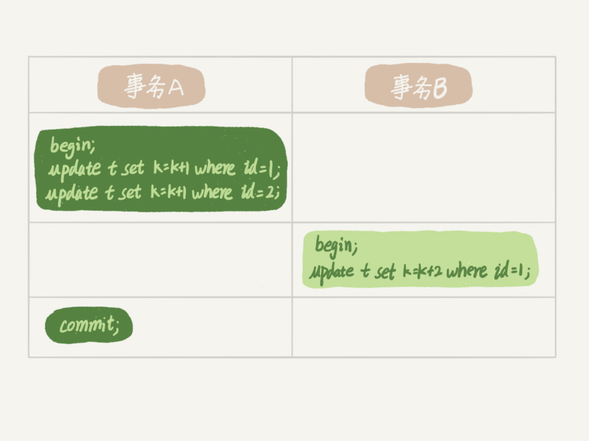
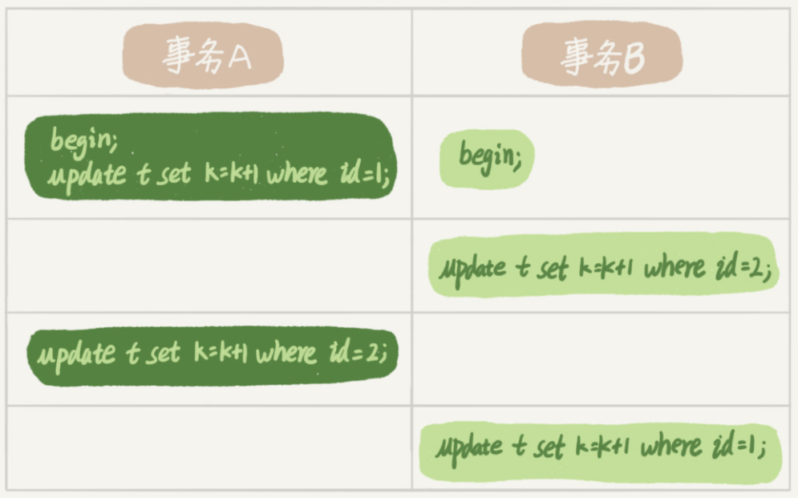

# 全局锁和表锁

**数据库锁设计的初衷是处理并发问题**。作为多用户共享的资源，当出现并发访问的时候，数据库需要合理地控制资源的访问规则。而锁就是用来实现这些访问规则的重要**数据结构**。

根据加锁的范围，MySQL 里面的锁大致可以分成全局锁、表级锁和行锁三类

## 全局锁

全局锁就是对整个数据库实例加锁。MySQL 提供了一个加全局读锁的方法，命令是 Flush tables with read lock (**FTWRL**)。当你需要让整个库处于只读状态的时候，可以使用这个命令，之后其他线程的以下语句会被阻塞：数据更新语句（数据的增删改）、数据定义语句（包括建表、修改表结构等）和更新类事务的提交语句。

> 如果执行flush tables with read lock命令行窗口退出后，则数据库会恢复为执行该命令之前的状态。
>
> unlock tables可以解除。

全局锁的典型使用场景是，做全库逻辑备份。也就是把整库每个表都 select 出来存成文本。在备份过程中整个库完全处于只读状态。

但是让整库都只读，会有以下问题：

- 如果你在主库上备份，那么在备份期间都不能执行更新，业务基本上就得停摆；
- 如果你在从库上备份，那么备份期间从库不能执行主库同步过来的 binlog，会导致主从延迟。

那么备份为什么要加锁呢？假设有这么一个场景，你要维护一个购买系统，关注的是用户账户余额表和用户课程表。

现在发起一个逻辑备份。假设备份期间，有一个用户，他购买了一门课程，业务逻辑里就要扣掉他的余额，然后往已购课程里面加上一门课。如果时间顺序上是先备份账户余额表 (u_account)，然后用户购买，然后备份用户课程表 (u_course)，会怎么样呢？你可以看一下这个图：


可以看到，这个备份结果里，用户 A 的数据状态是“账户余额没扣，但是用户课程表里面已经多了一门课”。如果用这个备份恢复数据，就会出现问题。

也就是说，不加锁的话，备份系统备份的得到的库不是一个逻辑时间点，这个视图是逻辑不一致的。

> 如果不在全局锁，因为不同表之间的执行顺序不同进而备份的时间不同。如果某个表在这个时间差中进行了更新并且成功被备份，而与其有关联的表已经在之前备份完毕已无法更新。此时就发生数据不一致。

前面在将事务隔离的时候提到可重复读可以拿到一个一致性视图，这样我们就可以在可重复读隔离级别下开启一个事务，这样去备份就能保证数据的一致性。

官方自带的逻辑备份工具是 mysqldump。当 mysqldump 使用参数`--single-transaction` 的时候，导数据之前就会启动一个事务，来确保拿到一致性视图。而由于 MVCC 的支持，这个过程中数据是可以正常更新的。

有了这个功能，为什么还需要 FTWRL 呢？一致性读是好，但前提是**引擎要支持这个隔离级别**。比如，对于 MyISAM 这种不支持事务的引擎，如果备份过程中有更新，总是只能取到最新的数据，那么就破坏了备份的一致性。这时，我们就需要使用 FTWRL 命令了。

single-transaction 方法只适用于所有的表使用事务引擎的库。如果有的表使用了不支持事务的引擎，那么备份就只能通过 FTWRL 方法。

**既然要全库只读，为什么不使用 set global readonly=true 的方式呢**？确实 readonly 方式也可以让全库进入只读状态，之所以还是用 FTWRL 主要有以下两点考虑：

- 一是，在有些系统中，readonly 的值会被用来做其他逻辑，比如用来判断一个库是主库还是备库。因此，修改 global 变量的方式影响面更大，我不建议你使用。
- 二是，在异常处理机制上有差异。如果执行 FTWRL 命令之后由于客户端发生异常断开，那么 MySQL 会自动释放这个全局锁，整个库回到可以正常更新的状态。而将整个库设置为 readonly 之后，如果客户端发生异常，则数据库就会一直保持 readonly 状态，这样会导致整个库长时间处于不可写状态，风险较高。


## 表级锁

- [mysql读锁（共享锁）与写锁（排他锁）](https://blog.csdn.net/She_lock/article/details/82022431)

MySQL 里面表级别的锁有两种：一种是表锁，一种是元数据锁（meta data lock，MDL)。

读锁（共享锁）在读取操作时创建，表示其他事务可以进行读取操作，但不能做写入操作。

写锁（排它锁）表示其他事务不能对数据做任何类型的操作，只能等当前事务结束才可做其他操作。

表锁的语法是 `lock tables ... read/write`。与 FTWRL 类似，可以用 `unlock tables` 主动释放锁，也可以在客户端断开的时候自动释放。需要注意，`lock tables` 语法除了会限制别的线程的读写外，也限定了本线程接下来的操作对象。

> 举个例子, 如果在某个线程 A 中执行 `lock tables t1 read, t2 write`; 这个语句，则其他线程写 t1、读写 t2 的语句都会被阻塞。同时，线程 A 在执行 unlock tables 之前，也只能执行读 t1、读写 t2 的操作。连写 t1 都不允许，自然也不能访问其他表。

在还没有出现更细粒度的锁的时候，表锁是最常用的处理并发的方式。InnoDB 支持行锁，因此应变不使用 `lock tables` 命令来控制并发，因为表锁影响的范围过大。

另一类表级的锁是 MDL（metadata lock)。**MDL 不需要显式使用，在访问一个表的时候会被自动加上**。**MDL 的作用是，保证读写的正确性**。比如如果一个查询正在遍历一个表中的数据，而执行期间另一个线程对这个表结构做变更，删了一列，那么查询线程拿到的结果跟表结构对不上。

> 元数据锁是 **server 层的锁**，表级锁，主要用于隔离DML（Data Manipulation Language，数据操纵语言，如select）和DDL（Data Definition Language，数据定义语言，如改表头新增一列）操作之间的干扰。每执行一条DML、DDL语句时都会申请MDL锁，DML操作需要MDL读锁，DDL操作需要MDL写锁（MDL加锁过程是系统自动控制，无法直接干预，读读共享，读写互斥，写写互斥）

在 MySQL 5.5 版本中引入了 MDL，当对一个表（数据）做增删改查操作的时候，加 MDL 读锁（即表数据的增删改查操作都需要先申请 MDL 读锁）；当要对表做结构变更操作的时候，加 MDL 写锁。

- 读锁之间不互斥，因此你可以有多个线程同时对一张表（数据）增删改查。
- 读写锁之间、写锁之间是互斥的，用来保证变更表结构操作的安全性。因此，如果有两个线程要同时给一个表加字段，其中一个要等另一个执行完才能开始执行。

> 加读锁则所有线程可正常读元数据，不影响数据的增删改查操作，只是不能修改表结构；加写锁则只有拥有锁的线程可以读写元数据，也就是修改表结构，其它线程不能执行任何操作，包括修改表结构与数据的增删改查。

给一个表加字段，或者修改字段，或者加索引，需要扫描全表的数据。在对大表操作的时候，需要格外小心，以免对线上的服务造成影响。但有时候对小表操作不慎也会出现问题，如下面的操纵序列：


1、session A 先启动，这时候会对表 t 加一个 MDL 读锁（系统默认添加）。由于 session B 需要的也是 MDL 读锁（读锁共享），因此可以正常执行。

2、之后 session C 会被 blocked，是因为 session A 的 MDL 读锁还没有释放，而 session C 需要 MDL 写锁，因此只能被阻塞。

3、之后所有要在表 t 上新申请 MDL 读锁的请求也会被 session C 阻塞（写锁的获取优先级高于读锁）。

> 申请MDL锁的操作会形成一个队列，**队列中写锁获取优先级高于读锁**。一旦出现写锁等待，不但当前操作会被阻塞，同时还会阻塞后续该表的所有操作。事务一旦申请到MDL锁后，直到事务执行完才会将锁释放。（这里有种特殊情况如果事务中包含DDL操作，mysql会在DDL操作语句执行前，隐式提交commit，以保证该DDL语句操作作为一个单独的事务存在，同时也保证元数据排他锁的释放，例如id 44的语句改为<begin;alter table testok add z varchar(10) not Null;select * from testok;>，此时一旦alter语句执行完成会马上提交事务（autocommit=1），后面的select就在本次事务之外，其执行完成后不会持有读锁）

如果某个表上的查询语句频繁，而且客户端有重试机制，也就是说超时后会再起一个新 session 再请求的话，这个库的线程很快就会爆满。事务中的 MDL 锁，在语句执行开始时申请，但是语句结束后并不会马上释放，而会等到整个事务提交后再释放。

**那么如何安全的给小表加字段呢？**

首先我们要**解决长事务**，事务不提交，就会一直占着 MDL 锁。在 MySQL 的 information_schema 库的 innodb_trx 表中，你可以查到当前执行中的事务。如果你要做 DDL 变更的表刚好有长事务在执行，要考虑先暂停 DDL，或者 kill 掉这个长事务。

如果你要变更的表是一个热点表，虽然数据量不大，但是上面的请求很频繁，而你不得不加个字段，你该怎么做呢？

这时候 kill 可能未必管用，因为新的请求马上就来了。比较理想的机制是，在 alter table 语句里面设定等待时间，如果在这个指定的等待时间里面能够拿到 MDL 写锁最好，拿不到也不要阻塞后面的业务语句，先放弃。之后开发人员或者 DBA 再通过重试命令重复这个过程。

MariaDB 已经合并了 AliSQL 的这个功能，所以这两个开源分支目前都支持 DDL NOWAIT/WAIT n 这个语法。

```mysql
ALTER TABLE tbl_name NOWAIT add column ...
ALTER TABLE tbl_name WAIT N add column ... 
```

## 问题

备份一般都会在备库上执行，你在用–single-transaction 方法做逻辑备份的过程中，如果主库上的一个小表做了一个 DDL，比如给一个表上加了一列。这时候，从备库上会看到什么现象呢？

假设这个 DDL 是针对 t1 表的，组要备份语句如下：

```mysql
-- 设置为可重复读
Q1:SET SESSION TRANSACTION ISOLATION LEVEL REPEATABLE READ;
Q2:START TRANSACTION  WITH CONSISTENT SNAPSHOT；
/* other tables */
Q3:SAVEPOINT sp;
/* 时刻 1 */
Q4:show create table `t1`;
/* 时刻 2 */
Q5:SELECT * FROM `t1`;
/* 时刻 3 */
Q6:ROLLBACK TO SAVEPOINT sp;
/* 时刻 4 */
/* other tables */
```

- Q1：在备份开始的时候，为了确保 RR（可重复读）隔离级别，再设置一次 RR 隔离级别 ;

- Q2：启动事务，这里用 `WITH CONSISTENT SNAPSHOT` 确保这个语句执行完就可以得到一个一致性视图

- Q3：设置一个保存点，这一步操作很重要
- Q4：通过 show create 拿到表结构
- Q5：正式导出数据
- Q6：回滚到 SAVEPOINT sp，在这里的作用是释放 t1 的 MDL 锁

DDL 从主库传过来的时间按照效果不同，分为四个时刻，题目设定为小表，我们假定到达后，如果开始执行，则很快能够执行完成。那么结果如下：

- 如果在 Q4 语句执行之前（时刻 1）到达，现象：没有影响，备份拿到的是 DDL 后的表结构。

- 如果在 `时刻2`  到达，则表结构被改过，Q5 执行的时候，报 Table definition has changed, please retry transaction，现象：mysqldump 终止；

  > 获取表结构和后面的select是强相关的，但是到这时还没有加锁，因此，此时是可以执行dll语句的，当获取表结构后再select的时候发现表结构变更了就会报错，估计是为了备份创建的表结构和当前的结构不匹配导致的。

- 如果在 `时刻2` 和 `时刻3` 之间到达，mysqldump 占着 t1 的 MDL 读锁，binlog 被阻塞，现象：主从延迟，直到 Q6 执行完成。

- 从“时刻 4”开始，mysqldump 释放了 MDL 读锁，现象：没有影响，备份拿到的是 DDL 前的表结构


# 行锁

MySQL 的行锁是在引擎层由各个引擎自己实现的。但并不是所有的引擎都支持行锁，比如 MyISAM 引擎就不支持行锁，不支持行锁意味着并发控制只能使用表锁，对于这种引擎的表，同一张表上任何时刻只能有一个更新在执行。InnoDB 支持行锁。

行锁就是针对数据表中行记录的锁。比如事务 A 更新了一行，而这时候事务 B 也要更新同一行，则必须等事务 A 的操作完成后才能进行更新。


## 两阶段锁

首先，看如下的例子，在下面的操作序列中，事务 B 的 update 语句执行时会是什么现象呢？假设字段 id 是表 t 的主键。



这个问题的结论取决于事务 A 在执行完两条 update 语句后，持有哪些锁，以及在什么时候释放。实际上事务 B 的 update 语句会被阻塞，直到事务 A 执行 commit 之后（事务提交释放锁🔐），事务 B 才能继续执行。

> 两阶段锁，锁的添加与释放分到两个阶段进行，之间不允许交叉加锁和释放锁。 也就是在事务开始执行后为涉及到的行按照需要加锁，但执行完不会马上释放，而是在事务结束时再统一释放他们。

**在 InnoDB 事务中，行锁是在需要的时候才加上的，但并不是不需要了就立刻释放，而是要等到事务结束时才释放。这个就是两阶段锁协议**。

知道了两阶段锁的协议，因此在 InnoDB 事务中，行锁是在需要的时候才加上的，但并不是不需要了就立刻释放，而是要等到事务结束时才释放。这个就是两阶段锁协议。

> 两阶段锁协议简单说：假设一个事务中有多行更新操作，因为更新操作会给表中的数据加上行锁，当执行完更新操作后，锁不会立马释放，而是等待commit成功后才会释放。
>
> 两阶段锁带来的影响：如果把加锁的操作（更新操作）放在整个事务的所有操作的前面，且此时对同一行的并发操作比较多，那么就意味着行被加锁的时间相对于把这些加锁的代码放在后面要长，阻塞的总体时间比较长，如果加锁的代码放在最后，阻塞的时间就会相对缩短，并且距离锁释放的时间更近，可以提高整体性能。

加入有一个电影票在线业务系统，顾客 A 要在影院 B 购买电影票，这个业务涉及到如下操作：

1、从顾客 A 账户余额中扣除电影票价（update）；

2、给影院 B 的账户余额增加这张电影票价（update）；

3、记录一条交易日志（insert）。

> 这三条数据需要事务支持，相比较下，影院 b 的账户更容易引发并发度冲突，涉及到多个事务对同一条记录操作，所以应该把第二条语句放在事务内的最后一条

完成整个交易我们需要 update 两条记录，并 insert 一条记录，为了保证原子性，我们需要包三个操作放到同一个事务中。那么应该怎么安排这个三个语句在事务中的顺序呢？

根据两阶段锁协议，不论你怎样安排语句顺序，所有的操作需要的行锁都是在事务提交的时候才释放的。所以，如果你把语句 2 安排在最后，比如按照 3、1、2 这样的顺序，那么影院账户余额这一行的锁时间就最少。这就最大程度地减少了事务之间的锁等待，提升了并发度。

## 死锁和死锁检测

当并发系统中不同线程出现循环资源依赖，涉及的线程都在等待别的线程释放资源时，就会导致这几个线程都进入无限等待的状态，称为**死锁**。这里以数据库中的行锁为例：



这时候，事务 A 在等待事务 B 释放 id=2 的行锁，而事务 B 在等待事务 A 释放 id=1 的行锁。 事务 A 和事务 B 在互相等待对方的资源释放，就是进入了死锁状态。出现死锁以后，有两种策略：

- 一种策略是，直接进入等待，直到超时。这个超时时间可以通过参数 innodb_lock_wait_timeout 来设置。通过 `show variables like 'innodb_lock_wait_timeout%'` 可以查看，单位为秒。
- 另一种策略是，发起死锁检测，发现死锁后，主动回滚死锁链条中的某一个事务，让其他事务得以继续执行。将参数 `innodb_deadlock_detect` 设置为 on（默认为 on），表示开启这个逻辑。但是死锁检测会耗费大量的资源。

```mysql
mysql> show variables like 'innodb_lock_wait_timeout%';
+--------------------------+-------+
| Variable_name            | Value |
+--------------------------+-------+
| innodb_lock_wait_timeout | 50    |
+--------------------------+-------+
1 row in set (0.00 sec)
```

对于死锁超时的设置，不能太大，太大需要等待较长时间不友好，也不能太小，太小会出现很多误伤。因此，正常情况下通常会采用第二条策略，即主动死锁检测。

主动死锁检测在发生死锁的时候，是能够快速发现并进行处理的，但是它也是有额外负担。想象一下这个过程：每当一个事务被锁的时候，就要看看它所依赖的线程有没有被别人锁住，如此循环，最后判断是否出现了循环等待，也就是死锁。

> 过程示例：新来的线程F，被锁了后就要检查锁住F的线程（假设为D）是否被锁，如果没有被锁，则没有死锁，如果被锁了，还要查看锁住线程D的是谁，如果是F，那么肯定死锁了，如果不是F（假设为B），那么就要继续判断锁住线程B的是谁，一直走知道发现线程没有被锁（无死锁）或者被F锁住（死锁）才会终止。

当所有的事务都更新同一行的场景会是什么样的？每个新来的被堵住的线程，都要判断会不会由于自己的加入导致了死锁，这是一个时间复杂度是 O(n) 的操作。假设有 1000 个并发线程要同时更新同一行，那么死锁检测操作就是 100 万这个量级的。虽然最终检测的结果是没有死锁，但是这期间要消耗大量的 CPU 资源。因此，你就会看到 CPU 利用率很高，但是每秒却执行不了几个事务。

> 整体死锁检测的耗费代价是 O(n2)级别的。 并发更新同一行的1000个线程，整体耗费的死锁检测操作为1000*1000=100万。 为什么是个乘法——并发更新此行R1的某单个线程Tx，其所作的死锁检测工作为，Tx会有查看锁持有情况，耗费1000此操作——a.查看自身持有的行锁; b.遍历其他999个线程所持有的行锁，总共为1+999=1000次。 为什么会遍历其他999个线程，而不是仅看当前持有R1行锁的这个线程就行了？—— 因为行锁排队。某线程Tm排队获取R1行锁，排在Tx前。如果Tx当前持有行锁R2，过会Tm先于Tx获持R1后，会变成——Tm持有R1，等待R2 && Tx持有R2，等待R1——Tm和Tx成环死锁。 因此并发更新同一行的有N个线程，对应的死锁检测耗费代价为O(N2) ! 死锁检测不可避免，为防止死锁检测代价过高引起性能问题——想办法减少同时对同一行的更新的并发并发度。即降低N值。

那么**怎么解决由这种热点行更新导致的性能问题呢**？问题的症结在于，死锁检测要耗费大量的 CPU 资源

- **一种头痛医头的方法，就是如果你能确保这个业务一定不会出现死锁，可以临时把死锁检测关掉**。但是这种操作本身带有一定的风险，因为业务设计的时候一般不会把死锁当做一个严重错误，毕竟出现死锁了，就回滚，然后通过业务重试一般就没问题了，这是**业务无损**的。而关掉死锁检测意味着可能会出现大量的超时，这是**业务有损**的。

- **另一个思路是控制并发度**。比如同一行同时最多只能有 10 个线程在更新，这样死锁的检测成本就比较低。控制并发可以在客户端做也可以在服务端做，但是在客户端做我们没有办法控制客户端的数量，比如虽然设置了每个客户端最多只能有 5 个线程，但有 100 个客户端，这样并发度依然很高。因此并发度控制最好在服务器端做，基本思路就是，对于相同行的更新，在进入引擎之前排队。这样在 InnoDB 内部就不会有大量的死锁检测工作了。

- **如果团队里暂时没有数据库方面的专家，不能实现这样的方案，能不能从设计上优化这个问题呢**？你可以考虑通过将一行改成逻辑上的多行来减少锁冲突。还是以影院账户为例，可以考虑放在多条记录上，比如 10 个记录，影院的账户总额等于这 10 个记录的值的总和。这样每次要给影院账户加金额的时候，随机选其中一条记录来加。这样每次冲突概率变成原来的 1/10，可以减少锁等待个数，也就减少了死锁检测的 CPU 消耗。

  > 但是此方案需要根据业务逻辑做详细设计。如果账户余额可能会减少，比如退票逻辑，那么这时候就需要考虑当一部分行记录变成 0 的时候，代码要有特殊处理。

## 问题

如果你要删除一个表里面的前 10000 行数据，有以下三种方法可以做到：

- 第一种，直接执行 delete from T limit 10000; （事务过长）
- 第二种，在一个连接中循环执行 20 次 delete from T limit 500;
- 第三种，在 20 个连接中同时执行 delete from T limit 500。

> 第二个选择比较好。 但是如果有这样的需求：循环20次的时候，如果在第10次的时候出现错了。那第10就失败回滚了。那此时如果想把之前9次成功的记录也给回滚回来，怎么做？ 就是想让这20次，要么都成功，只要有一次失败，就全部失败。 感觉这又绕回来了。把20个小事务改成一个大事务了。到不如直接选择第一种方法，直接一次性删除所有，不分成20次来删除了。 这样的场景该怎么做呢？

你会选择哪一种？第二种方式比较好。

第一种方式（即：直接执行 delete from T limit 10000）里面，单个语句占用时间长，锁的时间也比较长；而且大事务还会导致主从延迟。

第三种方式（即：在 20 个连接中同时执行 delete from T limit 500），会人为造成锁冲突。


