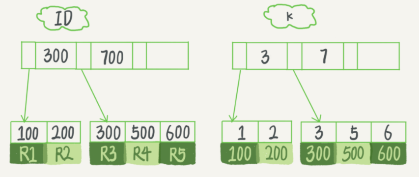
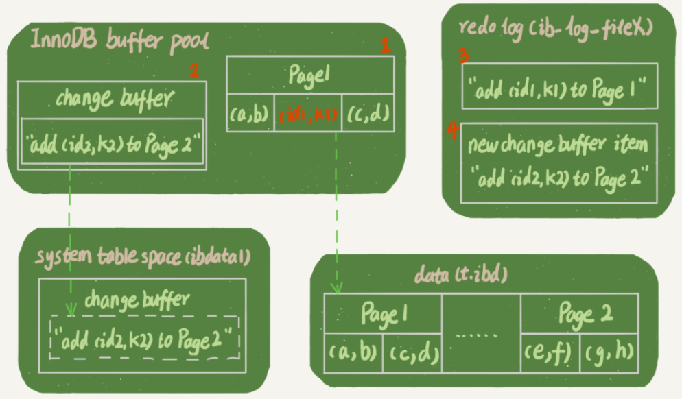
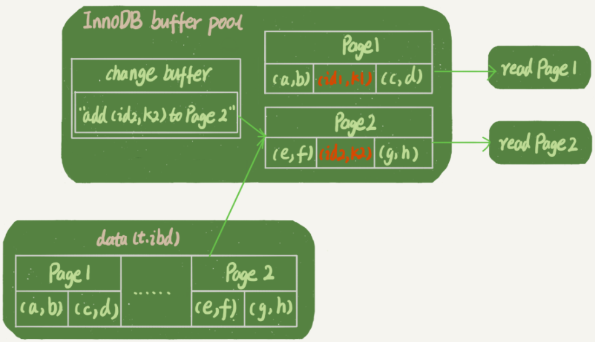
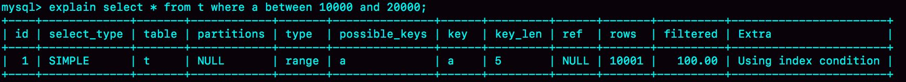
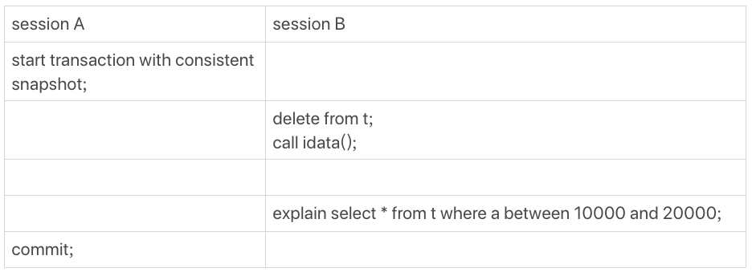
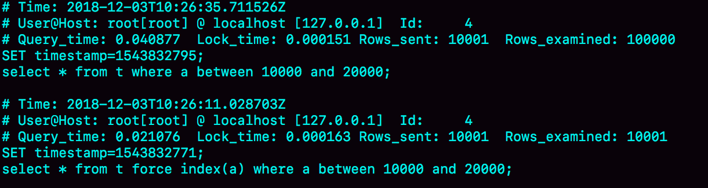

# 普通索引和唯一索引

- [Mysql主键索引、唯一索引、普通索引、全文索引、组合索引的区别](https://blog.csdn.net/leyangjun/article/details/42461879)

首先熟悉一下各个索引是什么：

- 普通索引：最基本的索引，没有任何限制
- 唯一索引：与"普通索引"类似，不同的就是：索引列的值必须唯一，但允许有空值。
- 主键索引：它 是一种特殊的唯一索引，不允许有空值。 
- 全文索引：仅可用于 MyISAM 表，针对较大的数据，生成全文索引很耗时好空间。
- 组合索引：为了更多的提高mysql效率可建立组合索引，遵循”最左前缀“原则。

---

假设你在维护一个市民系统，每个人都有一个唯一的身份证号，而且业务代码已经保证了不会写入两个重复的身份证号。如果市民系统需要按照身份证号查姓名，就会执行类似这样的 SQL 语句：

```mysql
select name from CUser where id_card = 'xxxxxxxyyyyyyzzzzz';
```

通过我们会考虑在 id_card 上常见索引。由于身份证号字段比较大，我不建议你把身份证号当做**主键**，那么现在你有两个选择，要么给 id_card 字段创建唯一索引，要么创建一个普通索引。如果业务代码已经保证了不会写入重复的身份证号，那么这两个选择逻辑上都是正确的。

> 非主键索引会存储主键索引的值，因此推荐选用短字段当主键索引

那么，从性能上来讲，是选择唯一索引还是普通索引呢？有什么选择依据吗？以下面的表为例：假设字段 k 上的值都不重复，数据从 R1到 R5

```mysql
mysql> create table T(
id int primary key, 
k int not null, 
name varchar(16),
index (k))engine=InnoDB;
insert into T(id, k) values (100,1), (200,2), (300,3), (500,5), (600,6);
```

那么，上表中数据在 InnoDB 的索引组织结构如下：



其中 ID 为主键索引，k 为普通个索引。接下来我们来分析这两中索引对于查询和更新语句的性能影响。

## 查询过程

假设查询语句为：`select id from T where k=5` 。查询语句在索引树上查找的过程，先是通过 B+ 树从树根开始，按层搜索到叶子节点，也就是图中右下角的这个数据页，然后可以认为数据页内部通过二分法来定位记录。

> 数据页内部通过有序数组保存节点。数据页之间通过双向链表串接

- 对于**普通索引**来说，查找到满足条件的第一个记录 (5,500) 后，需要查找下一个记录，直到碰到第一个不满足 k=5 条件的记录。
- 对于**唯一索引**来说，由于索引定义了唯一性，查找到第一个满足条件的记录后，就会停止继续检索。

那么，这个不同带来的性能差距会有多少呢？答案是，微乎其微。

> 普通索引跟唯一索引执行上的区别： 普通索引的等值查询，会继续遍历到第一个不相等的值才会结束，而唯一索引等值查询，命中则结束（性能差距微乎其微）

InnoDB 的数据是按数据页为单位来读写的。也就是说，当需要读一条记录的时候，并不是将这个记录本身从磁盘读出来，而是**以页为单位**，将其整体读入内存。在 InnoDB 中，每个数据页的大小默认是 16KB。因为引擎是按页读写的，所以说，当找到 k=5 的记录的时候，它所在的数据页就都在内存里了。那么，对于普通索引来说，要多做的那一次“查找和判断下一条记录”的操作，就只需要一次指针寻找和一次计算。

但是，如果 k=5 这个记录刚好是这个数据页的最后一个记录，那么要取下一个记录，必须读取下一个数据页，这个操作会稍微复杂一些。我们之前计算过，对于整型字段，一个数据页可以放近千个 key，因此出现这种情况的概率会很低。所以，我们计算平均性能差异时，仍可以认为这个操作成本对于现在的 CPU 来说可以忽略不计。

## change buffer

在说明唯一索引和普通索引对于更新语句的性能影响之前，这里需要介绍下 change buffer。

> 数据在内存中直接更新，不在内存的话change buffer记录更新操作（保存更新操作而不是数据），然后定时刷新到磁盘或者读取数据的时候更新读入内存的数据并刷新

当需要更新一个数据页时，如果数据页在内存中就直接更新，而如果这个数据页还没有在内存中的话，在不影响数据一致性的前提下，InnoDB 会将这些更新操作缓存在 change buffer 中，这样就不需要从磁盘中读入这个数据页了。在下次查询需要访问这个数据页的时候，将数据页读入内存，然后执行 change buffer 中与这个页有关的操作。通过这种方式就能保证这个数据逻辑的正确性。

change buffer 是可以被持久化的数据，也就是说，change buffer 在内存中有拷贝，也会被写入到磁盘上。

将 change buffer 中的操作应用到原数据页，得到最新结果的过程称为 merge。除了访问这个数据页会触发 merge 外，系统有后台线程会定期 merge。在数据库正常关闭（shutdown）的过程中，也会执行 merge 操作。

> change buffer的merge操作，先把change buffer的操作更新到内存的数据页中，此操作写到redo log中，mysql未宕机，redo log写满后需要移动check point点时，通过判断内存中数据和磁盘是否一致即是否是脏页来刷新到磁盘中，当mysql宕机后没有内存即没有脏页， 通过redo log来恢复。

显然，如果能够将更新操作先记录在 change buffer，减少读磁盘，语句的执行速度会得到明显的提升。而且，数据读入内存是需要占用 buffer pool 的，所以这种方式还能够避免占用内存，提高内存利用率。

**那么，什么条件下可以使用 change buffer 呢？**

对于唯一索引来说，所有的更新操作都要先判断这个操作是否违反唯一性约束。比如，要插入 (4,400) 这个记录，就要先判断现在表中是否已经存在 k=4 的记录，而这必须要将数据页读入内存才能判断。如果都已经读入到内存了，那直接更新内存会更快，就没必要使用 change buffer 了。

因此，唯一索引的更新就不能使用 change buffer，实际上也只有普通索引可以使用。

change buffer 用的是 buffer pool 里的内存，因此不能无限增大。change buffer 的大小，可以通过参数 innodb_change_buffer_max_size 来动态设置。这个参数设置为 50 的时候，表示 change buffer 的大小最多只能占用 buffer pool 的 50%。

## 更新过程

了解了change buffer 的机制，那么我们再一起来看看如果要在这张表中插入一个新记录 (4,400) 的话，InnoDB 的处理流程是怎样的。

第一种情况是，这个记录要更新的目标页在内存中。这时，InnoDB 的处理流程如下：

- 对于唯一索引来说，找到 3 和 5 之间的位置，判断到没有冲突，插入这个值，语句执行结束；
- 对于普通索引来说，找到 3 和 5 之间的位置，插入这个值，语句执行结束。比唯一索引少了冲突的判断

这样看来，普通索引和唯一索引对更新语句性能影响的差别，只是一个判断，只会耗费微小的 CPU 时间。

- 对于唯一索引来说，需要将数据页读入内存，判断到没有冲突，插入这个值，语句执行结束；
- 对于普通索引来说，则是将更新记录在 change buffer，语句执行就结束了。

将数据从磁盘读入内存涉及随机 IO 的访问，是数据库里面成本最高的操作之一。change buffer 因为减少了随机磁盘访问，所以对更新性能的提升是会很明显的。

> innodb 普通索引修改成唯一索引产生的生产事故, 写多读少使用 change buffer 可以加快执行速度(减少数据页磁盘 io); 但是,如果业务模型是写后立马会做查询, 则会触发 change buffer 立即 merge 到磁盘, 这样 的场景磁盘 io 次数不会减少,反而会增加 change buffer 的维护代价

## change buffer 使用场景

由上面分析我们知道了 change buffer 可以加速普通索引的更新过程，对唯一索引影响很小。那么，普通索引的所有场景中，使用 change buffer 都能启动加速作用吗？

因为 merge 的时候是真正进行数据更新的时刻，而 change buffer 的主要目的就是将记录的变更动作缓存下来，所以在一个数据页做 merge 之前，change buffer 记录的变更越多（也就是这个页面上要更新的次数越多），收益就越大。

因此，对于写多读少的业务来说，页面在写完以后马上被访问到的概率比较小，此时 change buffer 的使用效果最好。这种业务模型常见的就是账单类、日志类的系统。

反过来，假设一个业务的更新模式是写入之后马上会做查询，那么即使满足了条件，将更新先记录在 change buffer，但之后由于马上要访问这个数据页，会立即触发 merge 过程。这样随机访问 IO 的次数不会减少，反而增加了 change buffer 的维护代价。所以，对于这种业务模式来说，change buffer 反而起到了副作用。

## 索引选择与实践

那么，普通索引和唯一索引该如何选择呢？其实，这两类索引在查询能力上是没差别的，主要考虑的是对更新性能的影响。所以，我建议你尽量选择普通索引。

如果所有的更新后面，都马上伴随着对这个记录的查询，那么你应该关闭 change buffer。而在其他情况下，change buffer 都能提升更新性能。

在实际使用中，普通索引和 change buffer 的配合使用，对于数据量大的表的更新优化还是很明显的。

特别地，在使用机械硬盘时，change buffer 这个机制的收效是非常显著的。所以，当你有一个类似“历史数据”的库，并且出于成本考虑用的是机械硬盘时，那你应该特别关注这些表里的索引，尽量使用普通索引，然后把 change buffer 尽量开大，以确保这个“历史数据”表的数据写入速度。

## change buffer 和redo log

这里很容易把 change buffer 和 WAL 搞混。WAL 提升性能的核心机制，也的确是尽量减少随机读写，这两个概念确实容易混淆。

假设，我们在上面的表中执行如下插入语句：

```mysql
mysql> insert into t(id,k) values(id1,k1),(id2,k2);
```

我们假设当前 k 索引树的状态，查找到位置后，k1 所在的数据页在内存 (InnoDB buffer pool) 中，k2 所在的数据页不在内存中。如下图所示是带 change buffer 的更新状态图。



分析这条更新语句，你会发现它涉及了四个部分：内存、redo log（ib_log_fileX）、 数据表空间（t.ibd）、系统表空间（ibdata1）。这条更新语句做了如下的操作（按照图中的数字顺序）：

- Page 1 在内存中，直接更新内存；第一次写内存
- Page 2 没有在内存中，就在内存的 change buffer 区域，记录下“我要往 Page 2 插入一行”这个信息；第二次写内存
- 将上述两个动作记入 redo log 中（图中 3 和 4）。一次写磁盘

做完上面这些，事务就可以完成了。所以，你会看到，执行这条更新语句的成本很低，就是写了两处内存，然后写了一处磁盘（两次操作合在一起写了一次磁盘），而且还是顺序写的。同时，图中的两个虚线箭头，是后台操作，不影响更新的响应时间。

> 数据表空间：就是一个个的表数据文件，对应的磁盘文件就是“表名.ibd”； 
>
> 系统表空间：用来放系统信息，如数据字典等，对应的磁盘文件是“ibdata1”
>
> change buffer和redo log颗粒度不一样，因为change buffer只是针对如果更改的数据所在页不在内存中才暂时储存在change buffer中。而redo log会记录一个事务内进行数据更改的所有操作，即使修改的数据已经在内存中了，那也会记录下来。即change buffer记录的只是针对不在内存中的数据，redo log不管数据在不在内存中，都记录。

那么之后的查询改如何处理呢？比如我们要执行这样的查询

```mysql
select * from t where k in (k1, k2)
```

查询请求的示意图如下，如果读语句发生在更新语句后不久，内存中的数据都还在，那么此时的这两个读操作就与系统表空间（ibdata1）和 redo log（ib_log_fileX）无关了，因此并没有在图中体现出来。



*带有 change buffer 的读过程*

从图中可以看到：

- 读 Page 1 的时候，直接从内存返回。

- 要读 Page 2 的时候，需要把 Page 2 从磁盘读入内存中，然后应用 change buffer 里面的操作日志，生成一个正确的版本并返回结果。

可以看到，直到需要读 Page 2 的时候，这个数据页才会被读入内存。

> 有几位同学在前面文章的评论中问到，WAL 之后如果读数据，是不是一定要读盘，是不是一定要从 redo log 里面把数据更新以后才可以返回？其实是不用的。你可以看一下上图中的这个状态，虽然磁盘上还是之前的数据，但是这里直接从内存返回结果，结果是正确的。
>
> 不用将redo同步到磁盘，因为changebuffer已经记录了对应数据页的改变，我们只要将查询数据不在内存的数据页从磁盘中读入内存，然后利用changebuffer更新这些刚同步的数据页就可以了。 另外，redo只是作为crash-safe的，也就是异常重启时才用的到，平时是不会用它的。就算不用到changebuffer，不异常重启那些特殊情况也不会直接用redo，因为不用changebuffer时，每次数据页不在内存中就直接从磁盘读入，然后直接更新内存数据页才记录redo日记。

如果要简单地对比这两个机制在提升更新性能上的收益的话，**redo log 主要节省的是随机写磁盘的 IO 消耗（转成顺序写），而 change buffer 主要节省的则是随机读磁盘的 IO 消耗**。

> redo log 与 change buffer(含磁盘持久化) 这2个机制，不同之处在于——优化了整个变更流程的不同阶段。 先不考虑redo log、change buffer机制，简化抽象一个变更(insert、update、delete)流程： 
>
> 1、从磁盘读取待变更的行所在的数据页，读取至内存页中。 
>
> 2、对内存页中的行，执行变更操作 
>
> 3、将变更后的数据页，写入至磁盘中。 
>
> 步骤1，涉及 随机 读磁盘IO； 步骤3，涉及 随机 写磁盘IO。
>
> Change buffer机制，优化了步骤1，避免了随机读磁盘IO 
>
> Redo log机制， 优化了步骤3，避免了随机写磁盘IO，将随机写磁盘，优化为了顺序写磁盘(写redo log，确保crash-safe)
>
>  在我们mysql innodb中， change buffer机制不是一直会被应用到，仅当待操作的数据页当前不在内存中，需要先读磁盘加载数据页时，change buffer才有用武之地。 redo log机制，为了保证crash-safe，一直都会用到。
>
> 有没有用到change buffer机制，对于redo log这步的区别在于—— 用到了change buffer机制时，在redo log中记录的本次变更，是记录`new change buffer item`相关的信息，而不是直接的记录物理页的变更。

## 问题

从下面这张图中可以看到，change buffer 一开始是写内存的，那么如果这个时候机器掉电重启，会不会导致 change buffer 丢失呢？change buffer 丢了之后，再从磁盘读入数据可就没有了 merge 过程，就等于是数据丢失了。会不会出现这种情况呢？


# MySQL索引选择

在MySQL中，MySQL会决定使用哪种索引。有时候我们会遇到，一条本来可以执行得很快的语句，却由于 MySQL 选错了索引，而导致执行速度变得很慢？

首先如下的一个例子，创建一个表，里面 a、b 两个字段，并分别创建上索引：

```mysql
CREATE TABLE `t` (
  `id` int(11) NOT NULL,
  `a` int(11) DEFAULT NULL,
  `b` int(11) DEFAULT NULL,
  PRIMARY KEY (`id`),
  KEY `a` (`a`),
  KEY `b` (`b`)
) ENGINE=InnoDB；
```

之后在表里面插入 10万条数据，取值按整数递增，即：(1,1,1)，(2,2,2)，(3,3,3) 直到 (100000,100000,100000)。

数据生成可以按照下面存储过程方式生成：

```mysql
delimiter ;;
create procedure idata()
begin
  declare i int;
  set i=1;
  while(i<=100000)do
    insert into t values(i, i, i);
    set i=i+1;
  end while;
end;;
delimiter ;
call idata();
```

接下来我们分析一条SQL：

```sql
mysql> select * from t where a between 10000 and 20000;
```

我们看下这条SQL对索引的使用



可以看大 key 字段的值为 a，表示优化器使用了索引 a。我们做如下的操作：



*session A 和 session B 的执行流程*

从上面可以看到，session A 启动了一个事务，之后 session B 把数据删除，又调用了 idata 这个存储过程，插入了 10 万行数据。这时候，session B 的查询语句 select * from t where a between 10000 and 20000 就不会再选择索引 a 了。我们可以通过慢查询日志（slow log）来查看一下具体的执行情况。为了做对比，使用 force index(a) 来让优化器强制使用索引 a。实验过程如下：

```mysql
set long_query_time=0;
select * from t where a between 10000 and 20000; /*Q1*/
select * from t force index(a) where a between 10000 and 20000;/*Q2*/
```

- 第一句，是将慢查询日志的阈值设置为 0，表示这个线程接下来的语句都会被记录入慢查询日志中；
- 第二句，Q1 是 session B 原来的查询；
- 第三句，Q2 是加了 force index(a) 来和 session B 原来的查询语句执行情况对比。

查看 mysql 的慢查询设置，以下设置只对当前数据库设置生效，MySQL重启之后无效：

```mysql
mysql> show variables  like '%slow_query_log%';
+---------------------+------------------------------------------------------+
| Variable_name       | Value                                                |
+---------------------+------------------------------------------------------+
| slow_query_log      | OFF                                                  |
| slow_query_log_file | /usr/local/mysql/data/qimengdudeMacBook-Pro-slow.log |
+---------------------+------------------------------------------------------+
# 开启慢查询日志
mysql> set global slow_query_log=1;
```

慢查询时间设置：

```mysql
mysql> show variables like 'long_query_time%';
+-----------------+-----------+
| Variable_name   | Value     |
+-----------------+-----------+
| long_query_time | 10.000000 |
+-----------------+-----------+
1 row in set (0.00 sec)
```

上面三条SQL的慢查询日志如下：



可以看到，Q1 扫描了 10 万行，显然是走了全表扫描，执行时间是 40 毫秒。Q2 扫描了 10001 行，执行了 21 毫秒。也就是说，我们在没有使用 force index 的时候，MySQL 用错了索引，导致了更长的执行时间。

这个例子对应的是我们平常不断地删除历史数据和新增数据的场景。这时，MySQL 竟然会选错索引，为什么会出现这种情况呢？

## 优化器逻辑

我们知道，选择索引时优化器的工作。而优化器选择索引的目的，是找到一个最优的执行方案，并用最小的代价去执行语句。在数据库里面，扫描行数是影响执行代价的因素之一。扫描的行数越少，意味着访问磁盘数据的次数越少，消耗的 CPU 资源越少。当然，扫描行数并不是唯一的判断标准，优化器还会结合是否使用临时表、是否排序等因素进行综合判断。

> 优化器优化时会考虑的因素： 1.扫描行数 2.是否使用临时表 3. 是否需要排序

**那么，扫描行数如何判断呢？**

MySQL 在真正开始执行语句之前，并不能精确地知道满足这个条件的记录有多少条，而只能根据统计信息来估算记录数。

这个统计信息就是索引的“区分度”。显然，一个索引上不同的值越多，这个索引的区分度就越好。而一个索引上不同的值的个数，我们称之为“基数”（cardinality）。也就是说，这个基数越大，索引的区分度越好。


