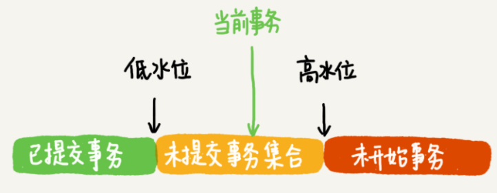
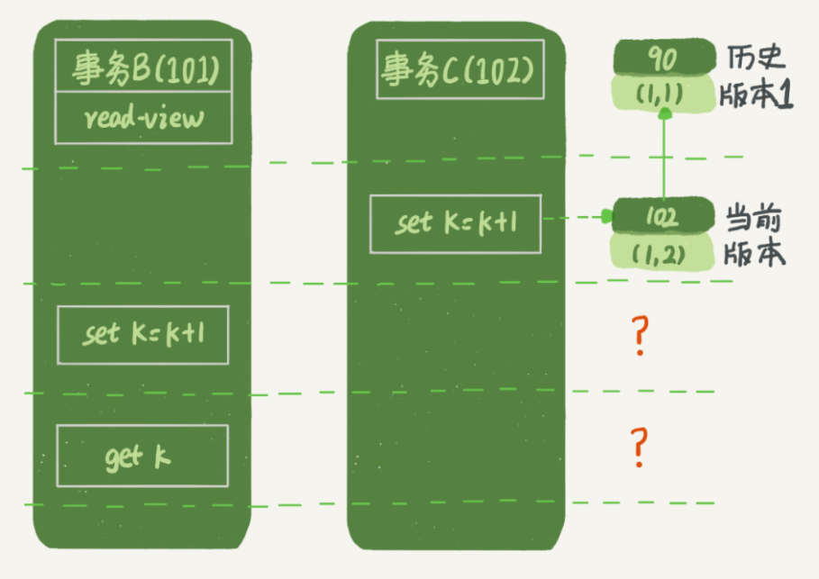
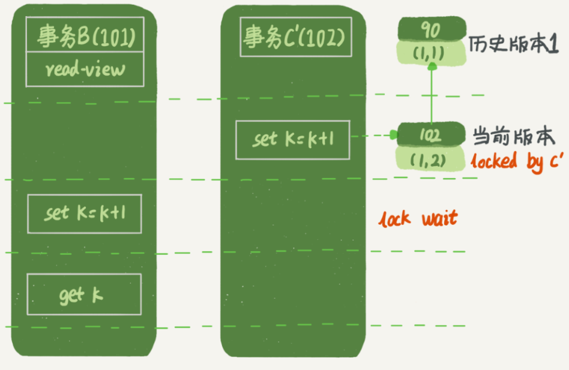

# 事务与隔离

在前面讲到事务的时候提到过，如果是可重复读隔离级别，事务 T 启动的时候会创建一个视图 read-view，之后事务 T 执行期间，即使有其他事务修改了数据，事务 T 看到的仍然跟在启动时看到的一样。在锁文章中提到，如果一个事务要更新一行数据，如果刚好另外一个事务拥有这一行的行锁，他就会被锁住，进入等待状态。那么，既然进入了等待状态，等到这个事务自己获取到行锁要更新数据的时候，它读到的值又是什么呢？

如下示例，下面是只有两行数据的表的初始化：

```mysql
mysql> CREATE TABLE `t` (
  `id` int(11) NOT NULL,
  `k` int(11) DEFAULT NULL,
  PRIMARY KEY (`id`)
) ENGINE=InnoDB;
insert into t(id, k) values(1,1),(2,2);
```

事务 A、B、C的执行流程如下：


这里我们需要注意事务的启动时机。`begin/start transaction` 命令并不是一个事务的起点，在执行到它们之后的第一个操作 InnoDB 表的语句，事务才真正启动。如果你想要马上启动一个事务，可以使用 `start transaction with consistent snapshot` 这个命令。两个命令的区别如下：

- 第一种启动方式，一致性视图是在执行第一个快照读语句时创建的；
- 第二种启动方式，一致性视图是在执行 `start transaction with consistent snapshot` 时创建的。

在上面的例子中，事务 C 没有显式地使用 begin/commit，表示这个 update 语句本身就是一个事务（mysql会隐式的开始和关闭事务（auto_commit=1）），语句完成的时候会自动提交。事务 B 在更新了行之后查询 ; 事务 A 在一个只读事务中查询，并且时间顺序上是在事务 B 的查询之后。

**上面的执行结果是事务 B 查到的 k 的值是 3，而事务 A 查到的 k 的值是 1**。为什么会这样呢？

> 事务B之所以查到的是3，是因为事务B的更新是在事务C更新的基础之上修改的。在修改的时候，需要先读然后再修改，事务B读取的时候，确实不会读取到事务C的更新后的内容。但是事务B进行更新的时候，会执行当前读，所谓当前读就是读取当前数据库中最新的数据内容，如果不执行当前读，而直接基于一致性读的前提下，直接执行更新操作，将会把事务C的更新给丢失掉。所以事务B更新的时候，是在已经提交的事务C的基础上更新数据。所以事务B就出现一个现象：执行更新前查询的值为(1,1)，执行完更新之后，会变成(1,3)，而不是(1,2)。 MySQL中读取数据的时候总是一致性读：事务开始前会创建一个一致性视图，在事务执行过程中，所有其他未提交或者已经提交的事务，对当前已经开启的事务不可见。 但是在更新数据的时候，会执行当前读：意思是在更新之前会去数据库中获取最新的已经提交的事务数据内容，然后基于已经提交的事务的基础上更新自己的内容。

在MySQL中有两个视图概念：

- 一个是 view。它是一个**用查询语句定义的虚拟表**，在调用的时候执行查询语句并生成结果。创建视图的语法是 c`reate view …` ，而它的查询方法与表一样。

- 另一个是 InnoDB 在实现 MVCC 时用到的一致性读视图，即 consistent read view，用于支持 RC（Read Committed，读提交）和 RR（Repeatable Read，可重复读）隔离级别的实现。

**一致性视图没有物理结构，作用是事务执行期间用来定义“我能看到什么数据”**。

## MVCC 中的快照

在可重复读隔离级别下，事务在启动的时候就“拍了个快照”，这个快照是基于整个数据库的。那如果一个库有 100G，不可能基于在这个 100G 的库上做快照吧，这个过程得多慢，那么快照是怎么实现的呢？

nnoDB 里面每个事务有一个唯一的事务 ID，叫作 transaction id。它是在事务开始的时候向 InnoDB 的事务系统申请的，是按申请顺序严格递增的。

而每行数据也都是有多个版本的。每次事务更新数据的时候，都会生成一个新的数据版本，并且把 `transaction id` 赋值给这个数据版本的事务 ID，记为 `row trx_id`。同时，旧的数据版本要保留，并且在新的数据版本中，能够有信息可以直接拿到它。

> 1.更新数据的事务才会生成对应的数据版本 
>
> 2.版本中包含本次数据的值,事务id,还有一个引用(指向上一个数据版本)

也就是说，数据表中的一行记录，其实可能有多个版本 (row)，每个版本有自己的 row trx_id。

如下图，就是一条记录（数据）被多个事务连续更新后的状态。


图中虚线框里是同一行数据的 4 个版本，当前最新版本是 V4，k 的值是 22，它是被 transaction id 为 25 的事务更新的，因此它的 row trx_id 也是 25。

语句更新会生成 undo log，那么undo log 在哪呢？上图中的三个虚线箭头，就是 undo log；而 V1、V2、V3 并不是物理上真实存在的，而是每次需要的时候根据当前版本和 undo log 计算出来的。比如，需要 V2 的时候，就是通过 V4 依次执行 U3、U2 算出来。

有了版本和 row trx_id 的概念之后，那么nnoDB 是怎么定义那个“100G”的快照的？按照可重复读的定义，一个事务启动的时候，能够看到所有已经提交的事务结果。但是之后，这个事务执行期间，其他事务的更新对它不可见。

因此，一个事务只需要在启动的时候声明说，“以我启动的时刻为准，如果一个数据版本是在我启动之前生成的，就认；如果是我启动以后才生成的，我就不认，我必须要找到它的上一个版本”。如果“上一个版本”也不可见，那就得继续往前找。还有，如果是这个事务自己更新的数据，它自己还是要认的。

在实现上， InnoDB 为每个事务构造了一个数组，用来保存这个事务启动瞬间，当前正在“活跃”的所有事务 ID。“活跃”指的就是，启动了但还没提交。数组里面事务 ID 的最小值记为**低水位**，当前系统里面已经创建过的事务 ID 的最大值加 1 记为**高水位**。这个视图数组和高水位，就组成了当前事务的一致性视图（read-view）。

> 注意此处低水位和高水位的区别。 低水位：数组内事务ID最小值。 高水位：当前系统已经创建的事务id的最大值+1 。低水位是【数组内】， 高水位【系统内】

> 这个数组有意思。 如果事务 A 是以 begin/start transaction 的方式启动的，那么此时，read-view 还没有创建，事务 A 中第一条读操作执行的时候，read-view 才会创建；此时，离 begin/start transaction 的执行已经过去一段时间，在这段时间中，会有新的事务被创建，这些新事务的 trx_id 都会比事务 A 的 trx_id 大；那么在这个数组中，事务 A 的 trx_id 就未必是数据中最后一个元素；这意味着，高水位线和事务 A 的 trx_id 之间有别的 trx_id。 如果事务 A 是以 start transaction with consistent snapshot 的方式开启事务，那么 read-view 在这一瞬间创建，事务 A 的 trx_id 就是数组中最后一个元素，高水位线就比事务 A 的 trx_id 大 1。

数据版本的可见性规则，就是基于数据的 row trx_id 和这个一致性视图的对比结果得到的。数组中的 row trx_id 分成几种不同情况。



 对于当前事务的启动瞬间来说，一个数据版本的 row trx_id，有以下几种可能：

- 如果落在绿色部分，表示这个版本是已提交的事务或者是当前事务自己生成的，这个数据是可见的；
- 如果落在红色部分，表示这个版本是由将来启动的事务生成的，是肯定不可见的；
- 如果落在黄色部分，那就包括两种情况
  - a. 若 row trx_id 在数组中，表示这个版本是由还没提交的事务生成的，不可见；
  - b. 若 row trx_id 不在数组中，表示这个版本是已经提交了的事务生成的，可见。

> 一个事务 A 启动瞬间，生成活跃数组和高水位的一致性快照， 
>
> 活跃数组：其他已经启动（不等于创建）但未提交的事务id集合 
>
> 低水位：活跃数组中事务id的最小值，小于这个值的事务一定已经已提交，对事务A可见 
>
> 高水位：已创建事务的最大值，大于这个值的事务一定未提交，对事务A不可见 低水位和高水位之间的黄色部分是包含活跃数组的，如果在活跃数组中，说明事务A启动时该事务未提交故不可见，反之可见。

拿最上面的版本图来说，如果有一个事务，它的低水位是 18，那么当它访问这一行数据时，就会从 V4 通过 U3 计算出 V3，所以在它看来，这一行的值是 11。

> 低水位18，则该事务中开始瞬间所建立的数组中最小值为18，而 V3 中的row trx_id为17小于18，说明 V3 已提交事务，所以会读取到最新数据为 V3 中的11。


InnoDB 利用了“所有数据都有多个版本”的这个特性，实现了“秒级创建快照”的能力。


## 问题分析

我们继续看一下图 1 中的三个事务，分析下事务 A 的语句返回的结果，为什么是 k=1。


这里，我们不妨做如下假设：

- 事务 A 开始前，系统里面只有一个活跃事务 ID 是 99；
- 事务 A、B、C 的版本号分别是 100、101、102，且当前系统里只有这四个事务；
- 三个事务开始前，(1,1）这一行数据的 row trx_id 是 90。

事务 A 的视图数组就是 `[99,100]`, 事务 B 的视图数组是`[99,100,101]`, 事务 C 的视图数组是`[99,100,101,102]`。下面我们分析事务A的查询逻辑有关的操作：


*事务 A 查询数据逻辑图*

从图中可以看到，第一个有效更新是事务 C，把数据从 (1,1) 改成了 (1,2)。这时候，这个数据的最新版本的 row trx_id 是 102，而 90 这个版本已经成为了历史版本。

第二个有效更新是事务 B，把数据从 (1,2) 改成了 (1,3)。这时候，这个数据的最新版本（即 row trx_id）是 101，而 102 又成为了历史版本。

由上面的表可以看出来，在事务 A 查询的时候，其实事务 B 还没有提交，但是它生成的 (1,3) 这个版本已经变成当前版本了。但这个版本对事务 A 必须是不可见的，否则就变成脏读了。当 事务 A 开始读数据的时候，它的视图数组是[99,100]。读取数据是从当前版本读起，所以事务 A 查询语句的读数据流程是这样的：

- 找到 (1,3) 的时候，判断出 row trx_id=101，比高水位大，处于红色区域，不可见；事务 A 在启动的瞬间，系统已只有一个活跃的事务 99，因此高水位就是 99 加 1 即 100，100 小于 101。
- 接着，找到上一个历史版本，一看 row trx_id=102，比高水位大，处于红色区域，不可见；
- 再往前找，终于找到了（1,1)，它的 row trx_id=90，比低水位小，处于绿色区域，可见。

这样执行下来，虽然期间这一行数据被修改过，但是事务 A 不论在什么时候查询，看到这行数据的结果都是一致的，所以我们称之为一致性读。

---

上面从代码的逻辑转义过来的，我们很难直觉感知。通过来讲，一个数据版本，对于一个事务视图来说，除了自己的更新总是可见以外，有三种情况：

- 版本未提交，不可见；
- 版本已提交，但是是在视图创建后提交的，不可见；
- 版本已提交，而且是在视图创建前提交的，可见。

> 是对查询语句来讲的，不适用于更新语句，因为更新语句是先读后写，并且这个读指的是当前读。

基于上面的规则，我们来判断下上图中查询结果，事务 A 的查询语句的视图数组是在事务 A （使用了`start transaction with consistent snapshot`事务启动时创建视图，使用 `begin` 时在执行第一个DML语句时创建）启动的时候生成的，这时候：

- (1,3) 还没提交，属于情况 1，不可见；
- (1,2) 虽然提交了，但是是在视图数组创建之后提交的，属于情况 2，不可见；
- (1,1) 是在视图数组创建之前提交的，可见。

## 更新逻辑

**事务 B （读到的 k 值为3）的 update 语句，如果按照一致性读，好像结果不对哦**？按照一致性读的逻辑，事务 B 的视图数组是先生成的，之后事务 C 才提交，不是应该看不见 (1,2) 吗，怎么能算出 (1,3) 来？



*事务 B 更新逻辑图*

是的，如果事务 B 在更新之前查询一次数据，这个查询返回的 k 的值确实是 1。但是，当它要去更新数据的时候，就不能再在历史版本上更新了，否则事务 C 的更新就丢失了。因此，事务 B 此时的 set k=k+1 是在（1,2）的基础上进行的操作。

> 事务与事务之间的隔离不应该影响最终数据的落地。就是说事务C先更新了数据，而后事务B也更新了同一份数据，以数据库的眼光来看这份数据的变动就是事务C的更新跟着事务B的更新，必须延续在一块而不能分开。 所以事务的更新必须是基于当前最新值来执行的，而读则是基于其视图，即可重复读的隔离，真的只是读层面的隔离。 在这个例子中，就是因为事务C的更新在前，事务B的更新必须延续事务C的结果，所以只能读取当前值再更新。而事务本身的更新是能被看到的，所以事务B再查询就只能是得到当前最新值。

所以，这里就用到了这样一条规则：**更新数据都是先读后写的，而这个读，只能读当前的值，称为“当前读”（current read）**。

因此，在更新的时候，当前读拿到的数据是 (1,2)，更新后生成了新版本的数据 (1,3)，这个新版本的 row trx_id 是 101。在执行事务 B 查询语句的时候，一看自己的版本号是 101，最新数据的版本号也是 101，是自己的更新，可以直接使用，所以查询得到的 k 的值是 3。

除了 update 语句外，select 语句如果加锁，也是当前读。所以，如果把事务 A 的查询语句 `select * from t where id=1` 修改一下，加上 `lock in share mode` 或 `for update`，也都可以读到版本号是 101 的数据，返回的 k 的值是 3。下面这两个 select 语句，就是分别加了读锁（S 锁，共享锁）和写锁（X 锁，排他锁）。

```mysql
mysql> select k from t where id=1 lock in share mode;
mysql> select k from t where id=1 for update;
```

> 当前事务加锁读，此时若遇到其他事务持有该数据的写锁，便只能等待，最终得到其他事务修改后提交的最新值，也就是当前读。当然如果其他事务并没有对该数据进行修改写，加锁读和不加锁读其实没区别。 总结一下，加锁读会导致读到最新修改的数值。
>
> 事务 update 语句基于当前读，而且 加锁 select 也是基于当前读； 而事务中的普通 select语句 则是一致性读；

## 往前一步

再往前一步，假设事务 C 不是马上提交的，而是变成了下面的事务 C’，会怎么样呢？


*事务 A、B、C'的执行流程*

事务 C’的不同是，更新后并没有马上提交，在它提交前，事务 B 的更新语句先发起了。前面说过了，虽然事务 C’还没提交，但是 (1,2) 这个版本也已经生成了，并且是当前的最新版本。那么，事务 B 的更新语句会怎么处理呢？

这里就需要用到**两阶段锁协议**，事务 C’没提交，也就是说 (1,2) 这个版本上的写锁还没释放。而事务 B 是当前读，必须要读最新版本，而且必须加锁，因此就被锁住了，必须等到事务 C’ 释放这个锁，才能继续它的当前读。

> 当前读必须要读最新版本 如果此时该行数据上有事物尚未提交，则当前事务必须等待锁
>
> “当前读”若读到的数据最终被回滚那就产生了脏读，这是不可接受的，所以必须确保“当前读”读到的数据是最终会被提交的数据。如果事务 B 在 C‘ 没有提交之前进行了读取，而随后事务 C’ 又回滚了事务，那么就会出现脏读，因此事务 B 必须等待事务 C' 提价。



*事务 B 更新逻辑图（配合事务 C'）*

---

**事务的可重复读的能力是怎么实现的？**

可重复读的核心就是一致性读（consistent read）；而事务更新数据的时候，只能用当前读。如果当前的记录的行锁被其他事务占用的话，就需要进入锁等待。

而读提交的逻辑和可重复读的逻辑类似，它们最主要的区别是：

- 在**可重复读隔离级别**下，只需要在事务开始的时候创建一致性视图，之后事务里的其他查询都共用这个一致性视图；
- 在**读已提交隔离级别**下，每一个语句执行前都会重新算出一个新的视图。

那么，我们再看一下，在读已提交隔离级别下，事务 A 和事务 B 的查询语句查到的 k，分别应该是多少呢？

> 这里需要说明一下，`start transaction with consistent snapshot;` 的意思是从这个语句开始，创建一个持续整个事务的一致性快照。所以，在读已提交隔离级别下，这个用法就没意义了，等效于普通的 start transaction。

下面是读提交时的状态图，可以看到这两个查询语句的创建**视图数组**的时机发生了变化，就是图中的 read view 框


这时，事务 A 的查询语句的视图数组是在执行这个语句的时候创建的，时序上 (1,2)、(1,3) 的生成时间都在创建这个视图数组的时刻之前。但是，在这个时刻：

- (1,3) 还没提交，属于情况 1（版本未提交不可见），不可见；
- (1,2) 提交了，属于情况 3（版本已提交，且在视图创建之前提交），可见。

所以，这时候事务 A 查询语句返回的是 k=2，显然地，事务 B 查询结果 k=3。

## 总结

InnoDB 的行数据有多个版本，每个数据版本有自己的 row trx_id，每个事务或者语句有自己的一致性视图。普通查询语句是一致性读，一致性读会根据 row trx_id 和一致性视图确定数据版本的可见性。

- 对于可重复读，查询只承认在**事务启动前**就已经提交完成的数据；
- 对于读已提交，查询只承认在**语句启动前**就已经提交完成的数据；

而当前读，**总是读取已经提交完成的最新版本**。为什么表结构不支持“可重复读”？这是因为表结构没有对应的行数据，也没有 row trx_id，因此只能遵循当前读的逻辑。表结构不支持可重复读，只支持当前读。

当然，MySQL 8.0 已经可以把表结构放在 InnoDB 字典里了，也许以后会支持表结构的可重复读。

## 问题

下面的表结构和初始化语句作为试验环境，事务隔离级别是可重复读。现在，我要把所有“字段 c 和 id 值相等的行”的 c 值清零，但是却发现了一个“诡异”的、改不掉的情况。请你构造出这种情况，并说明其原理。

```mysql
mysql> CREATE TABLE `t` (
  `id` int(11) NOT NULL,
  `c` int(11) DEFAULT NULL,
  PRIMARY KEY (`id`)
) ENGINE=InnoDB;
insert into t(id, c) values(1,1),(2,2),(3,3),(4,4);
```


复现出来以后，请你再思考一下，在实际的业务开发中有没有可能碰到这种情况？你的应用代码会不会掉进这个“坑”里，你又是怎么解决的呢？