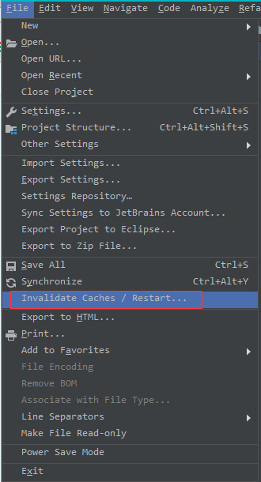

# IDEA常见使用及其配置

## XML警告

在使用 mybatis 时，xml 中的 sql 提示很多，下面的方法可以去除这些提示：[去掉IntelliJ IDEA 中 mybatis 对应的 xml 文件警告](<https://blog.csdn.net/aubdiy/article/details/68485336>)

1、去掉 No data sources configure 警告

`Prefernces --> Editor --> Inspections --> SQL --> No data sources configure` 取消检查

2、去掉 SQL dialect is not configured 警告

`Prefernces --> Editor --> Inspections --> SQL -->  SQL dialect detection` 取消检查

3、去掉 "注入语言"背景色

`Prefernces --> Editor --> Colors Scheme --> General --> Code --> Injected language fragment --> Background`

## JSP/HTML style及其短代码一行的问题

[IntelliJ IDEA one-line function formatting](https://stackoverflow.com/questions/36294708/intellij-idea-one-line-function-formatting)

IDEA中默认情况下会把 style 中的值以省略的形式展示，可以通过 `code folding` 中的 `HTML 'style' attribute` 去掉勾选；若方法体较短，会变成一行，可以通过在 `code folding` 将 `one line method` 选项去掉即可：

通过以下设置就可以将其展开：

## 拼写检查

去除拼写检查：`Editor --> Inspections --> Spelling --> Typo` 去掉勾选即可

## 文件编码

[解决IntelliJ IDEA控制台输出中文乱码问题](https://blog.csdn.net/liu865033503/article/details/81094575)

如何控制台还是乱码，可以在 Tomcat 的选项中添加 VM 选项：`-Dfile.encoding=UTF-8`

这样基本就可以解决控制台乱码问题。

## 重复代码提示

IDEA 会检测项目中是否有重复代码，通过设置可以将此提示去掉：`Setting --> Inspections --> General --> Duplicated Code fragment ` 去掉勾选即可。

## 去除JavaScript == 提示

`Settings -> Editor -> Inspections -> JavaScript -> Probable bugs -> Equality operator may cause type coercion`

## 去除JS非高效代码提示

`Settings -> Editor -> Inspections -> JavaScript -> General ->jQuery usage efficiency`

## 去除未识别HTML标签提示

`Settings -> Editor -> Inspections -> HTML`

## 自动生成 getter 与 setter 方法

IDEA项目中使用  `@Data` 无效，这是应为缺失了 `lombok` 插件，IDEA安装了此插件即可：[idea中@Data标签getset不起作用](https://blog.csdn.net/seapeak007/article/details/72911529)

IDEA Even Log面板无法正常显示日志的问题，有可能是日志所在的目录没有写入的权限，这是就需要为日志写入设置权限，只需要以管理员运行IDEA即可，解决办法如下：

[IDEA报Unable to save settings: Failed to save settings. Please restart IntelliJ IDEA](<https://blog.csdn.net/yjw123456/article/details/78547552>)

第二种情况就是重新设置 `User  Custom Font` ，解决办法如下：[Event Log Empty](https://youtrack.jetbrains.com/issue/DBE-8211?p=IDEA-211391)

# 常见操作

## 清理 Tomcat 缓存

在开发 Web 项目时浏览器会缓存JSP/HTML/JS/CSS等文件，可以通过 IDEA 的 `Invalidate Caches/Restart` 来禁用缓存。

## 项目修改热部署

在 IDEA 开发 javaweb 项目，默认情况下修改资源之后需要重启项目之后才可以让修改生效，显然这样开发效率会受到很大的影响，通过如下的配置实现修改的热部署。

首先打开 Tomcat 的配置，在部署时选择以 `exploded` 结尾的部署项目，而不是以 `war` 结尾的：

之后回到 `server` 选项，在 `On 'Update' action` 以及 `On frame deactivation` 的选项中均选择 `Update classes and resources` 选项即可：

# 快捷键

## 设置快捷键

**1、清除控制台快捷键**

打开设置，找到 `keymap` ，在搜索栏中搜索 `clear all` ，双击该选项为其添加不产生冲突的快捷键，此处设置为 `Alt+C`：

## 快捷键冲突

有道词典快捷键：

<kbd>Ctrl</kbd> + <kbd>Alt</kbd> + <kbd>S</kbd>

<kbd>Ctrl</kbd> + <kbd>Alt</kbd> + <kbd>V</kbd>

<kbd>Ctrl</kbd> + <kbd>Alt</kbd> + <kbd>X</kbd>

网易云音乐快捷键（全局）：

<kbd>Ctrl</kbd> + <kbd>Alt</kbd> + <kbd>P</kbd>

<kbd>Ctrl</kbd> + <kbd>Alt</kbd> + <kbd>Left</kbd>

<kbd>Ctrl</kbd> + <kbd>Alt</kbd> + <kbd>Right</kbd>

<kbd>Ctrl</kbd> + <kbd>Alt</kbd> + <kbd>Up</kbd>

<kbd>Ctrl</kbd> + <kbd>Alt</kbd> + <kbd>Down</kbd>

<kbd>Ctrl</kbd> + <kbd>Alt</kbd> + <kbd>M</kbd>

<kbd>Ctrl</kbd> + <kbd>Alt</kbd> + <kbd>L</kbd>

<kbd>Ctrl</kbd> + <kbd>Alt</kbd> + <kbd>D</kbd>

