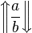
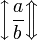
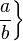

# 符号

## 各种括号

**不同尺寸的括号**

使用\big, \Big, \bigg, \Bigg 或者 \left \right

```latex
\Bigg ( 
  \bigg [ 
     \Big \{ 
     		\big \langle 
     			\left | 
     				\| \frac{a}{b} \| 
     			\right | 
     		\big \rangle 
     \Big \} 
  \bigg ] 
\Bigg )
```

$$
\large{  \Bigg (     \bigg [        \Big \{           \big \langle             \left |               \| \frac{a}{b} \|             \right |           \big \rangle        \Big \}     \bigg ]   \Bigg )}
$$

**其它种类括号**

| 功能                         | 语法                                                       | 显示                                                         |
| :--------------------------- | :--------------------------------------------------------- | :----------------------------------------------------------- |
| 圆括号，小括号               | \left**(** \frac{a}{b} \right**)**                         | $\large{\left( \frac{a}{b} \right)}$                         |
| 方括号，中括号               | \left**[** \frac{a}{b} \right**]**                         | ![\left[ \frac{a}{b} \right]](http://upload.wikimedia.org/math/8/5/8/8585c96f355f7e301fd5143bea32efaf.png) |
| 花括号，大括号               | \left**\{** \frac{a}{b} \right**\}**                       |  |
| 角括号                       | \left **\langle** \frac{a}{b} \right **\rangle**           |  |
| 单竖线，绝对值               | \left**\|** \frac{a}{b} \right**\|**                       |  |
| 双竖线，范                   | \left **\|** \frac{a}{b} \right **\|**                     |  |
| 取整函数 （Floor function）  | \left **\lfloor** \frac{a}{b} \right **\rfloor**           |  |
| 取顶函数 （Ceiling function) | \left **\lceil** \frac{c}{d} \right **\rceil**             |  |
| 斜线与反斜线                 | \left **/** \frac{a}{b} \right **\backslash**              |  |
| 上下箭头                     | \left **\uparrow** \frac{a}{b} \right **\downarrow**       |  |
|                              | \left **\Uparrow** \frac{a}{b} \right **\Downarrow**       |  |
|                              | \left **\updownarrow** \frac{a}{b} \right **\Updownarrow** |  |
| 混合括号                     | \left [ 0,1 \right )  <br/>\\left\langle \psi \right \|    | $\left [ 0,1 \right )$<br>$ \left \langle \psi \right\langle$ |
| 单左括号                     | \left \{ \frac{a}{b} **\right .**                          |  |
| 单右括号                     | **\left .** \frac{a}{b} \right \}                          |  |


# 公式

## 多行对齐

```latex
\begin{equation}
  \begin{split}
    x&=a+b+c\\
    &=d+e\\
    &=f+g
  \end{split}
\end{equation}
```

$$
\large{
  \begin{equation}
    \begin{split}
      x&=a+b+c\\
      &=d+e\\
      &=f+g
    \end{split}
  \end{equation}
}
$$

## 大括号

**左侧大括号**

```latex
f(x)=
  \begin{cases}
    0 & if & \text{x=0}\\
    1 & if & \text{x!=0}
  \end{cases}
```

$$
\large{
  f(x)=
  \begin{cases}
    0 & if & \text{x=0}\\
    1 & if & \text{x!=0}
  \end{cases}
}
$$

