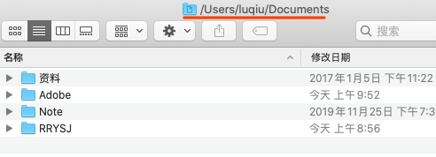

# 常见设置

## 文件及文件夹设置

### 显示路径与状态

默认状态下 finder 并不显示路径和状态，我们可以通过 finder 显示选项里面的 `显示路径栏` 和 `显示状态栏` 选项将其打开：


### 标题栏显示路径

上面设置方法可以显示文件的路径，但是增加了窗口的高度，若不想增加窗口的高度又想显示路径，那么就可以让路径显示在标题栏中，这样标题栏就不只是显示标题了。设置的命令如下：

```sh
defaults write com.apple.finder _FXShowPosixPathInTitle -bool YES
```



若要关闭，只需吧上述命令的 `YES` 改成 `NO` 即可。

### 显示隐藏文件

在终端中输入如下命令即可让所有隐藏文件显示：

```sh
defaults write com.apple.finder AppleShowAllFiles -boolean true ; killall Finder
```

若要重新隐藏，只需要执行如下命令：

```sh
defaults write com.apple.finder AppleShowAllFiles -boolean false ; killall Finder
```


# 开发相关

## 开发工具

### brew缺失

Mac 默认没有安装 homebrew，这需要我们手动安装，命令如下：

```sh
/usr/bin/ruby -e "$(curl -fsSL https://raw.githubusercontent.com/Homebrew/install/master/install)"
```

### conda命令不存在

安装完成 conda 之后发现提示 `zsh: command not found: conda` ，这是因为 conda 会把默认路径写到 `.bash_profile` 文件中，但在使用 `zsh` 时需要将其写入到 `.zshrc` 中。如下：

```bash
export PATH="Users/username/anaconda3/bin:$PATH"
```

设置完成，将其生效：

```sh
source ~/.zshrc
```

有可能你会发现你的电脑上并不存在 `.zshrc` 这个文件，只需要重建创建一个即可。

